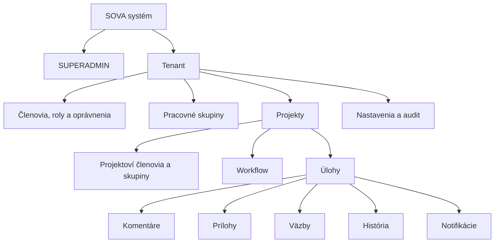
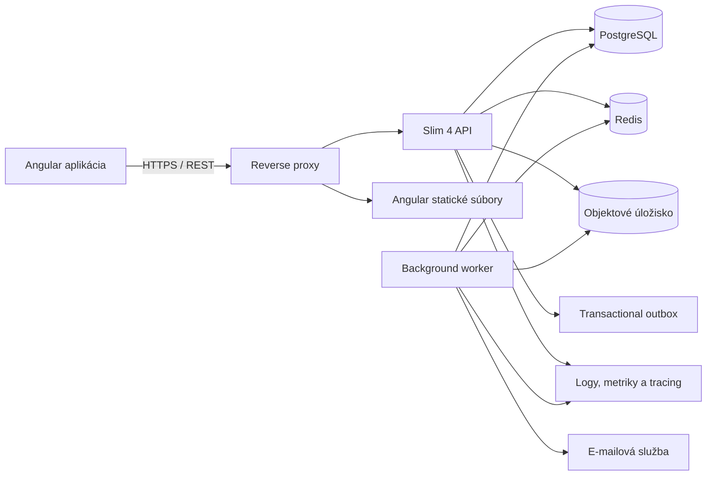

# SOVA

> Multitenantný systém na evidenciu a riadenie úloh, chýb a požiadaviek.

SOVA je pripravovaný webový issue tracker a task manager inšpirovaný systémami Jira,
MantisBT a Bugzilla. Je navrhnutý pre viac samostatných organizácií, ktoré potrebujú
bezpečne spravovať používateľov, pracovné skupiny, projekty a úlohy v jednej
inštalácii.

## Stav projektu

> **Projekt je momentálne vo fáze technického základu.**

Aktuálne je pripravené:

- produktová, technická a webflow dokumentácia,
- PostgreSQL 17 v `docker-compose.yml`,
- PHP 8.3+ Composer projekt v adresári `backend`,
- Slim 4 bootstrap, dependency injection, konfigurácia a middleware,
- Doctrine DBAL a základ databázových migrácií,
- API info, liveness a readiness endpointy,
- PHPUnit, PHPStan a PHP CS Fixer kontroly,
- Angular 22 standalone frontend v adresári `frontend`,
- TypeScript a Angular strict režim,
- Bootstrap 5, signals a OnPush change detection,
- lazy-loaded feature oblasti a zdieľané komponenty,
- lokalizácia pre SK, CS, EN, DE, PL a HU s detekciou prehliadača a EN fallbackom,
- Vitest, Prettier, typecheck a produkčný build.

Identity, tenancy, autorizácia a ostatné doménové moduly zatiaľ nie sú implementované
ani napojené na REST API.

## Hlavné ciele

- bezpečné oddelenie dát jednotlivých tenantov,
- vlastné prihlasovanie s heslami hashovanými pomocou Argon2id,
- systémové, tenantové a projektové roly,
- globálna rola `SUPERADMIN`,
- pracovné skupiny a projektové tímy,
- evidencia úloh, chýb, požiadaviek a ich workflow,
- komentáre, prílohy, väzby a história zmien,
- vyhľadávanie, filtre a notifikácie,
- tenantová a systémová administrácia,
- auditovateľnosť bezpečnostne významných operácií,
- responzívne a prístupné používateľské rozhranie.

## Prehľad domény



Používateľská identita je globálna a jeden používateľ môže patriť do viacerých
tenantov. Jeho členstvo, roly a oprávnenia sú pre každý tenant samostatné.

## Technologický stack

| Oblasť | Technológia |
|---|---|
| Backend | PHP 8.3–8.4 |
| API framework | Slim 4 |
| API štýl | REST, JSON, OpenAPI |
| Frontend | Angular 22 |
| UI | Bootstrap 5 |
| Lokalizácia | SK, CS, EN, DE, PL, HU; predvolený jazyk EN |
| Primárna databáza | PostgreSQL – odporúčaný návrh |
| Cache/fronta/sessions | Redis – podľa konkrétneho nasadenia |
| Prílohy | Privátne S3-kompatibilné objektové úložisko |
| Asynchrónne úlohy | Samostatný background worker |
| Autentifikácia | Serverová relácia v bezpečnej HttpOnly cookie |
| Heslá | Argon2id |

PostgreSQL, Redis, objektové úložisko a spôsob relácií sú odporúčania z aktuálnej
analýzy. Pred implementáciou majú byť potvrdené architektonickými rozhodnutiami.

## Navrhovaná architektúra

SOVA sa má začať ako **modulárny monolit** s oddeleným Angular klientom, Slim API a
background workerom.



Modulárny monolit umožní:

- jednoduchšie databázové transakcie,
- jednotnú autentifikáciu a autorizáciu,
- jednoduchšie lokálne prostredie a nasadenie,
- jasné doménové hranice bez predčasnej mikroservisnej réžie,
- neskoršie oddelenie vybraného modulu, ak vznikne reálna potreba.

## Multitenancy

Odporúčaný počiatočný model používa spoločnú PostgreSQL schému a `tenant_id` vo
všetkých tenantových tabuľkách.

Izoláciu majú vynucovať viaceré vrstvy:

1. overená používateľská relácia,
2. explicitný tenantový kontext,
3. aktívne členstvo používateľa,
4. permission-based autorizácia,
5. tenantové filtre v repositories,
6. databázové väzby a obmedzenia,
7. PostgreSQL Row-Level Security tam, kde je vhodná,
8. automatizované cross-tenant bezpečnostné testy.

Tenantové ID musí byť súčasťou aj cache kľúčov, background jobov, príloh, notifikácií
a auditných udalostí.

## Roly a oprávnenia

Predvolené roly:

| Rola | Rozsah |
|---|---|
| `SUPERADMIN` | Celý systém |
| `TENANT_OWNER` | Jeden tenant |
| `TENANT_ADMIN` | Jeden tenant |
| `PROJECT_MANAGER` | Jeden projekt |
| `GROUP_MANAGER` | Jedna pracovná skupina |
| `MEMBER` | Tenant alebo projekt |
| `REPORTER` | Projekt |
| `VIEWER` | Tenant alebo projekt |

Backend nebude rozhodovať iba podľa názvu roly. Roly budú sadami konkrétnych
oprávnení, napríklad `tenant.members.invite`, `project.settings.manage`,
`issue.assign` alebo `issue.transition`.

`SUPERADMIN` prístup k tenantovým dátam a prípadná impersonácia musia byť explicitné,
časovo obmedzené a auditované.

## Rozsah MVP

Prvá použiteľná verzia má obsahovať:

- prihlásenie, odhlásenie a obnovu hesla,
- tenantov, členstvá a pozvánky,
- roly a oprávnenia,
- `SUPERADMIN` a tenantovú administráciu,
- pracovné skupiny,
- projekty a projektový prístup,
- úlohy a základné workflow,
- komentáre, históriu a základné prílohy,
- filtre a textové vyhľadávanie,
- in-app a základné e-mailové notifikácie,
- bezpečnostný audit,
- monitoring, zálohy a opakovateľné nasadenie.

Pokročilé workflow editory, vlastné polia, sprinty, SLA, automatizácie, SSO, billing,
verejné integrácie a mobilná aplikácia nie sú súčasťou počiatočného MVP.

## Dokumentácia

### Produktová a technická analýza

| Dokument | Popis |
|---|---|
| [Základné zadanie](./zadanie.txt) | Pôvodné stručné požiadavky |
| [Analýza projektu](./docs/ANALYZA_PROJEKTU.md) | Funkčné moduly, architektúra, bezpečnosť, dáta, testovanie a realizácia |
| [Projektová pamäť](./docs/PROJECT_MEMORY.md) | Záväzné technické rozhodnutia vrátane lokalizácie |

### Webflow a používateľské toky

| Dokument | Popis |
|---|---|
| [Webflow index](./docs/webflow/README.md) | Obsah a pravidlá webflow dokumentácie |
| [Informačná architektúra](./docs/webflow/00-INFORMACNA-ARCHITEKTURA.md) | Routy, layouty, navigácia a guards |
| [Autentifikácia a onboarding](./docs/webflow/01-AUTENTIFIKACIA-A-ONBOARDING.md) | Login, heslá, pozvánky a prvé spustenie |
| [Projekty a úlohy](./docs/webflow/02-PROJEKTY-A-ULOHY.md) | Dashboard, projekty, Kanban a životný cyklus úloh |
| [Spolupráca](./docs/webflow/03-SPOLUPRACA.md) | Komentáre, prílohy, vyhľadávanie a notifikácie |
| [Administrácia](./docs/webflow/04-ADMINISTRACIA.md) | Tenant admin, SUPERADMIN a impersonácia |
| [Stavy rozhrania](./docs/webflow/05-STAVY-ROZHRANIA.md) | Loading, chyby, konflikty, responzivita a prístupnosť |

## Štruktúra repozitára

Aktuálna a plánovaná základná štruktúra:

```text
sova/
├── backend/                 # Slim 4 REST API a background worker
├── frontend/                # Angular webová aplikácia
├── docs/
│   ├── ANALYZA_PROJEKTU.md  # Hlavná analýza
│   ├── PROJECT_MEMORY.md     # Trvalé rozhodnutia a pravidlá projektu
│   ├── webflow/             # Navigácia, obrazovky a používateľské toky
│   └── adr/                 # Budúce architektonické rozhodnutia
├── README.md
└── zadanie.txt
```

Podrobnejšia štruktúra backendu a frontendu je navrhnutá v
[analýze projektu](./docs/ANALYZA_PROJEKTU.md).

## Odporúčaný postup implementácie

```mermaid
flowchart LR
    Decisions["Produktové a ADR rozhodnutia"] --> Foundation["Technický základ"]
    Foundation --> Identity["Identity a tenancy"]
    Identity --> Authorization["Roly a administrácia"]
    Authorization --> Projects["Skupiny a projekty"]
    Projects --> Issues["Úlohy a workflow"]
    Issues --> Collaboration["Spolupráca"]
    Collaboration --> Hardening["Testovanie a stabilizácia"]
    Hardening --> Pilot["Pilotný tenant"]
    Pilot --> Production["Produkcia a prevádzka"]
```



Najskôr sa má implementovať vertical slice:

```text
prihlásenie
→ výber tenantu
→ overenie členstva a oprávnenia
→ autorizované načítanie tenantového profilu
→ cross-tenant integračný test
```

Tým sa ešte pred projektmi a úlohami overia najrizikovejšie základy systému.

## Vývoj a lokálne spustenie

### Backend

Požiadavky na aktuálny backend:

- PHP 8.3 alebo 8.4,
- Composer 2,
- PHP rozšírenia `json`, `pdo` a `pdo_pgsql`,
- Docker s Compose pluginom pre lokálny PostgreSQL.

Spustenie databázy z koreňového adresára:

```powershell
docker compose up -d postgres
```

Príprava a spustenie backendu:

```powershell
Set-Location backend
Copy-Item .env.example .env
composer install
composer serve
```

API bude dostupné na `http://127.0.0.1:8080`.

```text
GET /api/v1
GET /api/v1/health
GET /api/v1/health/live
GET /api/v1/health/ready
```

Kontroly backendu:

```powershell
composer test
composer analyse
composer cs:check
composer check
```

Databázové migrácie:

```powershell
composer db:status
composer db:migrate
composer db:generate
```

Podrobnosti sú v [backend README](./backend/README.md).

### Frontend

Angular 22 vyžaduje Node `^22.22.3`, `^24.15.0` alebo `>=26.0.0`. Odporúčaná verzia
je zapísaná vo `frontend/.nvmrc`.

```powershell
Set-Location frontend
npm install
npm start
```

Frontend bude dostupný na `http://localhost:4200`.

Kontroly frontendu:

```powershell
npm run typecheck
npm test
npm run format:check
npm run build
npm run check
```

Podrobnosti sú vo [frontend README](./frontend/README.md).

## Kvalita a bezpečnosť

Backendový základ aktuálne používa:

- PHPUnit API testy,
- PHPStan na úrovni `max`,
- PHP CS Fixer s PER-CS 2.0 pravidlami,
- striktnú Composer validáciu,
- spoločný príkaz `composer check`.

Frontendový základ aktuálne používa:

- TypeScript `strict`,
- Angular `strictTemplates`,
- Vitest komponentové testy,
- Prettier kontrolu,
- produkčný Angular build,
- lazy-loaded route chunky,
- typovo kontrolované úplné prekladové katalógy,
- spoločný príkaz `npm run check`.

S ďalšími modulmi sa doplnia:

- backendové doménové a databázové integračné testy,
- frontendové unit, komponentové a E2E testy,
- cross-tenant testy ako povinná bezpečnostná sada,
- OpenAPI kontrakt medzi backendom a frontendom,
- test databázových migrácií,
- automatizované kontroly prístupnosti,
- bezpečnostná revízia pred produkčným nasadením,
- pravidelne overovaná obnova zo záloh.

## Prispievanie

Proces prispievania bude spresnený po inicializácii projektu. Dovtedy platí:

1. významnú technickú zmenu najskôr popísať v ADR,
2. funkciu viazať na akceptačné kritériá,
3. každú tenantovú operáciu posudzovať z pohľadu izolácie dát,
4. zmenu API zapísať do OpenAPI,
5. databázovú zmenu vykonať migráciou,
6. bezpečnostne významnú operáciu auditovať,
7. doplniť testy a relevantnú dokumentáciu.

## Licencia

Licencia projektu zatiaľ nebola určená. Pred zverejnením alebo distribúciou je
potrebné doplniť súbor `LICENSE` a túto sekciu aktualizovať.
