# SOVA – analýza projektu

> Multitenantný systém na evidenciu a riadenie úloh, chýb a požiadaviek

| Vlastnosť | Hodnota |
|---|---|
| Stav dokumentu | Návrh na diskusiu |
| Zdroj | `zadanie.txt` |
| Backend | PHP 8.3–8.4, Slim 4, REST API |
| Frontend | Angular 22, Bootstrap 5 |
| Typ systému | Multitenantná webová aplikácia |
| Hlavné oblasti | Issue tracking, task management, pracovné skupiny, administrácia |

Podrobná informačná architektúra, navigácia a používateľské toky sú rozpracované v
[dokumentácii webflow](./webflow/README.md). Záväzný návrh projektovo
konfigurovateľných typov úloh, hierarchie a verzovaných workflow je v dokumente
[Projektová konfigurácia typov úloh a workflow](./WORKFLOW-A-TYPY-ULOH.md).

## 1. Účel dokumentu

Tento dokument rozpracúva základné zadanie projektu SOVA do návrhu produktu, funkčných
modulov, bezpečnostného modelu, dátovej a aplikačnej architektúry, testovacej stratégie,
nasadenia a odporúčaného postupu realizácie.

Dokument nie je finálnou funkčnou špecifikáciou. Otázky uvedené v kapitole
[Otvorené produktové rozhodnutia](#23-otvorené-produktové-rozhodnutia) je potrebné
uzavrieť ešte pred implementáciou dotknutých častí.

## 2. Aktuálny stav projektu

Repozitár v čase vytvorenia analýzy obsahuje:

- základné zadanie v `zadanie.txt`,
- prázdne adresáre `backend`, `frontend` a `docs`,
- minimálny `README.md`,
- zatiaľ žiadnu implementáciu, databázovú schému ani testy.

Projekt sa preto nachádza vo fáze produktovej a technickej analýzy. V tejto fáze je
možné nastaviť hranice systému bez nákladných zmien existujúcej implementácie.

## 3. Vízia produktu

SOVA má byť webový systém podobný základnými princípmi produktom Jira, MantisBT alebo
Bugzilla, ale s kontrolovaným počiatočným rozsahom.

Systém má organizáciám umožniť:

- rozdeliť používateľov do pracovných skupín,
- vytvárať projekty,
- evidovať úlohy, chyby a požiadavky,
- prideľovať zodpovednosť používateľom alebo skupinám,
- riadiť životný cyklus úloh,
- diskutovať prostredníctvom komentárov,
- uchovávať prílohy a úplnú históriu zmien,
- vyhľadávať, filtrovať a sledovať prácu,
- spravovať roly, oprávnenia a nastavenia,
- bezpečne oddeliť dáta samostatných organizácií.

### 3.1 Hlavné ciele

1. **Bezpečná izolácia tenantov.** Dáta jedného tenantu nesmú byť prístupné inému
   tenantovi ani pri manuálne upravenej API požiadavke.
2. **Zrozumiteľná správa oprávnení.** Oprávnenia musia byť vyhodnocované jednotne na
   backende a auditované.
3. **Spoľahlivá evidencia práce.** Každá významná zmena úlohy musí byť dohľadateľná.
4. **Rozšíriteľnosť.** Nové typy úloh, workflow, integrácie alebo reporty sa majú dať
   doplniť bez prepisovania základov.
5. **Prevádzkovateľnosť.** Systém musí mať logy, metriky, zálohy, monitoring a
   opakovateľný proces nasadenia.

### 3.2 Odporúčané hranice prvej verzie

Prvá verzia nemá byť úplným klonom Jiry. Mala by spoľahlivo pokryť:

- účty a prihlasovanie,
- tenantov a ich členov,
- roly a oprávnenia,
- pracovné skupiny,
- projekty,
- úlohy, projektovo konfigurovateľné typy a workflow,
- komentáre, prílohy a históriu,
- základné vyhľadávanie a notifikácie,
- tenantovú a systémovú administráciu,
- audit a prevádzkový základ.

Grafický drag-and-drop workflow editor, sprinty, automatizácie, SLA, SSO, fakturácia
a rozsiahle integrácie majú byť riešené až po stabilizácii jadra. Možnosť definovať
typy, stavy, prechody a mapovanie typu na workflow cez formulárový alebo tabuľkový
editor však patrí do jadra.

## 4. Terminológia a doménová hierarchia

| Pojem | Význam |
|---|---|
| Systém | Celá inštalácia SOVA vrátane všetkých tenantov |
| Tenant | Samostatná organizácia alebo zákazník |
| Používateľ | Globálna identita, ktorá môže patriť do viacerých tenantov |
| Členstvo | Väzba používateľa na konkrétneho tenanta |
| Rola | Pomenovaná sada oprávnení v určitom rozsahu |
| Pracovná skupina | Skupina členov tenantu, napríklad Backend alebo QA |
| Projekt | Priestor tenantu, v ktorom sa evidujú úlohy |
| Úloha/issue | Evidovaná práca, chyba, príbeh alebo požiadavka |
| Typ úlohy | Projektová klasifikácia a hierarchická úroveň úlohy |
| Workflow | Projektová, verzovaná definícia stavov a povolených prechodov |
| Workflow šablóna | Vzor kopírovaný pri vytvorení projektu bez živej väzby |
| Audit | Nemenná evidencia bezpečnostne a funkčne významných operácií |

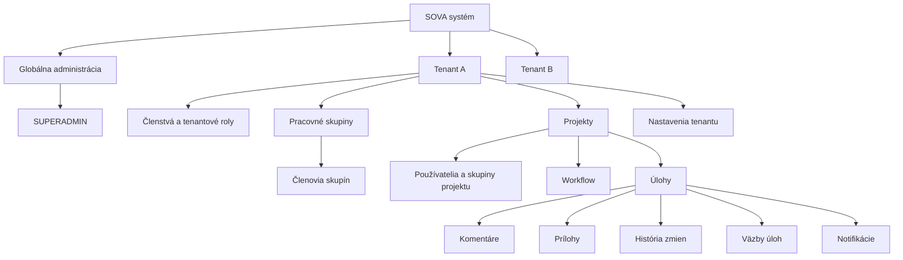

### 4.1 Základné invariancie

- Projekt patrí presne jednému tenantovi.
- Pracovná skupina patrí presne jednému tenantovi.
- Úloha patrí presne jednému projektu a tým aj jednému tenantovi.
- Typ úlohy, stav a workflow patria presne jednému projektu.
- Každý aktívny typ úlohy má práve jedno aktívne publikované workflow.
- Publikovaná verzia workflow je nemenná; zmena sa publikuje ako nová verzia.
- Člen skupiny musí byť aktívnym členom rovnakého tenantu.
- Používateľ alebo skupina priradená k projektu musí patriť rovnakému tenantovi.
- Väzba medzi úlohami nesmie v prvej verzii prepájať rozdielnych tenantov.
- Každý tenant musí mať aspoň jedného aktívneho vlastníka.
- `SUPERADMIN` je systémová rola, nie tenantová rola.

## 5. Používatelia a roly

### 5.1 Navrhované systémové a predvolené roly

| Rola | Rozsah | Hlavná zodpovednosť |
|---|---|---|
| `SUPERADMIN` | Systém | Tenanti, globálne nastavenia, systémový audit |
| `TENANT_OWNER` | Tenant | Úplná zodpovednosť za jeden tenant |
| `TENANT_ADMIN` | Tenant | Členovia, skupiny, projekty a tenantové nastavenia |
| `PROJECT_MANAGER` | Projekt | Nastavenie projektu, členovia, workflow a úlohy |
| `GROUP_MANAGER` | Skupina | Správa členov pracovnej skupiny |
| `MEMBER` | Tenant/projekt | Bežná práca s úlohami |
| `REPORTER` | Projekt | Vytváranie a sledovanie požiadaviek |
| `VIEWER` | Tenant/projekt | Prístup iba na čítanie |

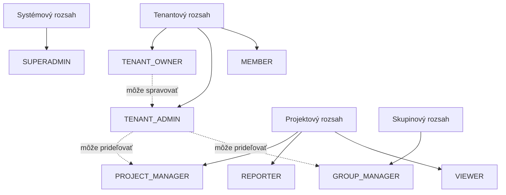

Diagram vyjadruje rozsahy správy, nie dedenie všetkých oprávnení. Efektívne oprávnenia
sa majú vypočítať z rolí priradených používateľovi v konkrétnom kontexte.

### 5.2 Model oprávnení

Backend nemá autorizovať operácie iba porovnaním názvu roly. Rola má byť pomenovanou
sadou konkrétnych oprávnení.

Príklady:

```text
system.tenants.create
system.tenants.suspend
system.audit.view

tenant.settings.manage
tenant.members.view
tenant.members.invite
tenant.members.disable
tenant.roles.manage
tenant.audit.view

group.create
group.update
group.members.manage

project.create
project.settings.manage
project.members.manage
project.archive

issue.view
issue.create
issue.update
issue.assign
issue.transition
issue.delete

comment.create
comment.update_own
comment.moderate
attachment.create
attachment.delete
```

Odporúčania pre prvú verziu:

- povolenia získané z viacerých rolí sa sčítajú,
- explicitné zakazujúce pravidlá sa zatiaľ nepoužijú,
- vlastné tenantové roly možno doplniť po stabilizácii predvolených rolí,
- zmena roly alebo oprávnenia okamžite zneplatní relevantnú autorizačnú cache,
- backend vykoná autorizáciu pri každej chránenej operácii,
- frontend používa oprávnenia iba na skrytie alebo deaktiváciu ovládacích prvkov.

### 5.3 Špeciálne pravidlá pre SUPERADMIN

`SUPERADMIN` môže spravovať tenantov a globálne nastavenia, ale jeho prístup do
tenantového obsahu musí byť kontrolovaný:

- bežná systémová administrácia nemá automaticky zobrazovať obsah úloh,
- vstup do tenantového kontextu musí byť explicitný,
- impersonácia používateľa musí vyžadovať dôvod,
- začiatok a koniec impersonácie sa auditujú,
- používateľ musí na obrazovke jasne vidieť, že impersonácia prebieha,
- citlivé operácie môžu vyžadovať opätovné overenie hesla alebo MFA.

## 6. Funkčné moduly

### 6.1 Identity a autentifikácia

Modul zabezpečí:

- vytvorenie používateľského účtu,
- overenie e-mailovej adresy,
- prihlásenie a odhlásenie,
- obnovu zabudnutého hesla,
- zmenu hesla,
- prehľad a zrušenie aktívnych relácií,
- dočasné obmedzenie prihlasovania po opakovaných neúspechoch,
- deaktiváciu alebo zablokovanie účtu,
- voliteľné MFA, povinné minimálne pre privilegované účty pred produkciou.

Heslá sa budú ukladať pomocou PHP `password_hash()` a `PASSWORD_ARGON2ID`.
Parametre Argon2id sa majú kalibrovať na produkčnom hardvéri. Po úspešnom prihlásení
sa má použiť `password_needs_rehash()`, aby sa starší hash mohol bezpečne aktualizovať.

Pre webovú Angular aplikáciu sa odporúča:

- náhodný nepriehľadný session token,
- uloženie tokenu v `HttpOnly`, `Secure`, `SameSite` cookie,
- serverová evidencia a revokácia relácií,
- CSRF ochrana pri stav meniacich požiadavkách,
- nepoužívať `localStorage` na dlhodobé autentifikačné tokeny.

#### 6.1.1 Stav účtu

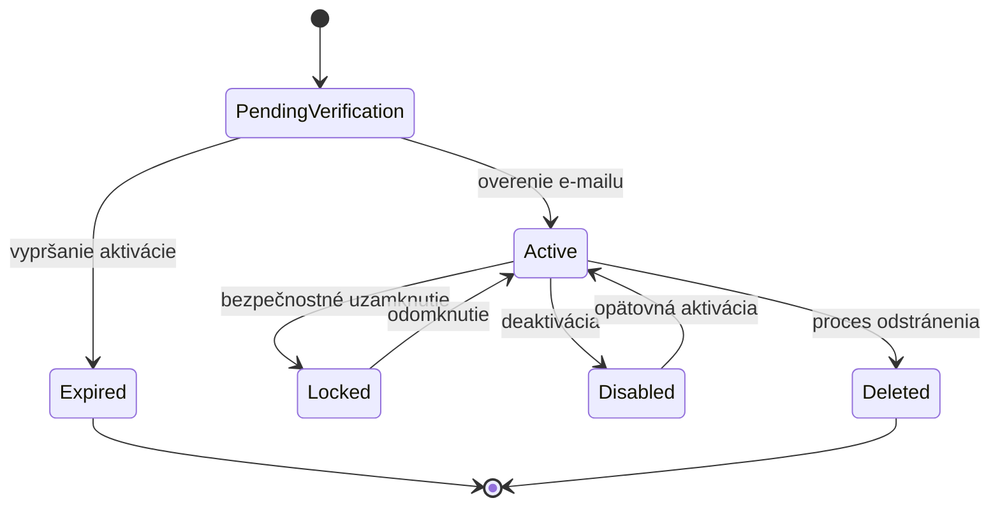

### 6.2 Správa tenantov

`SUPERADMIN` bude môcť:

- vytvoriť tenant,
- určiť prvého vlastníka,
- upraviť názov, slug a systémové limity,
- aktivovať, pozastaviť alebo archivovať tenant,
- prezerať globálne auditné udalosti,
- spustiť export dát,
- spustiť riadený proces odstránenia tenantu.

Navrhované stavy:

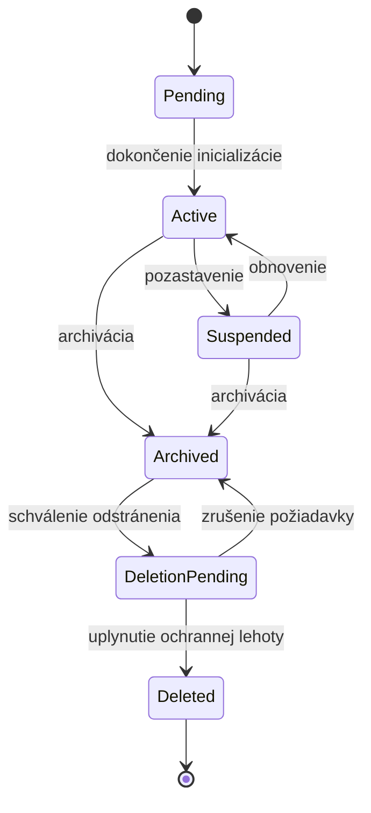

Pozastavenie nesmie okamžite vymazať dáta. Proces odstránenia má mať ochrannú lehotu,
audit a jasne definovanú politiku záloh.

### 6.3 Členstvá a pozvánky

Tenantový administrátor bude môcť:

- pozvať používateľa e-mailom,
- znovu poslať alebo zrušiť pozvánku,
- priradiť tenantové roly,
- pridať člena do pracovných skupín a projektov,
- deaktivovať alebo obnoviť členstvo,
- odstrániť členstvo bez odstránenia historických záznamov.

Pozývací token musí byť:

- kryptograficky náhodný,
- uložený iba ako hash,
- jednorazový,
- časovo obmedzený,
- viazaný na tenant a e-mailovú adresu.

### 6.4 Pracovné skupiny

Pracovná skupina obsahuje:

- názov a voliteľný kód,
- opis,
- stav aktívna/archivovaná,
- vedúceho alebo viacerých manažérov,
- členov,
- zoznam priradených projektov.

Skupina môže byť:

- nositeľom prístupu k projektu,
- predvoleným vlastníkom alebo riešiteľským tímom úlohy,
- filtrom v zoznamoch a reportoch,
- adresátom notifikácie.

V prvej verzii sa neodporúča hierarchické vnáranie skupín. Výrazne by komplikovalo
výpočet oprávnení a členstva.

### 6.5 Projekty

Projekt obsahuje:

- interné ID,
- tenantové ID,
- unikátny kód, napríklad `SOVA`,
- názov a opis,
- stav,
- vedúceho projektu,
- viditeľnosť,
- používateľov a pracovné skupiny,
- dostupné typy úloh,
- stavy, workflow a mapovanie typu na workflow,
- revíziu publikovanej konfigurácie,
- číselný rad úloh.

Odporúčané režimy viditeľnosti:

1. **Tenantový projekt** – viditeľný všetkým členom tenantu podľa ich roly.
2. **Súkromný projekt** – viditeľný iba explicitne priradeným používateľom a skupinám.

Archivovaný projekt je iba na čítanie, ale jeho história zostáva dostupná oprávneným
používateľom.

Každý projekt vlastní svoju konfiguráciu. Systémová alebo tenantová šablóna sa pri
vytvorení projektu skopíruje a jej neskoršia zmena existujúci projekt automaticky
neupraví.

### 6.6 Úlohy a issue tracking

Predvolené typy úloh:

- `TASK` – bežná pracovná úloha,
- `BUG` – chyba alebo regresia,
- `STORY` – používateľská alebo produktová požiadavka,
- `EPIC` – nadradená väčšia téma,
- `SUBTASK` – menšia časť štandardnej úlohy.

Typy nie sú globálny enum. Sú projektové entity a projektový správca môže vytvoriť
vlastný typ, určiť jeho poradie, podporované polia a hierarchickú úroveň `1` (Epic),
`0` (štandardný typ) alebo `-1` (Sub-task). EPIC zostáva úlohou v rovnakej doméne a
tabuľke ako ostatné typy.

Predvolené priority:

- `LOW`,
- `NORMAL`,
- `HIGH`,
- `CRITICAL`.

Základné polia úlohy:

| Pole | Popis |
|---|---|
| ID | Interný UUID identifikátor |
| Kód | Čitateľný identifikátor, napríklad `SOVA-123` |
| Projekt | Projekt, do ktorého úloha patrí |
| Typ | Projektový typ, napríklad task, bug, story, epic alebo sub-task |
| Názov | Stručné pomenovanie |
| Opis | Formátovaný podrobný obsah |
| Stav | Aktuálny stav workflow |
| Priorita | Dôležitosť úlohy |
| Autor | Používateľ, ktorý úlohu vytvoril |
| Riešiteľ | Konkrétny zodpovedný používateľ |
| Skupina | Zodpovedná pracovná skupina |
| Nadradená úloha | Voliteľná hierarchická väzba |
| Termín | Voliteľný dátum dokončenia |
| Odhad | Voliteľný odhad práce |
| Štítky | Jednoduchá kategorizácia |
| Verzia | Hodnota na detekciu súbežných zmien |
| Časy | Vytvorenie, úprava, vyriešenie a uzavretie |

#### 6.6.1 Predvolené workflow

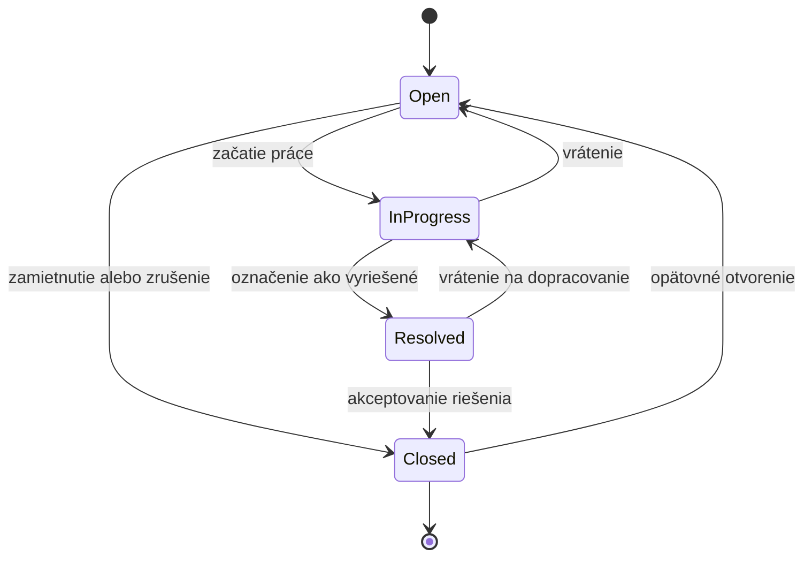

Prechod má definovať:

- zdrojový a cieľový stav,
- požadované oprávnenie,
- voliteľné povinné polia,
- prípadnú validačnú podmienku,
- udalosť zapísanú do histórie.

Projekt môže mať viac workflow a každý aktívny typ úlohy je mapovaný práve na jedno
publikované workflow. Zmeny sa pripravujú v drafte; publikovaná verzia je nemenná.
Publikovanie musí validovať graf, zobraziť dopad a atomicky migrovať existujúce úlohy,
ak sa odstraňuje používaný stav. Úplná špecifikácia je v
[Projektovej konfigurácii typov úloh a workflow](./WORKFLOW-A-TYPY-ULOH.md).

#### 6.6.2 Vytvorenie úlohy

Pri vytváraní úlohy backend:

1. overí aktívnu reláciu,
2. určí a overí tenantový kontext,
3. overí prístup k projektu a oprávnenie `issue.create`,
4. validuje projektový typ úlohy, hierarchiu, riešiteľa a skupinu,
5. načíta mapované publikované workflow a nastaví jeho počiatočný stav,
6. v transakcii atomicky pridelí ďalšie projektové číslo,
7. uloží úlohu a auditnú udalosť,
8. uloží doménovú udalosť do outboxu,
9. po commite nechá worker vytvoriť notifikácie.

#### 6.6.3 Súbežné úpravy

Úloha má obsahovať číslo verzie alebo čas poslednej zmeny. Klient pri úprave pošle
očakávanú verziu. Ak už niekto medzitým úlohu zmenil, API vráti konflikt a neprepíše
novšie dáta.

### 6.7 Komentáre, zmienky a história

Komentár obsahuje autora, text, čas vytvorenia a úpravy. Bežný používateľ môže upraviť
vlastný komentár v definovanom časovom okne; moderátor podľa osobitného oprávnenia.

História úlohy zachytáva minimálne:

- vytvorenie,
- zmenu názvu alebo opisu,
- zmenu stavu,
- zmenu priority,
- zmenu riešiteľa alebo skupiny,
- zmenu termínu,
- pridanie alebo odstránenie prílohy,
- vytvorenie alebo úpravu komentára,
- vytvorenie väzby s inou úlohou.

História a bezpečnostný audit nie sú totožné:

- história slúži používateľom na pochopenie vývoja úlohy,
- audit slúži na bezpečnosť, dohľadateľnosť a administráciu.

### 6.8 Prílohy

Obsah príloh sa nemá ukladať priamo do relačnej databázy. Databáza uloží:

- tenantové a objektové ID,
- pôvodný a interný názov,
- MIME typ,
- veľkosť,
- kontrolný súčet,
- identifikátor súboru v úložisku,
- autora a čas nahratia,
- výsledok bezpečnostného skenovania.

Súbory majú byť v privátnom objektovom úložisku. Stiahnutie musí prejsť autorizáciou
alebo použiť krátkodobú podpísanú URL.

### 6.9 Väzby medzi úlohami

Podporované typy väzieb môžu byť:

- blokuje / je blokovaná,
- súvisí s,
- duplikuje / je duplikovaná,
- nadradená / podradená.

Väzba musí byť konzistentná v oboch smeroch. V prvej verzii je vhodné povoliť väzby
iba v rámci jedného tenantu.

### 6.10 Vyhľadávanie a filtre

Rozšírené vyhľadávanie používa bezpečný Jira-like doménový jazyk `SovaQL`. Podporuje
rovnakú podmienku v textovom editore aj vo vizuálnom filter builderi, serverovú
validáciu, stabilné zoradenie a cursor stránkovanie. Jazyk sa nikdy nevykonáva ako
SQL; backend ho parsuje do typovaného AST a kombinuje s neodstrániteľným tenantovým
a autorizačným rozsahom.

Počiatočné polia:

- projekt,
- stav,
- typ,
- priorita,
- autor,
- riešiteľ,
- pracovná skupina,
- štítok,
- termín,
- dátum vytvorenia alebo zmeny,
- text v názve a opise.

Pre MVP postačuje PostgreSQL fulltext a vhodné databázové indexy. Samostatný
vyhľadávací systém má význam až po reálnom meraní objemu a výkonu.

Používateľ môže platný dotaz uložiť, kopírovať, označiť ako obľúbený a podľa
oprávnenia explicitne zdieľať členom alebo pracovným skupinám. Zdieľaný dotaz
neudeľuje prístup k úlohám. Uložený dotaz je opakovane použiteľný zdroj
dashboardových widgetov.

Každý používateľ môže mať v tenantovi viac osobných dashboardov, prepínať ich,
určiť predvolený dashboard a skladať ich z aplikáciou registrovaných widgetov.
Úplná syntax, UX, dátový model, API, bezpečnostné pravidlá a akceptačné kritériá sú v
[špecifikácii SovaQL a dashboardov](./SOVAQL-A-DASHBOARDY.md).

### 6.11 Notifikácie

Prvá verzia má podporovať:

- notifikácie v aplikácii,
- e-mailové notifikácie,
- prečítaný/neprečítaný stav,
- používateľské nastavenia pre typy udalostí.

Typické udalosti:

- pridelenie úlohy,
- zmienka v komentári,
- zmena stavu sledovanej úlohy,
- nový komentár,
- blížiaci sa alebo prekročený termín,
- prijatie pozvánky do tenantu.

Notifikácie sa spracujú asynchrónne. Výpadok e-mailovej služby nesmie zrušiť úspešnú
zmenu úlohy.

### 6.12 Audit

Auditná udalosť obsahuje:

- čas udalosti,
- používateľa alebo systémového aktéra,
- tenantový kontext,
- typ a ID objektu,
- názov operácie,
- relevantné pôvodné a nové hodnoty,
- IP adresu,
- user agent,
- correlation ID požiadavky,
- výsledok operácie.

Do auditu ani aplikačných logov sa nesmú zapísať:

- heslá a ich hashe,
- session tokeny,
- resetovacie a pozývacie tokeny,
- celé autorizačné hlavičky,
- tajné integračné kľúče.

## 7. Multitenantný návrh

### 7.1 Odporúčaný model

Pre prvú verziu sa odporúča:

- PostgreSQL,
- spoločná databáza a spoločná schéma,
- `tenant_id` v každej tenantovej tabuľke,
- viacvrstvová kontrola tenantového kontextu,
- PostgreSQL Row-Level Security tam, kde je praktická,
- tenantové ID v cache kľúčoch, joboch, súboroch a audite.

Výhody:

- jednoduchšie migrácie,
- nižšie prevádzkové náklady,
- jednoduchšie transakcie a reportovanie,
- vhodné pre počiatočnú a strednú veľkosť systému.

Nevýhodou je potreba mimoriadne dôslednej izolácie. Kritické pravidlá preto nemajú
zostať iba v controllery.

### 7.2 Vrstvy ochrany

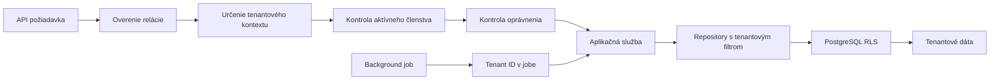

### 7.3 Pravidlá implementácie

- Tenantové ID neprijímať ako dôveryhodný údaj bez overenia členstva.
- Každý tenantový repository call musí vyžadovať tenantový kontext.
- Cudzie kľúče majú zabrániť väzbám objektov z rôznych tenantov.
- Unikátne obmedzenia majú často obsahovať `tenant_id`.
- Cache kľúč musí obsahovať tenantové ID.
- Každý queue job musí niesť tenantové ID a overiteľný typ operácie.
- Export, import a mazanie dát musia byť vykonané výhradne v tenantovom rozsahu.
- Testy musia cielene skúšať prístup tenantu A k identifikátorom tenantu B.

### 7.4 Alternatíva pre budúcnosť

Samostatná databáza alebo schéma pre tenanta môže byť neskôr ponúknutá enterprise
zákazníkom. Vyžaduje však:

- orchestráciu migrácií cez všetky databázy,
- samostatné connection pooly,
- zložitejšie zálohy,
- komplikovanejší globálny reporting,
- náročnejší monitoring.

Nemá sa zaviesť bez konkrétnej obchodnej alebo regulačnej požiadavky.

## 8. Navrhovaná technická architektúra

Systém sa odporúča implementovať ako modulárny monolit s oddeleným webovým klientom,
API procesom a background workerom.

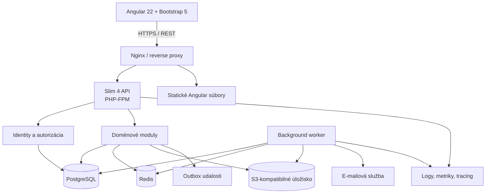

### 8.1 Prečo modulárny monolit

- jednoduchšie konzistentné databázové transakcie,
- jednoduchšie lokálne prostredie,
- menšia prevádzková záťaž,
- jednoduchšie refaktoringy počas vývoja domény,
- jasné modulové hranice umožnia neskoršie oddelenie vybraných služieb.

Mikroservisy by v tejto fáze priniesli distribuované transakcie, komplikovanejšiu
autentifikáciu, monitoring a nasadenie bez preukázaného prínosu.

## 9. Backend

### 9.1 Navrhovaná štruktúra

```text
backend/
├── bin/
│   ├── console
│   └── worker
├── config/
│   ├── container.php
│   ├── middleware.php
│   ├── routes.php
│   └── settings.php
├── migrations/
├── public/
│   └── index.php
├── src/
│   ├── Identity/
│   ├── Tenancy/
│   ├── Authorization/
│   ├── Workgroups/
│   ├── Projects/
│   ├── Issues/
│   ├── Notifications/
│   ├── Audit/
│   └── Shared/
└── tests/
    ├── Unit/
    ├── Integration/
    └── Api/
```

Každý doménový modul môže obsahovať:

```text
Module/
├── Application/
│   ├── Command/
│   ├── Query/
│   ├── DTO/
│   └── Service/
├── Domain/
│   ├── Entity/
│   ├── ValueObject/
│   ├── Event/
│   └── Repository/
├── Infrastructure/
│   ├── Persistence/
│   └── Integration/
└── Presentation/
    └── Http/
```

Nie je potrebné mechanicky vytvárať každú zložku pre každý malý modul. Hranice majú
pomáhať orientácii a testovateľnosti, nie vytvárať prázdnu abstrakciu.

### 9.2 Spracovanie API požiadavky

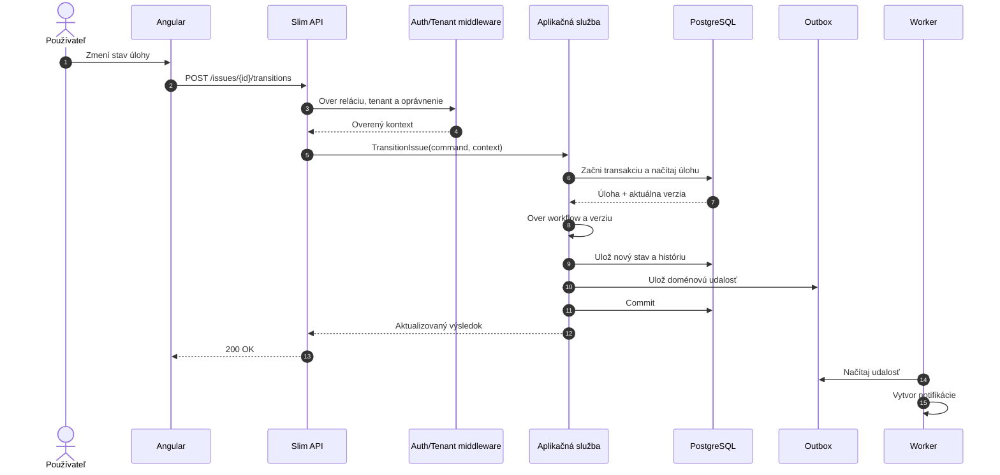

### 9.3 Zásady backendu

- Route handler má byť tenký.
- Validácia vstupu patrí na hranicu aplikácie.
- Autorizačné rozhodnutia vykonáva centrálna služba.
- SQL nesmie byť roztrúsené v HTTP controllery.
- Use-case, ktorý mení viac záznamov, používa transakciu.
- Doménové udalosti sa publikujú spoľahlivo cez transactional outbox.
- Časy sa ukladajú v UTC.
- Verejné ID nemá odhaľovať počet globálnych záznamov.
- Konfigurácia a secrets sa neukladajú do Git repozitára.

### 9.4 API konvencie

- základný prefix `/api/v1`,
- JSON ako hlavný formát,
- OpenAPI ako zdroj kontraktu,
- konzistentné chybové odpovede podľa Problem Details,
- cursor alebo offset stránkovanie podľa konkrétneho zoznamu,
- explicitné povolené filtre a triedenie,
- maximálna veľkosť stránky,
- correlation ID pre každú požiadavku,
- idempotency key pre vybrané kritické vytváracie operácie,
- optimistické zamykanie cez verziu alebo `ETag`.

Príklady endpointov:

```text
POST   /api/v1/auth/login
POST   /api/v1/auth/logout
POST   /api/v1/auth/password/forgot
POST   /api/v1/auth/password/reset
GET    /api/v1/auth/sessions
DELETE /api/v1/auth/sessions/{sessionId}

GET    /api/v1/tenants
POST   /api/v1/system/tenants
PATCH  /api/v1/system/tenants/{tenantId}

GET    /api/v1/tenants/{tenantId}/members
POST   /api/v1/tenants/{tenantId}/invitations
PATCH  /api/v1/tenants/{tenantId}/members/{memberId}

GET    /api/v1/tenants/{tenantId}/workgroups
POST   /api/v1/tenants/{tenantId}/workgroups

GET    /api/v1/tenants/{tenantId}/projects
POST   /api/v1/tenants/{tenantId}/projects

GET    /api/v1/tenants/{tenantId}/projects/{projectId}/issues
POST   /api/v1/tenants/{tenantId}/projects/{projectId}/issues
GET    /api/v1/tenants/{tenantId}/issues/{issueId}
PATCH  /api/v1/tenants/{tenantId}/issues/{issueId}
POST   /api/v1/tenants/{tenantId}/issues/{issueId}/transitions
POST   /api/v1/tenants/{tenantId}/issues/{issueId}/comments
POST   /api/v1/tenants/{tenantId}/issues/{issueId}/attachments
```

### 9.5 HTTP odpovede

Odporúčané používanie stavov:

| Stav | Použitie |
|---|---|
| `200` | Úspešné čítanie alebo úprava |
| `201` | Vytvorenie zdroja |
| `204` | Úspešná operácia bez tela odpovede |
| `400` | Neplatný formát požiadavky |
| `401` | Chýbajúca alebo neplatná autentifikácia |
| `403` | Používateľ nemá oprávnenie |
| `404` | Zdroj neexistuje alebo nemá byť odhalený |
| `409` | Konflikt verzie alebo unikátneho údaja |
| `422` | Sémanticky neplatné vstupné údaje |
| `429` | Prekročený rate limit |

## 10. Frontend

### 10.1 Navrhovaná štruktúra

```text
frontend/src/app/
├── core/
│   ├── api/
│   ├── auth/
│   ├── tenant-context/
│   ├── error-handling/
│   └── layout/
├── shared/
│   ├── components/
│   ├── directives/
│   ├── forms/
│   └── utilities/
└── features/
    ├── authentication/
    ├── tenant-selection/
    ├── system-admin/
    ├── tenant-admin/
    ├── workgroups/
    ├── projects/
    ├── issues/
    └── notifications/
```

### 10.2 Angular zásady

- standalone komponenty,
- lazy loading funkčných oblastí,
- typed reactive forms,
- signals pre lokálny a odvodený stav,
- RxJS pre asynchrónne dátové toky,
- typovaný API klient generovaný z OpenAPI,
- centrálne spracovanie HTTP chýb,
- route guards pre používateľský komfort, nie ako náhrada backendovej autorizácie,
- zdieľané Bootstrap komponenty namiesto kopírovania HTML,
- responzívnosť od začiatku,
- prístupnosť minimálne WCAG 2.2 AA,
- pripravenosť na lokalizáciu.

Globálny state manager sa nemá zavádzať automaticky. Ak sa ukáže potreba komplexného
zdieľaného stavu, môže sa doplniť až na základe konkrétnych scenárov.

### 10.3 Navrhované trasy

```text
/login
/forgot-password
/select-tenant

/t/:tenantSlug/dashboard
/t/:tenantSlug/dashboards
/t/:tenantSlug/dashboards/:dashboardId
/t/:tenantSlug/projects
/t/:tenantSlug/projects/:projectKey
/t/:tenantSlug/issues/:issueKey
/t/:tenantSlug/workgroups
/t/:tenantSlug/admin

/system/tenants
/system/audit
/system/settings
```

### 10.4 Hlavné obrazovky

- prihlásenie a obnova hesla,
- výber aktívneho tenantu,
- osobné tenantové dashboardy a ich správa,
- zoznam projektov,
- detail a nastavenia projektu,
- tabuľkový zoznam úloh,
- Kanban pohľad,
- detail úlohy s históriou,
- pracovné skupiny,
- členovia, roly a pozvánky,
- tenantová administrácia,
- samostatná systémová administrácia.

## 11. Dátový model

Nasledujúci diagram zobrazuje jadro dátového modelu. Audit, relácie, notifikácie a
niektoré pomocné tabuľky sú kvôli čitateľnosti zjednodušené.

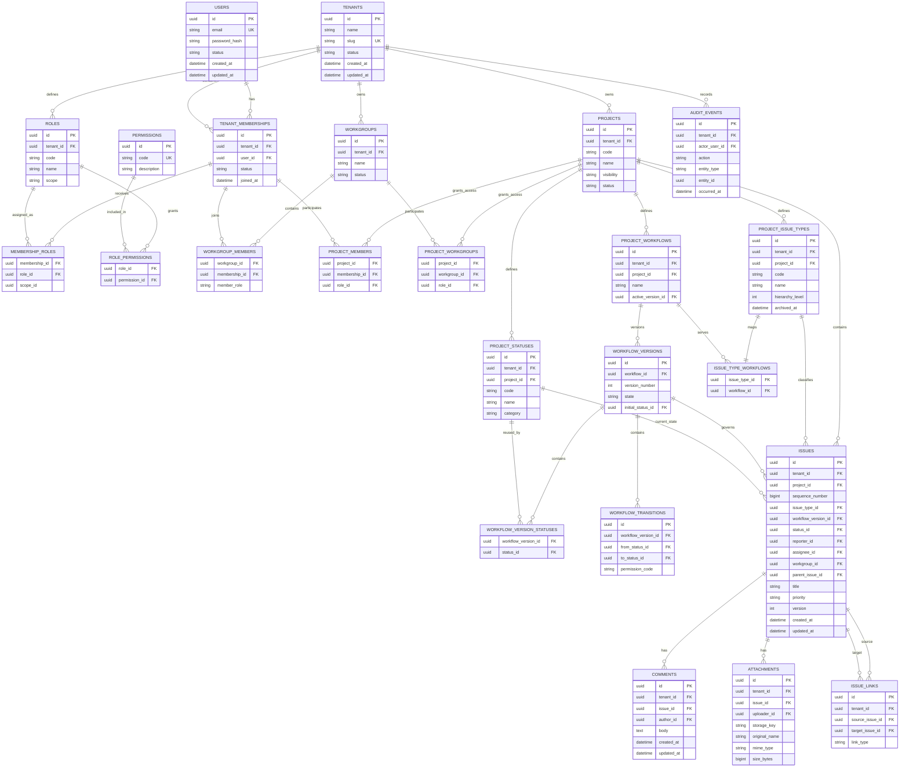

### 11.1 Databázové zásady

- Použiť databázové migrácie; ručné zásahy do produkčnej schémy nie sú štandardný
  spôsob zmeny.
- Verejné entity identifikovať UUID, ideálne časovo zoraditeľným variantom.
- Projektový kód úlohy skladať z kódu projektu a atomického poradového čísla.
- Tenantové unikátne obmedzenia majú obsahovať `tenant_id`.
- Cudzie kľúče a kompozitné obmedzenia majú chrániť tenantovú integritu.
- Konfiguračné väzby typov, stavov a workflow majú kompozitne chrániť aj
  `project_id`; samotné UUID nesmie umožniť cross-project referenciu.
- Publikované verzie workflow sú nemenné a použitá konfigurácia sa archivuje namiesto
  fyzického odstránenia.
- Indexovať stĺpce používané na tenantové filtrovanie a bežné vyhľadávanie.
- Soft delete používať iba tam, kde je potrebná obnova alebo historická referencia.
- Auditné udalosti majú byť append-only.

## 12. Bezpečnosť

### 12.1 Autentifikácia

- Argon2id a pravidelná kontrola potreby rehashu.
- Jednotná chyba pri nesprávnom e-maile aj hesle, aby sa neodhaľovali účty.
- Rate limiting podľa účtu aj IP adresy.
- Bezpečné jednorazové tokeny pre reset hesla a pozvánky.
- Zrušenie všetkých relácií po bezpečnostne významnej zmene.
- MFA minimálne pre systémových administrátorov.

### 12.2 Webová a API bezpečnosť

- TLS,
- úzky CORS whitelist,
- CSRF ochrana pri cookie autentifikácii,
- parametrizované databázové dotazy,
- validácia a normalizácia vstupov,
- bezpečné renderovanie a sanitizácia formátovaného obsahu,
- Content Security Policy,
- ochranné HTTP hlavičky,
- obmedzenie veľkosti requestov,
- kontrola typu a obsahu príloh,
- zákaz otvoreného presmerovania,
- bezpečné chybové odpovede bez stack trace v produkcii.

### 12.3 Secrets

Secrets sa nesmú ukladať do repozitára. Patria sem:

- databázové heslá,
- SMTP prihlasovacie údaje,
- aplikačné kľúče,
- integračné tokeny,
- kľúče objektového úložiska.

Produkcia má používať správcu secrets alebo bezpečne injektované environment
premenné. Logy nesmú vypisovať celé prostredie.

### 12.4 Najkritickejšie bezpečnostné testy

1. Používateľ tenantu A skúsi načítať objekt tenantu B cez známe UUID.
2. Používateľ bez projektového prístupu skúsi použiť priamy API endpoint.
3. Deaktivovaný člen skúsi pokračovať so starou reláciou.
4. Používateľ skúsi priradiť k úlohe člena iného tenantu.
5. Background job sa spustí bez tenantového kontextu.
6. Používateľ zmení verziu alebo stav úlohy mimo povoleného workflow.
7. Nahraná príloha obsahuje spustiteľný alebo škodlivý obsah.
8. `SUPERADMIN` začne impersonáciu bez povinného dôvodu alebo auditu.

## 13. Nefunkčné požiadavky

### 13.1 Výkon

Počiatočné ciele, ktoré treba potvrdiť meraním:

- bežné API čítanie do 300 ms na 95. percentile bez externých služieb,
- bežná zmena do 500 ms na 95. percentile,
- stránkované zoznamy s pevne obmedzenou veľkosťou,
- dlhé exporty, e-maily a spracovanie súborov asynchrónne,
- žiadne N+1 databázové dotazy v hlavných zoznamoch.

### 13.2 Dostupnosť a odolnosť

- health endpointy pre API a worker,
- timeouty externých volaní,
- opakovanie dočasne neúspešných jobov s limitom,
- dead-letter evidencia pre trvalo chybné joby,
- graceful shutdown workerov,
- idempotentné spracovanie udalostí.

### 13.3 Prístupnosť

- ovládanie klávesnicou,
- viditeľný focus,
- správne labely formulárov,
- zrozumiteľné validačné chyby,
- dostatočný kontrast,
- stav nevyjadrovať iba farbou,
- primeraná podpora čítačiek obrazovky.

### 13.4 Lokalizácia a čas

- texty frontendu nepripájať natvrdo k doménovej logike,
- pripraviť minimálne slovenčinu a angličtinu, ak sa potvrdí medzinárodné použitie,
- časy ukladať v UTC,
- zobrazovať ich v časovej zóne používateľa,
- dátumové formáty riešiť podľa locale.

## 14. Testovacia stratégia

### 14.1 Testovacia pyramída

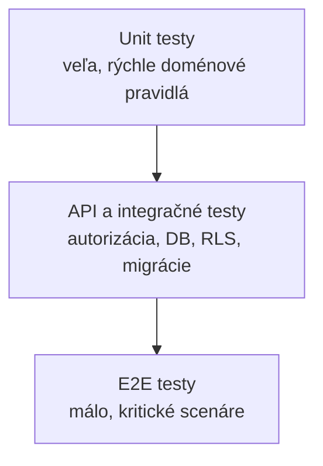

### 14.2 Backend

- PHPUnit pre unit a integračné testy,
- testy doménových pravidiel bez HTTP vrstvy,
- integračné testy repositories a transakcií,
- API testy autentifikácie, validácie a oprávnení,
- testy PostgreSQL RLS a tenantovej izolácie,
- testy databázových migrácií na čistej aj existujúcej databáze,
- PHPStan na vysokej úrovni,
- automatická kontrola formátovania podľa PSR-12.

### 14.3 Frontend

- unit testy služieb a pomocných funkcií,
- komponentové testy formulárov a chybových stavov,
- integračné testy navigácie a tenantového kontextu,
- E2E testy kritických používateľských ciest,
- automatizované kontroly prístupnosti.

### 14.4 Povinné end-to-end scenáre

1. Pozvanie nového používateľa a prijatie členstva.
2. Prihlásenie, výber tenantu a odhlásenie.
3. Obnova zabudnutého hesla.
4. Vytvorenie skupiny, projektu a pridelenie členov.
5. Vytvorenie úlohy a prechod cez celé workflow.
6. Komentár, zmienka, príloha a notifikácia.
7. Zamietnutie nepovolenej operácie.
8. Konflikt dvoch súbežných úprav.
9. Izolácia dvoch tenantov.
10. Pozastavenie tenantu a následné obnovenie.

## 15. Pozorovateľnosť a audit prevádzky

### 15.1 Logovanie

Použiť štruktúrované JSON logy s poľami:

- timestamp,
- severity,
- environment,
- service,
- correlation ID,
- tenant ID, ak je dostupné,
- user ID, ak je dostupné,
- route alebo job type,
- trvanie,
- výsledok,
- bezpečne spracovaná chyba.

### 15.2 Metriky

Sledovať minimálne:

- počet a trvanie API požiadaviek,
- chybovosť podľa endpointu,
- počet neúspešných prihlásení,
- veľkosť a vek job fronty,
- úspešnosť odosielania e-mailov,
- databázové spojenia a pomalé dotazy,
- využitie CPU, pamäte a disku,
- počet aktívnych tenantov a používateľov bez ukladania citlivého obsahu do metrík.

### 15.3 Alerty

Alert má existovať aspoň pre:

- nedostupné API,
- nedostupnú databázu,
- narastajúcu frontu,
- vysokú chybovosť,
- zlyhanie zálohy,
- nedostatok diskového priestoru,
- nezvyčajný počet neúspešných prihlásení.

## 16. Nasadenie

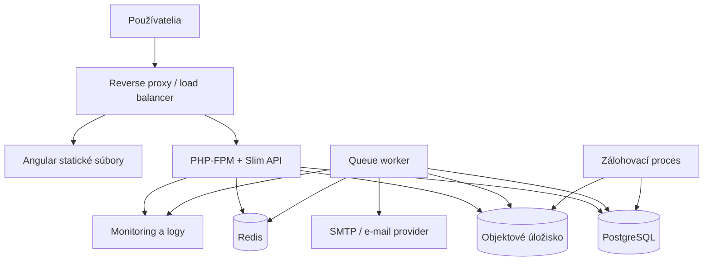

### 16.1 Prostredia

- **Local development** – rýchle lokálne spustenie všetkých závislostí.
- **CI** – izolované zostavenie, testy a kontrola migrácií.
- **Staging** – konfiguráciou čo najbližšie produkcii, bez produkčných secrets.
- **Production** – riadené nasadenie, monitoring, zálohy a obmedzený prístup.

### 16.2 Databázové migrácie pri nasadení

- migrácie musia byť verzované,
- pred nasadením sa otestujú na realistickej kópii schémy,
- pri veľkých tabuľkách sa majú navrhovať tak, aby zbytočne neblokovali prevádzku,
- aplikácia a migrácia majú byť počas rolling nasadenia dočasne kompatibilné,
- rollback aplikácie sa nesmie spoliehať na deštruktívne vrátenie dátovej migrácie.

### 16.3 Zálohovanie

Je potrebné definovať:

- frekvenciu databázových záloh,
- zálohu objektového úložiska,
- retention politiku,
- šifrovanie záloh,
- oddelenie záloh od produkčného účtu,
- Recovery Point Objective,
- Recovery Time Objective,
- pravidelný test obnovy.

Samotná existencia záložného súboru nestačí. Obnova musí byť pravidelne overená.

## 17. CI/CD

```mermaid
flowchart LR
    Commit["Commit / pull request"] --> Format["Formátovanie a lint"]
    Format --> Static["Statická analýza"]
    Static --> Unit["Unit testy"]
    Unit --> Integration["Integračné a API testy"]
    Integration --> Frontend["Frontend testy a build"]
    Frontend --> Security["Kontrola závislostí"]
    Security --> Artifact["Verzovaný artefakt / image"]
    Artifact --> Staging["Nasadenie na staging"]
    Staging --> Smoke["Smoke a E2E testy"]
    Smoke --> Approval["Schválenie produkcie"]
    Approval --> Production["Produkčné nasadenie"]
    Production --> Verify["Health check a monitoring"]
```

Každý release má byť spätne dohľadateľný ku konkrétnemu commitu, migráciám a výsledkom
testov.

## 18. Realizačný plán

```mermaid
flowchart LR
    F0["Fáza 0<br/>Produktové rozhodnutia"] --> F1["Fáza 1<br/>Technický základ"]
    F1 --> F2["Fáza 2<br/>Identity a tenancy"]
    F2 --> F3["Fáza 3<br/>Roly a administrácia"]
    F3 --> F4["Fáza 4<br/>Skupiny a projekty"]
    F4 --> F5["Fáza 5<br/>Úlohy a workflow"]
    F5 --> F6["Fáza 6<br/>Spolupráca"]
    F6 --> F7["Fáza 7<br/>Kompletné UI"]
    F7 --> F8["Fáza 8<br/>Stabilizácia"]
    F8 --> F9["Fáza 9<br/>Pilot a produkcia"]
    F9 --> F10["Fáza 10<br/>Prevádzka a rozvoj"]
```

### 18.1 Fáza 0 – Produktové rozhodnutia

Výstupy:

- potvrdený rozsah MVP,
- aktéri a používateľské scenáre,
- akceptačné kritériá,
- rozhodnutie o registrácii a pozvánkach,
- model rolí a oprávnení,
- pravidlá viditeľnosti projektov,
- pravidlá projektových typov, hierarchie a workflow,
- architektonické rozhodnutia,
- prvý ER a OpenAPI návrh.

### 18.2 Fáza 1 – Technický základ

Výstupy:

- inicializovaný Composer/Slim backend,
- inicializovaný Angular frontend,
- lokálne prostredie,
- konfigurácia a DI container,
- PostgreSQL a migrácie,
- error handling a logovanie,
- testovacie frameworky,
- základ CI pipeline,
- OpenAPI skeleton.

### 18.3 Fáza 2 – Identity a tenancy

Výstupy:

- používateľské účty,
- Argon2id heslá,
- relácie,
- prihlásenie a odhlásenie,
- obnova hesla,
- tenanty,
- členstvá,
- pozvánky,
- výber tenantového kontextu,
- prvé testy tenantovej izolácie.

### 18.4 Fáza 3 – Oprávnenia a administrácia

Výstupy:

- permission katalóg,
- predvolené roly,
- centrálna autorizačná služba,
- systémová rola `SUPERADMIN`,
- tenantová administrácia,
- systémová administrácia,
- bezpečnostný audit,
- ochrana posledného vlastníka tenantu.

### 18.5 Fáza 4 – Skupiny a projekty

Výstupy:

- pracovné skupiny,
- členstvo a správa skupín,
- projekty,
- viditeľnosť projektov,
- projektoví členovia a skupiny,
- projektové roly,
- archivácia projektu.

### 18.6 Fáza 5 – Úlohy a workflow

Výstupy:

- projektové typy a priority,
- hierarchia Epic → štandardná úloha → Sub-task,
- vytvorenie, čítanie a úprava úloh,
- atomický projektový číselný rad,
- riešiteľ a zodpovedná skupina,
- verzované workflow, stavy a prechody,
- mapovanie typu na workflow,
- draft, validácia dopadu, publikovanie a migrácia konfigurácie,
- história,
- SovaQL parser, autorizované vyhľadávanie a cursor stránkovanie,
- ochrana pred súbežným prepisom.

### 18.7 Fáza 6 – Spolupráca

Výstupy:

- komentáre,
- zmienky,
- sledovatelia,
- prílohy,
- väzby úloh,
- in-app notifikácie,
- e-mailové notifikácie,
- outbox a worker.

### 18.8 Fáza 7 – Kompletné používateľské rozhranie

Výstupy:

- uložené a zdieľateľné SovaQL dotazy,
- správa viacerých osobných dashboardov,
- skladateľný layout a základné query-backed widgety,
- zoznam a detail projektu,
- tabuľkový a Kanban pohľad úloh,
- detail úlohy s históriou,
- administračné obrazovky,
- responzívnosť,
- prístupnosť,
- jednotné chybové a načítavacie stavy.

### 18.9 Fáza 8 – Stabilizácia

Výstupy:

- kompletné integračné a E2E testy,
- bezpečnostná revízia,
- výkonnostné testy,
- kontrola tenantovej izolácie,
- optimalizácia indexov a dotazov,
- zálohovanie a úspešný test obnovy,
- používateľská a prevádzková dokumentácia.

### 18.10 Fáza 9 – Pilot a produkcia

Výstupy:

- staging nasadenie,
- pilotný tenant,
- spracovaná spätná väzba,
- vyriešené kritické chyby,
- produkčné nasadenie,
- monitoring a alerty,
- incidentný a rollback postup.

### 18.11 Fáza 10 – Prevádzka a rozvoj

Výstupy:

- pravidelné aktualizácie závislostí,
- vyhodnocovanie metrík a výkonu,
- obnova zo záloh v pravidelných intervaloch,
- plán ďalších modulov podľa reálneho používania,
- revízia oprávnení, auditov a bezpečnostných udalostí.

## 19. Rozsah MVP

### 19.1 Povinné pre MVP

- autentifikácia a obnova hesla,
- bezpečné relácie,
- tenanti a členstvá,
- pozvánky,
- `SUPERADMIN`,
- tenantové roly a oprávnenia,
- pracovné skupiny,
- projekty a ich prístup,
- úlohy, projektové typy a konfigurovateľné workflow,
- komentáre a história,
- základné prílohy,
- SovaQL vyhľadávanie, uložené filtre, osobné dashboardy a widgety,
- in-app a základné e-mailové notifikácie,
- systémová a tenantová administrácia,
- audit,
- tenantová izolácia,
- CI/CD, monitoring a zálohy.

### 19.2 Odložené funkcie

- grafický drag-and-drop workflow editor; formulárová alebo tabuľková konfigurácia je
  povinná už v MVP,
- vlastné polia a obrazovkové schémy,
- sprinty, backlog a velocity reporty,
- automatizačné pravidlá,
- SLA a eskalácie,
- GitHub/GitLab integrácie,
- SSO cez externého poskytovateľa,
- verejné API tokeny,
- webhooks,
- billing a plány,
- mobilná aplikácia,
- databáza na tenanta,
- pokročilý analytický modul.

## 20. Akceptačné kritériá MVP

MVP možno považovať za pripravené na pilot, keď:

1. nový tenant možno vytvoriť a bezpečne inicializovať,
2. vlastník môže pozvať používateľov a priradiť im roly,
3. tenant môže vytvoriť skupiny a projekty,
4. oprávnený používateľ môže vytvoriť, priradiť a dokončiť úlohu,
5. nepovolený používateľ nedokáže operáciu vykonať priamo cez API,
6. dáta rozdielnych tenantov sú izolované vo všetkých kritických scenároch,
7. história a audit zaznamenávajú požadované operácie,
8. používateľ môže uložiť SovaQL dotaz a použiť ho vo vlastnom dashboardovom
   widgete,
9. používateľ môže vytvoriť viac osobných dashboardov a bezpečne medzi nimi
   prepínať,
10. komentáre, prílohy a notifikácie fungujú bez blokovania hlavnej transakcie,
11. súbežná úprava neprepíše novšie dáta bez upozornenia,
12. systém je nasaditeľný opakovateľným procesom,
13. monitoring rozpozná nedostupnosť API, databázy a workerov,
14. databázu a prílohy je možné obnoviť z otestovanej zálohy,
15. kritické používateľské cesty prechádzajú automatizovanými testami,
16. nie sú otvorené známe kritické bezpečnostné chyby.

## 21. Definition of Done

Funkcia je dokončená, keď:

- má potvrdené akceptačné kritériá,
- rešpektuje tenantový a autorizačný model,
- má implementovaný backend aj potrebné UI,
- má relevantné unit a integračné testy,
- API zmena je v OpenAPI,
- databázová zmena má migráciu,
- chyba a prázdny stav majú zmysluplné UI,
- bezpečnostne významná operácia má audit,
- logy neobsahujú citlivé dáta,
- statická analýza, testy a build prejdú,
- používateľská alebo technická dokumentácia je aktualizovaná,
- zmena je overená v staging prostredí.

## 22. Riziká a mitigácie

| Riziko | Dopad | Mitigácia |
|---|---|---|
| Príliš široký rozsah podobný Jire | Dlhý vývoj bez použiteľného výsledku | Uzavrieť MVP a odkladať pokročilé funkcie |
| Únik dát medzi tenantmi | Kritický bezpečnostný incident | Tenant context, repository filtre, RLS, FK a izolované testy |
| Roly natvrdo v controllery | Nekonzistentná autorizácia | Centrálna permission služba |
| Neauditovaný SUPERADMIN | Strata dôvery a dohľadateľnosti | Explicitný vstup do tenantu a audit impersonácie |
| JWT alebo tokeny v localStorage | Zvýšený dopad XSS | HttpOnly cookie a revokovateľné relácie |
| E-mail v hlavnej transakcii | Pomalé alebo zlyhávajúce operácie | Transactional outbox a worker |
| Súbory v databáze | Rast DB a komplikované zálohy | Objektové úložisko a metadáta v DB |
| Predčasné mikroservisy | Vysoká prevádzková zložitosť | Modulárny monolit |
| Neobmedzené zoznamy | Výkonové problémy | Povinné stránkovanie a indexy |
| Súbežné prepísanie úlohy | Strata zmien | Optimistické zamykanie |
| Záloha bez testu obnovy | Falošný pocit bezpečia | Pravidelné restore testy |
| Nejasný význam pracovnej skupiny | Nekonzistentné oprávnenia a priraďovanie | Definovať skupinu pred návrhom DB a API |

## 23. Otvorené produktové rozhodnutia

Pred implementáciou dotknutých modulov je potrebné rozhodnúť:

1. Bude registrácia verejná alebo bude účet vznikať iba cez pozvánku?
2. Môže používateľ patriť do viacerých tenantov? Odporúčanie: áno.
3. Má tenant vlastného `TENANT_OWNER`, alebo iba administrátorov?
4. Môže `SUPERADMIN` čítať obsah tenantových úloh?
5. Je impersonácia požadovaná už v MVP?
6. Budú projekty tenantovo verejné, súkromné alebo oba typy?
7. Sú pracovné skupiny nositeľom oprávnení alebo iba organizačnou jednotkou?
8. Môže mať úloha súčasne zodpovednú skupinu aj konkrétneho riešiteľa?
9. Majú byť priority pevné, projektovo konfigurovateľné alebo tenantové šablóny?
10. Bude opis a komentár používať Markdown alebo WYSIWYG editor?
11. Aké typy a maximálne veľkosti príloh sú povolené?
12. Aká je retention politika auditov, odstránených účtov a tenantov?
13. Má byť systém dostupný v slovenčine aj angličtine?
14. Bude SOVA verejný SaaS alebo interná/on-premise aplikácia?
15. Aké objemy používateľov, tenantov, projektov a úloh sa očakávajú?
16. Aké sú požadované RPO, RTO a dostupnosť?
17. Ktorý e-mailový a objektový storage provider sa použije?

Rozhodnutia o workflow a typoch úloh sú uzavreté: oba sú konfigurovateľné na úrovni
projektu podľa [samostatnej implementačnej špecifikácie](./WORKFLOW-A-TYPY-ULOH.md).

## 24. Odporúčané architektonické rozhodnutia

V `docs/adr` sa odporúča postupne zaznamenať minimálne:

1. modulárny monolit namiesto mikroservisov,
2. PostgreSQL ako primárna databáza,
3. spoločná schéma s `tenant_id` a RLS,
4. globálny používateľ a tenantové členstvo,
5. session autentifikácia cez HttpOnly cookie,
6. permission-based autorizácia,
7. UUID pre verejné identifikátory,
8. OpenAPI ako kontrakt medzi backendom a frontendom,
9. transactional outbox pre asynchrónne udalosti,
10. objektové úložisko pre prílohy,
11. UTC pre ukladanie času,
12. stratégia soft delete, auditu a retencie.

## 25. Bezprostredné ďalšie kroky

1. Odpovedať na otvorené produktové otázky s dopadom na MVP.
2. Zapísať potvrdené rozhodnutia do funkčnej špecifikácie.
3. Vytvoriť katalóg oprávnení a maticu rolí.
4. Spresniť ER model vrátane unikátnych a cudzích kľúčov.
5. Definovať prvú OpenAPI špecifikáciu pre identity, tenantov a členstvá.
6. Vytvoriť ADR dokumenty pre kľúčové technické rozhodnutia.
7. Inicializovať backend, frontend, lokálne prostredie a CI.
8. Implementovať vertical slice: prihlásenie → výber tenantu → autorizované načítanie
   tenantového profilu.
9. Automatizovane otestovať tenantovú izoláciu ešte pred implementáciou projektov a
   úloh.

Tento postup umožní najskôr overiť najrizikovejšie časti – autentifikáciu,
tenantový kontext a autorizáciu – a až potom na nich bezpečne stavať zvyšok systému.
