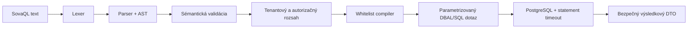

# SOVA – SovaQL, uložené dotazy a osobné dashboardy

> Záväzná implementačná špecifikácia pre rozšírené vyhľadávanie, opakovane
> použiteľné filtre, skladateľné widgety a správu osobných dashboardov

| Vlastnosť            | Rozhodnutie                                                      |
| -------------------- | ---------------------------------------------------------------- |
| Jazyk                | `SovaQL` verzie `1`, Jira-like doménový query jazyk              |
| Hlavný zdroj dát     | Úlohy dostupné aktuálnemu používateľovi v aktívnom tenantovi     |
| Uložený dotaz        | Tenantová entita s vlastníkom, verziou a voliteľným zdieľaním    |
| Dashboard            | Osobný, tenantový a vlastnený jedným používateľom                |
| Počet dashboardov    | Používateľ môže mať v tenantovi viac dashboardov                 |
| Widget               | Inštancia serverom registrovaného typu napojená na uložený dotaz |
| Layout               | Používateľsky meniteľná responzívna 12-stĺpcová mriežka          |
| Bezpečnostná hranica | Backendová autorizácia a tenantový rozsah, nie samotný dotaz     |

Táto špecifikácia rozvíja všeobecné požiadavky z
[analýzy projektu](./ANALYZA_PROJEKTU.md), webflow dokumentov
[Projekty a úlohy](./webflow/02-PROJEKTY-A-ULOHY.md) a
[Spolupráca](./webflow/03-SPOLUPRACA.md). Pri implementácii má prednosť pred ich
staršími všeobecnými formuláciami o dashboardoch a filtroch.

## 1. Cieľ a rozsah

Používateľ musí vedieť:

- vyhľadať úlohy výrazom podobným JQL bez znalosti SQL,
- zostaviť rovnakú podmienku aj cez vizuálny editor filtrov,
- dotaz validovať, spustiť, uložiť, upraviť, kopírovať a znovu použiť,
- bezpečne zdieľať uložený dotaz s vybranými členmi alebo pracovnými skupinami,
- vytvoriť si v každom tenantovi viac osobných dashboardov,
- jeden dashboard nastaviť ako predvolený a medzi dashboardmi sa rýchlo prepínať,
- pridávať, konfigurovať, presúvať, meniť veľkosť a odstraňovať widgety,
- použiť jeden uložený dotaz vo viacerých widgetoch a dashboardoch,
- otvoriť z widgetu úplný zoznam úloh s rovnakým dotazom.

Prvá verzia zámerne neobsahuje:

- kompatibilitu so všetkými operátormi alebo funkciami Jira JQL,
- vykonávanie SQL, skriptov, regulárnych výrazov alebo používateľských funkcií,
- dotazy nad auditom, komentármi, prílohami alebo ľubovoľnými doménovými entitami,
- spoločné tímové dashboardy a verejné anonymné dashboardy,
- pluginy, ktoré by mohli na server nahrať spustiteľný kód widgetu,
- vlastné polia; návrh však rezervuje ich budúce pomenovanie,
- historické JQL operátory typu `WAS`, `CHANGED`, `DURING` a `BY`.

## 2. Záväzné princípy

1. **Tenant sa v SovaQL nezadáva.** Určuje ho autentifikovaný route kontext a
   používateľ ho dotazom nesmie rozšíriť ani prepísať.
2. **Dotaz nie je oprávnenie.** Výsledok je vždy prienikom podmienky, aktívneho
   tenantu, projektového prístupu a `issue.view`.
3. **SovaQL nie je SQL.** Vstup sa tokenizuje a parsuje do typovaného AST; SQL sa
   zostaví iba z interného whitelistu polí a operátorov s parametrizovanými hodnotami.
4. **Strojové názvy sú stabilné a anglické.** Kľúčové slová, polia a funkcie sa
   neprekladajú. UI ich opis, chyby a nápovedu lokalizuje.
5. **Projektová konfigurácia ostáva projektová.** Hodnoty `type` a `status` používajú
   nemenné projektové kódy, nie meniteľné zobrazované názvy.
6. **Widget neobsahuje vlastnú kópiu dotazu.** Odkazuje na `saved_query_id`, aby ten
   istý dotaz zostal opakovane použiteľný.
7. **Osobný dashboard neudeľuje prístup.** Vlastník vidí iba dáta, ku ktorým má
   aktuálne oprávnenie; zmena prístupu sa prejaví pri nasledujúcom načítaní.
8. **Konfigurácia sa verzuje.** Uložené dotazy, dashboardy a widgety používajú
   optimistické zamykanie.
9. **Typy widgetov vlastní aplikácia.** Konfigurácia používateľa je validované JSON,
   nie HTML, SQL, JavaScript ani názov ľubovoľnej komponenty.
10. **Čiastočná chyba nezablokuje dashboard.** Každý widget má samostatné loading,
    empty, stale, forbidden, configuration-error a runtime-error stavy.

## 3. Pojmy

| Pojem           | Význam                                                          |
| --------------- | --------------------------------------------------------------- |
| SovaQL          | Textový doménový jazyk pre výber a zoradenie úloh               |
| Ad hoc dotaz    | Neuložený výraz v rozšírenom vyhľadávaní                        |
| Uložený dotaz   | `SavedQuery`; v UI môže byť pomenovaný „Uložený filter“         |
| Kanonický dotaz | Normalizovaný SovaQL výraz vytvorený serverom z AST             |
| Query editor    | Textový editor SovaQL s validáciou a návrhmi                    |
| Filter builder  | Vizuálny editor, ktorý vytvára rovnaké AST ako query editor     |
| Dashboard       | Osobná pomenovaná plocha používateľa v jednom tenantovi         |
| Widget type     | Aplikáciou registrovaný druh widgetu a schéma jeho konfigurácie |
| Widget instance | Konkrétne umiestnený a nakonfigurovaný widget na dashboarde     |
| Widget preset   | Predvyplnená konfigurácia typu, nie nový typ widgetu            |

## 4. SovaQL verzia 1

### 4.1 Základná podoba

Dotaz sa skladá z povinnej podmienky a voliteľného zoradenia:

```sovaql
project = SOVA
AND statusCategory != DONE
AND assignee = currentUser()
ORDER BY priority DESC, updated DESC
```

Ďalšie príklady:

```sovaql
type IN (BUG, STORY) AND priority IN (HIGH, CRITICAL)
```

```sovaql
text ~ "timeout pri prihlaseni" AND created >= startOfDay("-30d")
```

```sovaql
assignee IS EMPTY AND group = group("Backend")
```

```sovaql
watcher = currentUser() AND statusCategory != DONE ORDER BY updated DESC
```

```sovaql
project IN (SOVA, OPS)
AND status IN (OPEN, IN_PROGRESS)
AND due < startOfDay()
ORDER BY due ASC, key ASC
```

### 4.2 Lexikálne pravidlá

- Kľúčové slová a názvy polí/funkcií nerozlišujú veľkosť písmen.
- Kanonický výstup používa veľké logické kľúčové slová a kanonické názvy polí.
- Jednoduchý identifikátor zodpovedá `[A-Za-z_][A-Za-z0-9_-]*`.
- Textová hodnota je v dvojitých úvodzovkách; `\"` a `\\` sú podporované escape
  sekvencie.
- Číslo môže mať znamienko, používa desatinnú bodku a nesmie obsahovať oddeľovače
  tisícov.
- Dátum alebo čas sa zapisuje ako text v ISO 8601.
- Relatívny posun sa zapisuje ako text, napríklad `"-7d"`, `"+2h"` alebo `"-1w"`.
- Hodnota zhodná s rezervovaným kľúčovým slovom sa musí zapísať v úvodzovkách.
- Verzia 1 nepodporuje komentáre v dotaze.
- Maximálna UTF-8 dĺžka dotazu je `8 192` bajtov.

### 4.3 Orientačná EBNF gramatika

Gramatika je základ kontraktných parser testov. Whitespace medzi tokenmi je
nepovinný okrem miest, kde oddeľuje dve slová.

```ebnf
query           = expression, [ order_by ];
order_by        = "ORDER", "BY", sort_item, { ",", sort_item };
sort_item       = field, [ "ASC" | "DESC" ], [ "NULLS", ("FIRST" | "LAST") ];

expression      = or_expression;
or_expression   = and_expression, { "OR", and_expression };
and_expression  = not_expression, { "AND", not_expression };
not_expression  = [ "NOT" ], primary;
primary         = "(", expression, ")" | predicate;

predicate       = field, comparison_operator, value
                | field, set_operator, set_value
                | field, empty_operator;

comparison_operator = "=" | "!=" | ">" | ">=" | "<" | "<=" | "~" | "!~";
set_operator    = "IN" | "NOT", "IN";
empty_operator  = "IS", [ "NOT" ], "EMPTY";

set_value       = "(", value, { ",", value }, ")" | function_call;
field           = identifier, [ ".", identifier ];
value           = string | number | boolean | identifier | function_call;
function_call   = identifier, "(", [ value, { ",", value } ], ")";
boolean         = "true" | "false";
```

Parser musí dodržať precedenciu:

1. zátvorky,
2. `NOT`,
3. `AND`,
4. `OR`,
5. `ORDER BY`.

Výraz `a OR b AND c` preto znamená `a OR (b AND c)`. UI má pri kombinácii `AND` a
`OR` používateľa viesť k explicitným zátvorkám.

### 4.4 Polia

| Pole             | Typ             | Podporované operátory            | Význam                              |
| ---------------- | --------------- | -------------------------------- | ----------------------------------- |
| `key`            | issue key       | `=`, `!=`, `IN`, `NOT IN`        | Napríklad `SOVA-123`                |
| `project`        | project code    | `=`, `!=`, `IN`, `NOT IN`        | Nemenný kód projektu                |
| `type`           | issue-type code | `=`, `!=`, `IN`, `NOT IN`        | Kód typu v projekte                 |
| `hierarchyLevel` | integer         | porovnania, `IN`, `NOT IN`       | `1`, `0` alebo `-1`                 |
| `status`         | status code     | `=`, `!=`, `IN`, `NOT IN`        | Kód stavu v projekte                |
| `statusCategory` | enum            | `=`, `!=`, `IN`, `NOT IN`        | `TO_DO`, `IN_PROGRESS`, `DONE`      |
| `priority`       | enum            | `=`, `!=`, `IN`, `NOT IN`        | `LOW`, `NORMAL`, `HIGH`, `CRITICAL` |
| `title`          | text            | `~`, `!~`, `=`, `!=`             | Názov úlohy                         |
| `text`           | fulltext        | `~`, `!~`                        | Názov a bezpečne indexovaný opis    |
| `reporter`       | user            | rovnosť, množiny, empty          | Autor úlohy                         |
| `assignee`       | user            | rovnosť, množiny, empty          | Konkrétny riešiteľ                  |
| `group`          | workgroup       | rovnosť, množiny, empty          | Zodpovedná pracovná skupina         |
| `watcher`        | user            | rovnosť, množiny                 | Používateľ sledujúci úlohu          |
| `parent`         | issue key       | rovnosť, množiny, empty          | Priama nadradená úloha              |
| `labels`         | label           | `=`, `!=`, `IN`, `NOT IN`, empty | Aspoň jeden zadaný štítok           |
| `due`            | date            | porovnania, empty                | Termín                              |
| `estimate`       | duration/number | porovnania, empty                | Normalizovaný odhad                 |
| `created`        | datetime        | porovnania                       | Čas vytvorenia                      |
| `updated`        | datetime        | porovnania                       | Čas poslednej úpravy                |
| `resolved`       | datetime        | porovnania, empty                | Čas vyriešenia                      |
| `closed`         | datetime        | porovnania, empty                | Čas uzavretia                       |

`summary` môže parser v prechodnom období prijať ako alias poľa `title`, ale
kanonický dotaz vždy vráti `title`. Ďalšie aliasy sa nepridávajú bez zmeny verzie
jazyka.

Budúce vlastné polia použijú priestor `cf.<immutable-key>`. Verzia 1 token s bodkou
odmietne jasnou chybou `QUERY_FIELD_NOT_SUPPORTED`, aby nevznikla nekompatibilná
dočasná interpretácia.

### 4.5 Hodnoty projektových entít

`project` používa nemenný tenantovo unikátny kód projektu. `type` a `status` používajú
nemenný kód unikátny v projekte:

```sovaql
project = SOVA AND type = BUG AND status = IN_PROGRESS
```

Ak dotaz zahŕňa viac projektov, `type = BUG` alebo `status = OPEN` znamená všetky
dostupné projektové entity s rovnakým kódom. Zobrazovaný názov sa môže zmeniť bez
zmeny výsledku uloženého dotazu. Archivované typy a stavy sa pri vyhľadávaní
existujúcich úloh naďalej vyhodnocujú.

Editor ponúka hodnoty iba z projektov dostupných používateľovi. Ak ručne zadaný kód
neexistuje alebo nie je dostupný, server vráti rovnakú všeobecnú chybu, aby neodhalil
cudziu konfiguráciu.

### 4.6 Používatelia a pracovné skupiny

Podporované funkcie:

| Funkcia                                     | Návratový typ | Použitie                        |
| ------------------------------------------- | ------------- | ------------------------------- |
| `currentUser()`                             | user          | Aktuálne prihlásený používateľ  |
| `user("<public-uuid>")`                     | user          | Stabilná verejná identita člena |
| `group("<public-uuid-or-unique-name>")`     | workgroup     | Pracovná skupina tenantu        |
| `membersOf("<public-uuid-or-unique-name>")` | set of user   | Členovia skupiny                |

Príklady:

```sovaql
assignee = currentUser()
```

```sovaql
assignee IN membersOf("Backend")
```

```sovaql
group = group("Backend")
```

Zobrazované meno používateľa nie je stabilná identita. Vizuálny picker preto uloží
`user("<public-uuid>")`, hoci UI vedľa tokenu zobrazuje aktuálne meno. Názov skupiny
možno použiť len pri jednoznačnej zhode v tenantovi; kanonizácia ho nahradí verejným
UUID.

### 4.7 Časové funkcie

| Funkcia                  | Príklad               | Význam                         |
| ------------------------ | --------------------- | ------------------------------ |
| `now()`                  | `updated <= now()`    | Aktuálny okamih                |
| `startOfDay([offset])`   | `startOfDay("-7d")`   | Začiatok dňa a voliteľný posun |
| `endOfDay([offset])`     | `endOfDay("+2d")`     | Koniec dňa a voliteľný posun   |
| `startOfWeek([offset])`  | `startOfWeek("-1w")`  | Pondelok 00:00 a posun         |
| `endOfWeek([offset])`    | `endOfWeek()`         | Koniec nedele                  |
| `startOfMonth([offset])` | `startOfMonth("-1M")` | Začiatok mesiaca a posun       |
| `endOfMonth([offset])`   | `endOfMonth()`        | Koniec mesiaca                 |

Jednotky sú `m` minúta, `h` hodina, `d` deň, `w` týždeň a `M` kalendárny mesiac.
Relatívny čas sa vyhodnocuje pri každom spustení. Používa uloženú časovú zónu
používateľa; ak chýba, časovú zónu tenantu, napokon UTC. Konkrétny okamih sa v API a
databáze prenáša v UTC.

### 4.8 `EMPTY` a trojhodnotová logika

Voliteľné pole sa testuje cez:

```sovaql
assignee IS EMPTY
due IS NOT EMPTY
```

`field != value` nezhoduje `NULL`. Ak má výsledok obsahovať aj prázdne pole, treba
to uviesť:

```sovaql
assignee != currentUser() OR assignee IS EMPTY
```

`labels = X` znamená „obsahuje štítok X“. `labels != X` znamená „neobsahuje X“ a
zahŕňa aj úlohu bez štítkov. `labels IN (X, Y)` znamená „obsahuje aspoň jeden z X
alebo Y“ a `labels NOT IN (X, Y)` znamená „neobsahuje ani jeden“. Požiadavka na
všetky štítky sa v prvej verzii zapíše explicitne:

```sovaql
labels = X AND labels = Y
```

### 4.9 Fulltext

Operátor `~` nad `text` používa PostgreSQL fulltext, nie SQL `LIKE` a nie regulárny
výraz. Nad `title` môže používať bezpečné case-insensitive hľadanie optimalizované
indexom.

```sovaql
text ~ "\"reset hesla\" timeout"
```

Presná interpretácia tokenov sa verzionuje spolu s jazykom. Server nepovolí
neobmedzené wildcardy ani regulárne výrazy. Jazyková konfigurácia fulltextu musí byť
predvídateľná aj pri obsahu v podporovaných jazykoch SOVA; predvolená bezpečná
konfigurácia je `simple`, kým meranie nepreukáže vhodnejšiu stratégiu.

### 4.10 Triedenie a stránkovanie

`ORDER BY` je súčasť uloženého dotazu:

```sovaql
statusCategory != DONE ORDER BY due ASC NULLS LAST, priority DESC
```

Povolené sú najviac tri explicitné polia. Server vždy pridá stabilný interný
tie-breaker `issue_id`, aj keď sa v kanonickom texte nezobrazuje. Výsledky používajú
cursor pagination, nie klientom vypočítaný offset. Cursor je krátkodobý, podpísaný a
viazaný aspoň na:

- tenant,
- používateľa a autorizačnú revíziu,
- hash kanonického dotazu,
- smer a hodnoty triedenia.

Zmena dotazu, oprávnení alebo zoradenia starý cursor zneplatní.

### 4.11 Chyby a validácia

Validácia má dve fázy:

1. syntaktická validácia vytvorí AST,
2. sémantická validácia overí pole, operátor, typ hodnoty, funkciu, dostupnú
   referenciu a limity zložitosti.

Chyba obsahuje stabilný kód a rozsah v pôvodnom texte:

```json
{
  "valid": false,
  "errors": [
    {
      "code": "QUERY_OPERATOR_NOT_ALLOWED",
      "message_key": "query.errors.operatorNotAllowed",
      "start": 17,
      "end": 18,
      "arguments": {
        "field": "priority",
        "operator": "~"
      }
    }
  ]
}
```

Minimálne chybové kódy:

| Kód                               | Význam                                            |
| --------------------------------- | ------------------------------------------------- |
| `QUERY_SYNTAX_INVALID`            | Neplatný token, zátvorka alebo štruktúra          |
| `QUERY_FIELD_UNKNOWN`             | Neznáme pole                                      |
| `QUERY_FIELD_NOT_SUPPORTED`       | Známe, ale v tejto verzii nepodporované pole      |
| `QUERY_OPERATOR_NOT_ALLOWED`      | Operátor nie je platný pre typ poľa               |
| `QUERY_VALUE_INVALID`             | Hodnota má neplatný typ alebo formát              |
| `QUERY_VALUE_NOT_AVAILABLE`       | Hodnota neexistuje alebo nie je dostupná          |
| `QUERY_VALUE_AMBIGUOUS`           | Meno nemožno jednoznačne rozlíšiť                 |
| `QUERY_FUNCTION_UNKNOWN`          | Nepodporovaná funkcia                             |
| `QUERY_FUNCTION_ARGUMENT_INVALID` | Neplatný argument funkcie                         |
| `QUERY_TOO_COMPLEX`               | Prekročený limit zložitosti                       |
| `QUERY_TOO_LONG`                  | Prekročená dĺžka                                  |
| `QUERY_TIMEOUT`                   | Bezpečnostný časový limit vykonania               |
| `QUERY_CURSOR_INVALID`            | Cursor nepatrí k aktuálnemu dotazu alebo kontextu |

Chyba pri citlivej referencii nesmie rozlíšiť „neexistuje“ a „existuje mimo môjho
prístupu“.

### 4.12 Limity zložitosti

Odporúčané počiatočné serverové limity:

| Limit                                    |                    Hodnota |
| ---------------------------------------- | -------------------------: |
| Dĺžka dotazu                             |         8 192 UTF-8 bajtov |
| Počet AST uzlov                          |                        100 |
| Hĺbka zátvoriek                          |                         10 |
| Hodnoty v jednom `IN`                    |                        100 |
| Triediace polia                          |                          3 |
| Veľkosť stránky                          | predvolene 50, najviac 100 |
| Synchrónny čas vykonania                 |                  3 sekundy |
| Widgety načítané frontend klientom naraz |                  najviac 4 |

Limity sú konfigurovateľné prevádzkou, ale API ich vracia v query metadata. Zmena
nesmie umožniť obísť tenantový rozsah alebo databázový statement timeout.

## 5. Editor a vyhľadávací pohľad

### 5.1 Dva editory, jedno AST

Rozšírené vyhľadávanie ponúkne:

- **Základný režim** – polia, operátory a hodnoty cez ovládacie prvky,
- **SovaQL režim** – textový editor s autocomplete a označením chýb.

Oba režimy používajú rovnaký serverový parser a AST. Prepnutie nesmie zmeniť význam
dotazu. Ak pokročilý výraz nemožno bez straty vyjadriť základným editorom, UI ho
zobrazí iba na čítanie a ponúkne návrat do SovaQL režimu; nesmie ho potichu
zjednodušiť.

Autocomplete je kontextový:

- na začiatku navrhuje povolené polia,
- po poli navrhuje kompatibilné operátory,
- po operátore navrhuje hodnoty dostupné aktuálnemu používateľovi,
- po dokončenej podmienke navrhuje `AND`, `OR` a `ORDER BY`.

Počas písania sa validácia debouncuje a staršia odpoveď nesmie prepísať novšiu.

### 5.2 Výsledky

Pohľad výsledkov obsahuje:

- dotaz a stav jeho validácie,
- počet výsledkov, ak ho možno bezpečne a v limite vypočítať,
- cursor stránkovanie,
- konfigurovateľné stĺpce,
- zoradenie z dotazu,
- akcie „Uložiť“, „Uložiť ako“ a „Pridať na dashboard“,
- jasné rozlíšenie nulového výsledku, nulového prístupu a chyby.

Pri akcii „Pridať na dashboard“ sa ad hoc dotaz najprv uloží alebo používateľ vyberie
už existujúci uložený dotaz.

### 5.3 URL

Trvalý obnoviteľný pohľad používa iba nepriehľadný identifikátor:

```text
/t/:tenantSlug/issues?filter=:savedQueryId
```

Celý SovaQL výraz sa štandardne nevkladá do URL, pretože môže obsahovať mená alebo
iné osobné údaje a URL sa zapisuje do histórie, logov a analytiky. Ad hoc rozpracovaný
dotaz zostáva v stave stránky a lokálnom session storage. Zdieľateľný odkaz vznikne
uložením dotazu s príslušným prístupom.

## 6. Uložené dotazy

### 6.1 Vlastnosti

`SavedQuery` obsahuje:

| Pole                       | Význam                                          |
| -------------------------- | ----------------------------------------------- |
| `id`                       | Verejné UUID                                    |
| `tenant_id`                | Povinný bezpečnostný rozsah                     |
| `owner_membership_id`      | Vlastník v danom tenantovi                      |
| `name`                     | Názov unikátny pre vlastníka po normalizácii    |
| `description`              | Voliteľný plain text                            |
| `raw_query`                | Posledný používateľský zápis                    |
| `canonical_query`          | Serverom normalizovaný výraz                    |
| `language_version`         | Pre prvú verziu `1`                             |
| `default_columns`          | Validovaný zoznam stĺpcov pre výsledkový pohľad |
| `visibility`               | `PRIVATE` alebo `SHARED`                        |
| `version`                  | Optimistické zamykanie                          |
| `created_at`, `updated_at` | Časy v UTC                                      |
| `archived_at`              | Voliteľná bezpečná archivácia                   |

Uložiť možno iba syntakticky a sémanticky platný dotaz. `canonical_query` generuje
server a klient ho nesmie diktovať.

### 6.2 Zdieľanie

Predvolená viditeľnosť je `PRIVATE`. `SHARED` dotaz používa explicitné granty:

| Principal        | Povolenie           |
| ---------------- | ------------------- |
| Člen tenantu     | `VIEW` alebo `EDIT` |
| Pracovná skupina | `VIEW` alebo `EDIT` |

Zdieľanie vyžaduje `saved_query.share`. Grant možno vytvoriť iba pre aktívneho člena
alebo skupinu toho istého tenantu. `EDIT` zahŕňa použitie a úpravu, nie zmenu
vlastníka alebo grantov.

Zdieľaný dotaz:

- nikdy neudeľuje `issue.view` ani projektový prístup,
- každému používateľovi môže vrátiť odlišný bezpečný prienik výsledkov,
- nesmie v autocomplete ani chybe odhaliť používateľovi nedostupný projekt,
- môže byť zdrojom widgetu len dovtedy, kým vlastník dashboardu má grant,
- pri strate grantu zobrazí widget stav „Zdroj už nie je dostupný“ bez starých dát.

Pred úpravou dotazu použitého inými používateľmi UI zobrazí počet dotknutých
widgetov a ponúkne „Uložiť ako kópiu“. Úprava je optimisticky zamknutá cez `version`
alebo `If-Match`.

### 6.3 Obľúbené a navigácia

Používateľ môže dostupný dotaz označiť ako obľúbený. Obľúbenie je osobná väzba
`membership_id + saved_query_id`, nie vlastnosť dotazu. Obľúbené dotazy sa zobrazia
v ľavej navigácii aktívneho tenantu a ich poradie je osobná preferencia.

### 6.4 Životný cyklus

- Vlastník môže dotaz premenovať, upraviť, kopírovať, zdieľať a archivovať.
- Používateľ s `EDIT` môže upraviť obsah, ale nie vlastníka ani granty.
- `saved_query.manage` umožní tenantovému správcovi riešiť opustené zdieľané dotazy;
  samo osebe neudeľuje prístup k výsledným úlohám.
- Dotaz použitý widgetom sa nedá natrvalo odstrániť. API vráti
  `409 SAVED_QUERY_IN_USE` a počet závislostí.
- UI ponúkne nahradiť zdroj dotknutých widgetov, widgety odstrániť alebo dotaz iba
  archivovať.
- Archivovaný dotaz sa nedá vybrať pre nový widget; existujúce widgety zobrazia
  konfiguračnú chybu a akciu na výmenu zdroja.
- Pri zrušení členstva sa súkromné dotazy archivujú podľa retenčnej politiky.
  Zdieľané dotazy musí správca previesť na iného aktívneho vlastníka alebo archivovať.

## 7. Osobné dashboardy

### 7.1 Vlastníctvo a počet

Dashboard patrí presne jednému `owner_membership_id` a jednému `tenant_id`.
Používateľ:

- má v každom tenantovi nezávislú sadu dashboardov,
- môže vytvoriť viac dashboardov,
- vidí iba vlastné osobné dashboardy,
- môže dashboard vytvoriť prázdny, zo systémovej predlohy alebo duplikovaním svojho,
- môže ho premenovať, zoradiť v prepínači, nastaviť ako predvolený a odstrániť,
- nemôže dashboard presunúť do iného tenantu.

Tímové alebo tenantovo zdieľané dashboardy sú budúce rozšírenie a nesmú sa simulovať
zmenou `owner_membership_id`.

### 7.2 Predvolený a aktívny dashboard

Každý aktívny člen tenantu musí mať aspoň jeden dashboard:

1. pri prvom otvorení sa idempotentne vytvorí štartovací dashboard,
2. práve jeden dashboard je predvolený,
3. posledný aktívny dashboard je osobná tenantová preferencia,
4. `/t/:tenantSlug/dashboard` presmeruje na posledný aktívny dostupný dashboard,
5. ak preferencia chýba alebo cieľ zanikol, otvorí sa predvolený dashboard,
6. posledný dashboard nemožno odstrániť; možno ho vyprázdniť alebo obnoviť zo
   systémovej predlohy.

Odporúčaná kanonická route:

```text
/t/:tenantSlug/dashboards/:dashboardId
```

### 7.3 Správa dashboardov

Obrazovka „Spravovať dashboardy“ zobrazuje názov, príznak predvoleného dashboardu,
počet widgetov a poslednú úpravu. Podporuje:

- vytvoriť,
- otvoriť,
- premenovať,
- duplikovať,
- nastaviť ako predvolený,
- meniť poradie v prepínači,
- odstrániť po potvrdení.

Prepínač dashboardov je dostupný priamo v hlavičke dashboardu. Prepnutie nesmie
meniť tenant. Režim úprav je explicitný; bežné kliknutie alebo drag v obsahu widgetu
nesmie náhodne presunúť layout.

### 7.4 Layout

Desktop používa 12-stĺpcovú mriežku. Každá inštancia widgetu má:

- `x`, `y`, `width`, `height`,
- minimálnu a maximálnu veľkosť určenú typom widgetu,
- stabilné poradie odvodené z `y`, potom `x`, potom `id`.

Server validuje hranice, prekrytie, minimálnu veľkosť a maximálny počet widgetov.
Odporúčaný limit je 30 widgetov na dashboard.

Na tablete a mobile sa layout deterministicky preusporiada do jedného stĺpca podľa
stabilného poradia. Mobilné preusporiadanie neprepisuje desktopové súradnice. Widget
musí byť použiteľný bez horizontálneho scrollu okrem dátovej tabuľky, ktorá môže mať
vlastný ohraničený scroll.

Zmena viacerých pozícií sa ukladá jednou atomickou požiadavkou proti
`dashboard.version`. Pri `409 DASHBOARD_VERSION_CONFLICT` klient načíta novú verziu a
ponúkne opätovné aplikovanie rozloženia; nesmie potichu prepísať zmeny z inej karty.

### 7.5 Štartovacia predloha

Systémová predloha je verzovaný dátový manifest dodaný aplikáciou, nie spustiteľný
skript. Obsahuje definície súkromných dotazov, widget presetov a layoutu. Pri prvom
použití sa v jednej transakcii:

1. vytvoria súkromné uložené dotazy vlastnené členstvom,
2. vytvorí dashboard,
3. vytvoria widgety odkazujúce na nové `saved_query_id`,
4. dashboard sa nastaví ako predvolený a aktívny.

Predloha nesmie obsahovať tenantové UUID ani konkrétne osoby; používa dynamické
funkcie ako `currentUser()`. Odporúčaný štartovací dashboard:

| Widget                         | Uložený dotaz/preset                                                                  |
| ------------------------------ | ------------------------------------------------------------------------------------- |
| Zoznam „Pridelené mne“         | `assignee = currentUser() AND statusCategory != DONE ORDER BY priority DESC, due ASC` |
| Počet „Po termíne“             | `due < startOfDay() AND statusCategory != DONE`                                       |
| Zoznam „Nedávno aktualizované“ | `statusCategory != DONE ORDER BY updated DESC`                                        |
| Rozdelenie „Podľa stavu“       | `statusCategory != DONE`, `group_by = status`                                         |

Obnovenie zo systémovej predlohy existujúci dashboard neprepíše. Vytvorí nový
dashboard a nové súkromné dotazy, aby používateľ nestratil vlastnú konfiguráciu.

## 8. Katalóg widgetov

### 8.1 Spoločný kontrakt

Každý widget obsahuje:

| Pole                        | Význam                                   |
| --------------------------- | ---------------------------------------- |
| `id`                        | UUID inštancie                           |
| `dashboard_id`, `tenant_id` | Rodič a bezpečnostný rozsah              |
| `type_key`                  | Stabilný kľúč z registra aplikácie       |
| `schema_version`            | Verzia konfiguračnej schémy typu         |
| `title`                     | Voliteľný vlastný názov ako plain text   |
| `saved_query_id`            | Povinný zdroj dát                        |
| `configuration`             | JSON validovaný schémou konkrétneho typu |
| `x`, `y`, `width`, `height` | Layout                                   |
| `version`                   | Optimistické zamykanie                   |

Spoločné správanie:

- hlavička zobrazuje názov, čas posledného obnovenia a menu,
- „Zobraziť všetko“ otvorí výsledky konkrétneho uloženého dotazu,
- manuálne obnovenie rešpektuje rate limit,
- neplatný alebo nedostupný zdroj nezobrazuje staré citlivé dáta,
- export dát nie je automaticky povolený widgetom,
- konfigurácia nemôže obsahovať HTML ani názov spustiteľnej komponenty.

### 8.2 Základné typy

#### `issue_count`

Jedna číselná hodnota – počet úloh zodpovedajúcich uloženému dotazu.

Konfigurácia:

- voliteľný krátky popis,
- sémantický vizuálny token, nie ľubovoľná CSS farba,
- zobrazenie alebo skrytie odkazu na výsledky.

Príklady presetov: „Pridelené mne“, „Po termíne“, „Kritické otvorené“.

#### `issue_list`

Kompaktný zoznam výsledkov.

Konfigurácia:

- 3 až 10 povolených stĺpcov,
- limit 5 až 50 položiek,
- kompaktná alebo komfortná hustota,
- zobrazenie issue key, ktoré nemožno vypnúť.

Poradie určuje `ORDER BY` uloženého dotazu. Widget nesmie potichu používať iné
zoradenie.

Príklady presetov: „Nedávno aktualizované“, „Moje otvorené úlohy“, „Najbližšie
termíny“.

#### `issue_breakdown`

Jednorozmerné rozdelenie počtu úloh.

Konfigurácia:

- `group_by`: `project`, `type`, `status`, `statusCategory`, `priority`, `assignee`
  alebo `group`,
- `visualization`: `bar`, `donut` alebo `table`,
- `top_n`: 3 až 20,
- zobrazenie prázdnej hodnoty,
- zoradenie podľa počtu alebo názvu.

Kliknutie na segment otvorí výsledky pôvodného dotazu doplneného bezpečne
vygenerovanou podmienkou segmentu.

Príklady presetov: „Podľa stavu“, „Zaťaženie riešiteľov“, „Úlohy podľa priority“.

#### `issue_matrix`

Dvojrozmerná štatistická tabuľka.

Konfigurácia:

- `rows` a `columns` z rovnakého whitelistu ako breakdown,
- najviac 20 hodnôt na os,
- zobrazenie súčtov riadkov a stĺpcov,
- voliteľné skrytie nulových buniek.

Rovnaké pole nesmie byť súčasne na oboch osiach. Kliknutie na bunku otvorí prienik
pôvodného dotazu a oboch hodnôt.

Príklady presetov: „Stav × priorita“, „Riešiteľ × stav“.

#### `issue_time_series`

Časový priebeh počtu udalostí nad úlohami vybranými dotazom.

Konfigurácia:

- `event`: `created`, `resolved` alebo `closed`,
- `bucket`: `day`, `week` alebo `month`,
- rozsah: 7, 30, 90 alebo 365 dní,
- `visualization`: `line` alebo `bar`,
- voliteľná druhá séria pre porovnanie `created` a `resolved`.

Časové bucketovanie používa rovnakú časovú zónu ako časové funkcie SovaQL. UI musí
uviesť, že dotaz sa aplikuje na aktuálne viditeľné úlohy a séria nie je nemenným
historickým snapshotom.

### 8.3 Registry a kompatibilita

Backend a frontend majú zdieľať kontrakt registra:

- `type_key`,
- aktuálnu `schema_version`,
- lokalizačný kľúč názvu a opisu,
- minimálnu/predvolenú/maximálnu veľkosť,
- JSON Schema konfigurácie,
- podporované agregačné dimenzie,
- migračné funkcie medzi verziami konfigurácie.

Neznámy alebo dočasne vypnutý typ sa na existujúcom dashboarde zobrazí ako
„Widget nie je dostupný“ s možnosťou odstránenia. Server nesmie neznámu konfiguráciu
automaticky interpretovať ako iný typ.

## 9. Načítanie a stavy dashboardu

Konfigurácia dashboardu a dáta widgetov sa načítavajú oddelene:

1. klient načíta dashboard, layout a bezpečne zobrazené metadáta zdrojov,
2. viditeľné widgety načíta s obmedzenou paralelnosťou,
3. každý widget dostane vlastný výsledok alebo vlastnú chybu,
4. widgety mimo viewportu možno načítať neskôr,
5. zmena dashboardu zruší už nepotrebné požiadavky.

Dashboard nemá mať jednu neobmedzenú databázovú transakciu pre všetky widgety. API
môže podporiť limitovaný batch transport, ale odpoveď musí zachovať samostatný stav a
limit pre každý widget.

Odpoveď dát widgetu obsahuje minimálne:

```json
{
  "widget_id": "019c...",
  "saved_query_id": "019c...",
  "saved_query_version": 4,
  "generated_at": "2026-07-26T10:15:00Z",
  "data": {},
  "warnings": []
}
```

Automatický refresh je predvolene vypnutý alebo najmenej 60 sekúnd. Neaktívna karta
prehliadača refresh pozastaví. Čas posledného úspešného výsledku sa zobrazuje bez
ukladania samotných citlivých dát do trvalej frontendovej cache.

## 10. Dátový model

Odporúčané tabuľky:

| Tabuľka                            | Dôležité polia                                                                                                                                                              |
| ---------------------------------- | --------------------------------------------------------------------------------------------------------------------------------------------------------------------------- |
| `saved_queries`                    | `id`, `tenant_id`, `owner_membership_id`, `name`, `description`, `raw_query`, `canonical_query`, `language_version`, `default_columns`, `visibility`, `version`, timestamps |
| `saved_query_grants`               | `tenant_id`, `saved_query_id`, `principal_type`, `principal_id`, `permission`, timestamps                                                                                   |
| `saved_query_favourites`           | `tenant_id`, `membership_id`, `saved_query_id`, `position`                                                                                                                  |
| `dashboards`                       | `id`, `tenant_id`, `owner_membership_id`, `name`, `position`, `is_default`, `version`, timestamps                                                                           |
| `dashboard_widgets`                | `id`, `tenant_id`, `dashboard_id`, `saved_query_id`, `type_key`, `schema_version`, `title`, `configuration`, `x`, `y`, `width`, `height`, `version`, timestamps             |
| `membership_dashboard_preferences` | `tenant_id`, `membership_id`, `active_dashboard_id`, `updated_at`                                                                                                           |

Databázové obmedzenia musia chrániť:

- rovnaký `tenant_id` vo všetkých referenciách,
- vlastníctvo dashboardu aktívnym alebo historicky evidovaným členstvom tenantu,
- unikátny normalizovaný názov uloženého dotazu u vlastníka,
- unikátny normalizovaný názov dashboardu u vlastníka,
- najviac jeden predvolený dashboard na členstvo cez partial unique index,
- grant iba členovi alebo skupine rovnakého tenantu,
- widget a jeho dashboard v rovnakom tenantovi,
- zdroj widgetu v rovnakom tenantovi,
- nezáporné súradnice a kladné rozmery,
- zákaz fyzického odstránenia uloženého dotazu použitého widgetom.

Kontrola prekrytia widgetov a limitu 30 položiek patrí aj do doménovej služby, pretože
ju nemožno jednoducho a čitateľne vyjadriť bežným constraintom.

## 11. Backendová architektúra

Odporúčané modulové hranice:

```text
Issues/
├── Application/Query/SearchIssues
├── Domain/QueryLanguage/
│   ├── Lexer
│   ├── Parser
│   ├── Ast
│   ├── SemanticValidator
│   └── CanonicalPrinter
└── Infrastructure/Persistence/IssueQueryCompiler

SavedQueries/
├── Application/Command/
├── Application/Query/
├── Domain/
└── Infrastructure/Persistence/

Dashboards/
├── Application/Command/
├── Application/Query/
├── Domain/WidgetRegistry/
└── Infrastructure/Persistence/
```

`IssueQueryCompiler` dostane už validované, typované AST a autorizačný kontext.
Postup vykonania:



Zakázané je:

- skladať názov stĺpca priamo z používateľského tokenu,
- vkladať hodnoty do SQL stringu,
- prekladať SovaQL na SQL cez všeobecné textové nahrádzanie,
- spustiť databázový dotaz pred sémantickou validáciou,
- filtrovať tenant alebo oprávnenia až po načítaní výsledkov do PHP.

Saved query, dashboard a widget majú samostatné aplikačné príkazy a repozitáre.
Dashboardový modul používa verejnú query službu modulu Issues; neimportuje jeho
interné persistence triedy.

## 12. REST API

Presné OpenAPI schémy sa doplnia pri implementácii. Odporúčané endpointy:

```text
POST   /api/v1/tenants/{tenantId}/issue-query/validate
GET    /api/v1/tenants/{tenantId}/issue-query/metadata
POST   /api/v1/tenants/{tenantId}/issue-query/suggestions
POST   /api/v1/tenants/{tenantId}/issues/search

GET    /api/v1/tenants/{tenantId}/saved-queries
POST   /api/v1/tenants/{tenantId}/saved-queries
GET    /api/v1/tenants/{tenantId}/saved-queries/{savedQueryId}
PATCH  /api/v1/tenants/{tenantId}/saved-queries/{savedQueryId}
POST   /api/v1/tenants/{tenantId}/saved-queries/{savedQueryId}/copy
PUT    /api/v1/tenants/{tenantId}/saved-queries/{savedQueryId}/grants
PUT    /api/v1/tenants/{tenantId}/saved-queries/{savedQueryId}/favourite
DELETE /api/v1/tenants/{tenantId}/saved-queries/{savedQueryId}/favourite
POST   /api/v1/tenants/{tenantId}/saved-queries/{savedQueryId}/archive

GET    /api/v1/tenants/{tenantId}/dashboards
POST   /api/v1/tenants/{tenantId}/dashboards
GET    /api/v1/tenants/{tenantId}/dashboards/{dashboardId}
PATCH  /api/v1/tenants/{tenantId}/dashboards/{dashboardId}
POST   /api/v1/tenants/{tenantId}/dashboards/{dashboardId}/copy
PUT    /api/v1/tenants/{tenantId}/dashboards/{dashboardId}/default
PUT    /api/v1/tenants/{tenantId}/dashboards/{dashboardId}/layout
DELETE /api/v1/tenants/{tenantId}/dashboards/{dashboardId}

POST   /api/v1/tenants/{tenantId}/dashboards/{dashboardId}/widgets
PATCH  /api/v1/tenants/{tenantId}/dashboards/{dashboardId}/widgets/{widgetId}
DELETE /api/v1/tenants/{tenantId}/dashboards/{dashboardId}/widgets/{widgetId}
GET    /api/v1/tenants/{tenantId}/dashboards/{dashboardId}/widgets/{widgetId}/data
GET    /api/v1/tenants/{tenantId}/widget-types
```

Vyhľadávanie je `POST`, pretože dotaz môže byť dlhý a môže obsahovať osobné údaje.
Je to idempotentné čítanie aj napriek HTTP metóde. Endpoint neprijíma `tenant_id` v
tele ako dôveryhodný údaj.

Príklad požiadavky:

```json
{
  "query": "assignee = currentUser() AND statusCategory != DONE ORDER BY updated DESC",
  "page_size": 50,
  "cursor": null,
  "fields": ["key", "type", "title", "status", "priority", "updated"]
}
```

Stabilné doménové chyby:

|  HTTP | Kód                            | Význam                                              |
| ----: | ------------------------------ | --------------------------------------------------- |
| `404` | `SAVED_QUERY_NOT_FOUND`        | Dotaz neexistuje alebo nie je dostupný              |
| `409` | `SAVED_QUERY_VERSION_CONFLICT` | Dotaz bol medzičasom upravený                       |
| `409` | `SAVED_QUERY_IN_USE`           | Dotaz používa aspoň jeden widget                    |
| `404` | `DASHBOARD_NOT_FOUND`          | Dashboard neexistuje alebo nemá správneho vlastníka |
| `409` | `DASHBOARD_VERSION_CONFLICT`   | Súbežná zmena dashboardu/layoutu                    |
| `409` | `LAST_DASHBOARD_REQUIRED`      | Nemožno odstrániť posledný dashboard                |
| `422` | `DASHBOARD_LAYOUT_INVALID`     | Prekrytie alebo neplatné rozmery                    |
| `422` | `WIDGET_CONFIGURATION_INVALID` | Konfigurácia nezodpovedá registru                   |
| `404` | `WIDGET_DATA_SOURCE_NOT_FOUND` | Zdroj neexistuje alebo už nie je dostupný           |
| `429` | `QUERY_RATE_LIMITED`           | Prekročený bezpečný počet dotazov                   |

## 13. Oprávnenia a bezpečnosť

Odporúčané oprávnenia:

```text
saved_query.create
saved_query.update_own
saved_query.archive_own
saved_query.share
saved_query.manage

dashboard.create
dashboard.update_own
dashboard.delete_own
```

Bežná rola `MEMBER` dostane oprávnenia na vlastné dotazy a dashboardy, nie
`saved_query.share` alebo `saved_query.manage`, pokiaľ tenant neurčí inak.

Pri každej validácii, nápovede, vyhľadávaní a agregácii backend:

1. overí reláciu a aktívne členstvo,
2. z route určí tenant,
3. zostaví zoznam dostupných projektov a oprávnení,
4. validuje všetky referencie v tomto obmedzenom rozsahu,
5. pridá tenantový a autorizačný predikát pred používateľský AST,
6. aplikuje statement timeout, rate limit a limity zložitosti,
7. vráti iba autorizované polia a entity.

Osobitné hrozby a mitigácie:

| Hrozba                    | Povinná mitigácia                                                |
| ------------------------- | ---------------------------------------------------------------- |
| SQL injection             | AST, whitelist compiler, parametrizované hodnoty                 |
| Cross-tenant dotaz        | Tenant iba z route/contextu, kompozitné FK a negatívne testy     |
| Obídenie projektu         | Autorizačný predikát je neodstrániteľná časť query plánu         |
| Enumerácia cudzích názvov | Rovnaké not-found chyby a access-filtered autocomplete           |
| Inference cez agregácie   | Agregovať až po aplikovaní rovnakého `issue.view` rozsahu        |
| Stored XSS v názve        | Plain text, kontextové escapovanie, zákaz HTML                   |
| DoS zložitým dotazom      | Limity AST, page size, rate limit a DB statement timeout         |
| Únik cez URL/log          | Query cez POST; logovať hash a metriky, nie celý citlivý text    |
| Únik zo stale cache       | Cache kľúč obsahuje tenant, používateľa/ACL revíziu a query hash |
| Neplatný zdieľaný zdroj   | Overenie grantu pri každom načítaní widgetu                      |

Auditovať sa má vytvorenie, zdieľanie, zmena grantov, archivácia a administratívny
prevod uloženého dotazu, ako aj vytvorenie a odstránenie dashboardu. Bežné spustenie
dotazu sa nemá zapisovať do bezpečnostného auditu s celým textom; prevádzkové logy
obsahujú request ID, hash kanonického dotazu, trvanie, počet výsledkov a chybový kód.

## 14. Výkon a indexy

Počiatočné PostgreSQL indexy sa majú odvodiť z reálnych query plánov, minimálne však
treba posúdiť:

- kompozitné B-tree indexy začínajúce `tenant_id` a často `project_id`,
- `status_id`, `project_issue_type_id`, `priority`, `assignee_id`, `group_id`,
- `due_at`, `created_at`, `updated_at`, `resolved_at`, `closed_at`,
- GIN index pre fulltext názvu a bezpečne normalizovaného opisu,
- GIN alebo normalizovanú väzobnú tabuľku pre štítky,
- indexy väzieb sledovateľov a členov pracovných skupín.

Query compiler nesmie automaticky vytvárať neobmedzené joiny podľa vstupu. Agregačné
widgety používajú rovnakú query službu, ale vlastnú projekciu (`COUNT`, `GROUP BY`,
časové buckety), aby nenačítavali celé entity.

Metriky:

- čas lexovania, parsovania, kompilácie a databázového vykonania,
- počet AST uzlov a typ dotazu,
- počet timeoutov a rate-limitov,
- p50/p95/p99 latencia vyhľadávania a jednotlivých typov widgetov,
- počet widgetov na dashboard a podiel čiastočných chýb,
- pomalé query hashe bez uloženia citlivého textu.

## 15. Frontendová organizácia

Odporúčané feature hranice:

```text
frontend/src/app/features/
├── issue-search/
│   ├── pages/
│   ├── components/query-editor/
│   ├── components/filter-builder/
│   └── data-access/
├── saved-queries/
│   ├── pages/
│   ├── components/
│   └── data-access/
└── dashboards/
    ├── pages/dashboard-page/
    ├── pages/dashboard-management-page/
    ├── components/widget-host/
    ├── widgets/
    └── data-access/
```

Widget komponenty môžu používať zdieľaný prezentačný základ v rámci feature
`dashboards`, ale nesmú sa presunúť do globálneho `shared`, ak sú špecifické pre
dashboardovú doménu. Všetky zostávajú standalone, `OnPush`, používajú signals pre
lokálny/odvodený stav a rešpektujú existujúce i18n pravidlá.

Prístupnosť:

- drag-and-drop má rovnocenné klávesnicové akcie „presunúť“ a „zmeniť veľkosť“,
- graf má textový názov, súhrn a dostupnú tabuľkovú alternatívu,
- segment sa neodlišuje iba farbou,
- loading a refresh sa oznamujú primerane cez live region bez zahltenia,
- focus po pridaní widgetu prejde na nový widget a po odstránení na bezpečné miesto.

## 16. Testovacia stratégia

### 16.1 Parser a compiler

Povinné sú tabuľkové a property-based testy:

- každý podporovaný operátor pre každý kompatibilný typ poľa,
- precedencia `NOT`, `AND`, `OR` a zátvoriek,
- escape sekvencie, Unicode a ISO časy,
- kanonizácia je idempotentná,
- `parse(print(parse(query)))` zachová význam AST,
- odmietnutie neznámych polí, funkcií a nekompatibilných typov,
- limity dĺžky, hĺbky, `IN` a počtu uzlov,
- vstupy podobné SQL injection zostanú hodnotami alebo sa odmietnu,
- compiler nikdy nevloží používateľský identifikátor ako SQL stĺpec,
- stabilné cursor stránkovanie bez duplicít a vynechania v nezmenenom datasete.

### 16.2 Autorizačné a integračné testy

- dotaz nikdy nevráti úlohu iného tenantu,
- používateľ nevidí úlohu neprístupného projektu ani cez count/matrix,
- autocomplete a chyba neodhalia cudzie projekty, typy, stavy, skupiny ani osoby,
- `currentUser()` sa vyhodnotí podľa relácie, nie hodnoty z requestu,
- strata projektového prístupu okamžite zmení výsledok widgetu,
- zdieľaný dotaz neudeľuje prístup k úlohám,
- odobraný grant zneprístupní widget bez zobrazenia starej cache,
- cudzí dashboard v rovnakom tenantovi aj rovnaké UUID v inom tenantovi vrátia 404,
- dashboard/widget nemožno pripojiť k dotazu iného tenantu.

### 16.3 Frontend a E2E

- vytvorenie dotazu vo vizuálnom editore a dokončenie v SovaQL režime,
- presná chyba s označením chybného rozsahu,
- uloženie, kopírovanie, obľúbenie a zdieľanie dotazu,
- upozornenie pred zmenou dotazu používaného widgetmi,
- vytvorenie aspoň troch dashboardov, prepínanie a zmena predvoleného,
- návrat po prihlásení na posledný aktívny dashboard v konkrétnom tenantovi,
- pridanie každého základného typu widgetu,
- presun a resize myšou aj klávesnicou,
- mobilné zoradenie bez poškodenia desktop layoutu,
- samostatný loading, empty a error stav viacerých widgetov,
- konflikt dvoch kariet pri úprave dashboardu,
- zákaz odstránenia posledného dashboardu a používaného uloženého dotazu,
- otvorenie „Zobraziť všetko“ s rovnakým uloženým dotazom.

## 17. Akceptačné kritériá

Funkcia je pripravená na implementačné odovzdanie, keď:

1. server rozpozná a kanonizuje gramatiku SovaQL v1,
2. podporuje všetky polia, operátory a funkcie označené v tejto špecifikácii,
3. žiadny dotaz, návrh hodnoty ani agregácia neprekročí tenantové a projektové
   oprávnenia,
4. používateľ vytvorí, uloží a znovu otvorí vlastný dotaz,
5. oprávnený používateľ dotaz zdieľa explicitným členom alebo skupinám,
6. zdieľanie dotazu nezmení autorizáciu výsledkov,
7. používateľ má viac osobných dashboardov a vie určiť predvolený,
8. aplikácia bezpečne obnoví posledný aktívny dashboard v rámci tenantu,
9. používateľ pridá, nakonfiguruje, presunie, zväčší a odstráni widget,
10. každý základný widget čerpá dáta výhradne cez `saved_query_id`,
11. zmena uloženého dotazu sa po potvrdení prejaví vo všetkých jeho widgetoch,
12. čiastočná chyba jedného widgetu nezablokuje ostatné,
13. súbežná zmena dotazu alebo dashboardu neprepíše novšiu verziu,
14. query a widget endpointy majú limity, timeout, monitoring a bezpečnostné testy,
15. OpenAPI, lokalizačné kľúče a E2E scenáre zodpovedajú finálnemu kontraktu.

## 18. Odporúčané poradie implementácie

1. **SovaQL jadro** – lexer, parser, AST, validácia, kanonizácia a kontraktné testy.
2. **Bezpečné vyhľadávanie** – compiler, autorizovaný scope, cursor a query metadata.
3. **Uložené dotazy** – CRUD, obľúbené, granty, audit a výsledkový pohľad.
4. **Osobné dashboardy** – CRUD, predvolený/aktívny dashboard, layout a konflikty.
5. **Widget registry** – spoločný kontrakt a `issue_count`/`issue_list`.
6. **Agregácie** – breakdown, matrix a time series s indexmi a limitmi.
7. **Hardening** – E2E, accessibility, query performance, rate limiting a threat model.

Každý krok musí byť použiteľný samostatne. Dashboardy sa nezačnú implementovať cez
inline query konfiguráciu; počkajú na stabilnú identitu uloženého dotazu, aby
nevznikla migračná slepá ulička.
