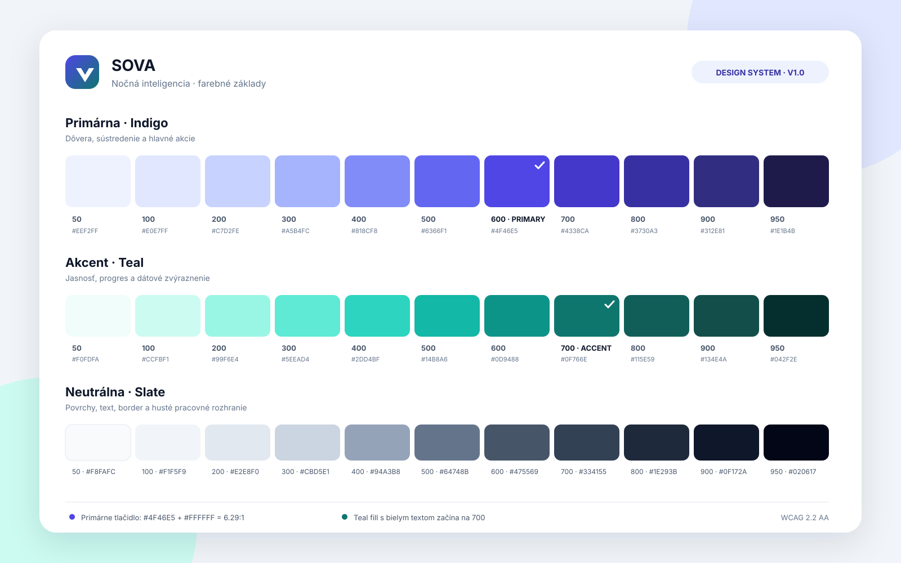
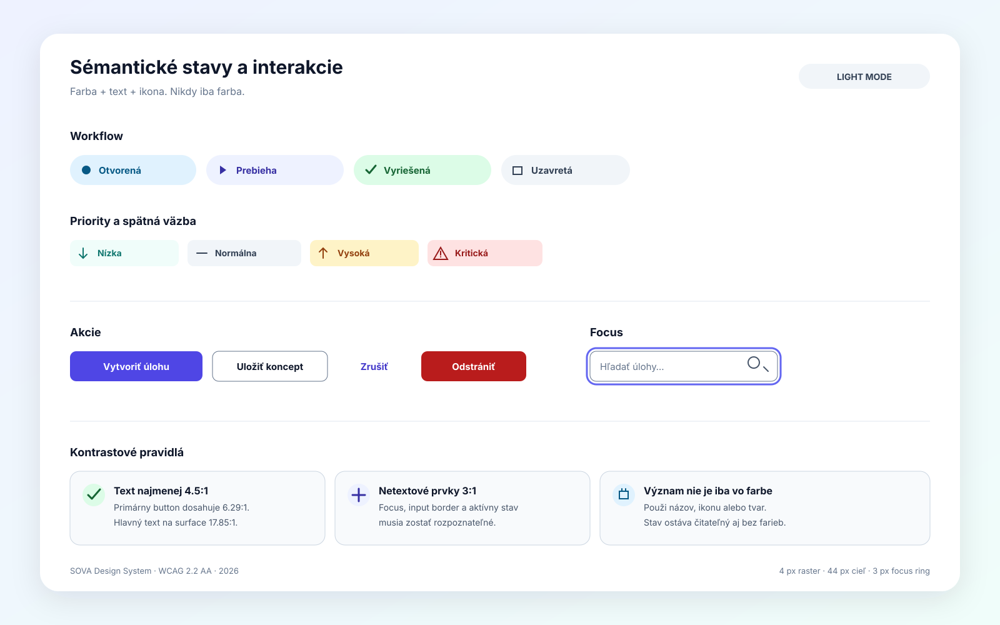
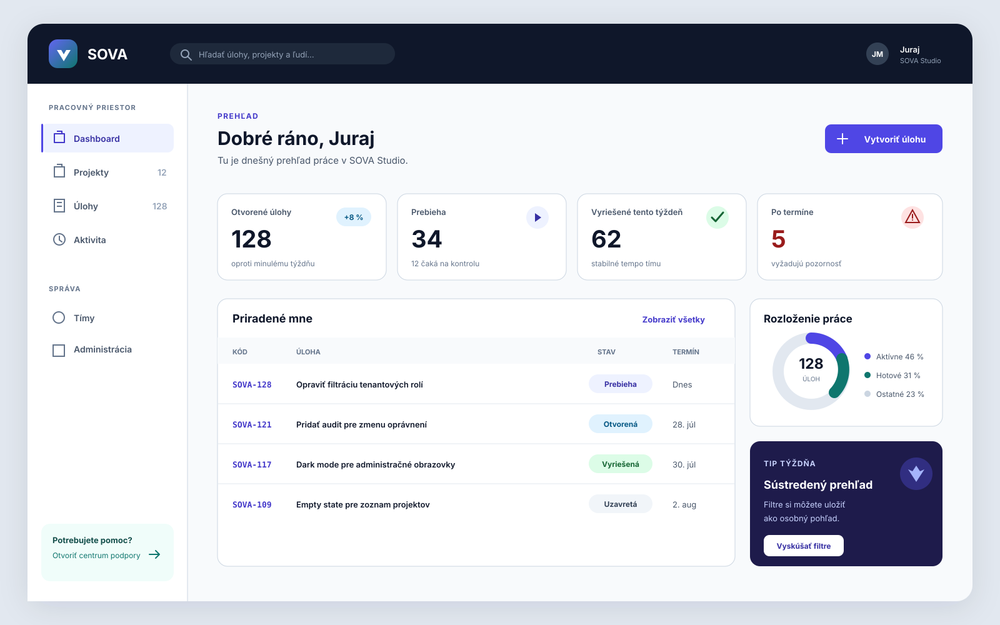
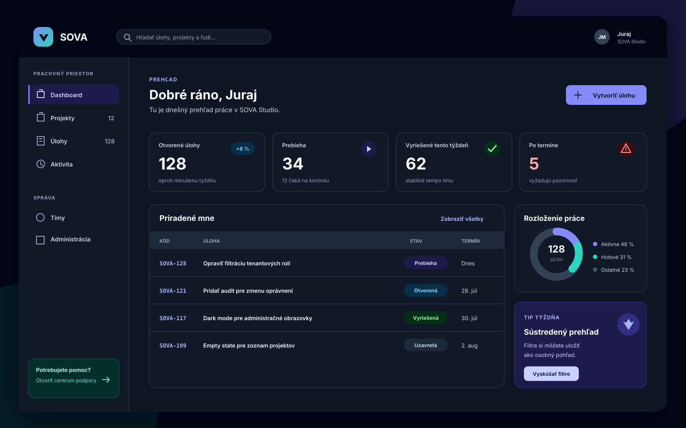

# SOVA UI design manuál

| Vlastnosť | Hodnota |
|---|---|
| Stav | Záväzný základ pre nové UI |
| Verzia | 1.0 |
| Dátum | 2026-07-26 |
| Vizuálny smer | Nočná inteligencia |
| Technický základ | Angular 22, Bootstrap 5.3, CSS custom properties |

Tento manuál definuje spoločný vizuálny jazyk aplikácie SOVA. Nové obrazovky a
komponenty sa majú riadiť sémantickými tokenmi z tohto dokumentu. Pri zmene
vizuálneho smerovania treba aktualizovať tento dokument aj
[`PROJECT_MEMORY.md`](./PROJECT_MEMORY.md).

## 1. Vizuálny koncept

SOVA má pôsobiť pokojne, presne a dôveryhodne aj pri práci s veľkým množstvom úloh.
Vizuálny smer **Nočná inteligencia** vychádza z mena produktu:

- hlboké indigo predstavuje sústredenie, dôveru a nočnú oblohu,
- tyrkysový akcent predstavuje jasnosť, aktivitu a úspešný posun,
- chladné neutrálne odtiene slate držia dátovo bohaté obrazovky čisté,
- farba zvýrazňuje rozhodnutia a stav; neslúži ako dekorácia bez významu.

Odporúčaný pomer na bežnej obrazovke je približne 80 % neutrálnych plôch, 15 %
primárnej farby a najviac 5 % akcentov a stavových farieb.



## 2. Primitívne farebné škály

Primitívne tokeny opisujú samotnú farbu. Komponenty ich nemajú používať priamo;
majú používať sémantické tokeny z ďalšej kapitoly.

### 2.1 Primárna škála — Indigo

| Token | HEX | Odporúčané použitie |
|---|---|---|
| `indigo-50` | `#EEF2FF` | jemné aktívne pozadie |
| `indigo-100` | `#E0E7FF` | vybrané položky, badge pozadie |
| `indigo-200` | `#C7D2FE` | jemný border v dark mode |
| `indigo-300` | `#A5B4FC` | odkaz a dôraz v dark mode |
| `indigo-400` | `#818CF8` | dark-mode focus a grafy |
| `indigo-500` | `#6366F1` | focus ring a dekoratívny akcent |
| `indigo-600` | `#4F46E5` | primárna akcia v light mode |
| `indigo-700` | `#4338CA` | hover, odkazy, aktívna navigácia |
| `indigo-800` | `#3730A3` | pressed stav, text na jemnom pozadí |
| `indigo-900` | `#312E81` | silný brandový dôraz |
| `indigo-950` | `#1E1B4B` | tmavé brandové plochy |

Biely text sa používa až od `indigo-600`. Kombinácia `#FFFFFF` na `indigo-600`
má kontrast približne `6.29:1`. `indigo-500` s bielym textom je pod cieľom
`4.5:1` pre bežný text a nesmie sa použiť ako základ primárneho tlačidla.

### 2.2 Akcentová škála — Teal

| Token | HEX | Odporúčané použitie |
|---|---|---|
| `teal-50` | `#F0FDFA` | jemné akcentové pozadie |
| `teal-100` | `#CCFBF1` | zvýraznenie progresu |
| `teal-200` | `#99F6E4` | dark-mode jemný dôraz |
| `teal-300` | `#5EEAD4` | grafy v dark mode |
| `teal-400` | `#2DD4BF` | dekoratívny akcent |
| `teal-500` | `#14B8A6` | grafy a ilustrácie |
| `teal-600` | `#0D9488` | ikony a veľký text |
| `teal-700` | `#0F766E` | prístupný text a vyplnená akcia |
| `teal-800` | `#115E59` | hover/pressed |
| `teal-900` | `#134E4A` | silný akcentový text |
| `teal-950` | `#042F2E` | tmavé akcentové plochy |

Teal nie je druhá primárna farba. Používa sa na progres, pomocné zvýraznenie,
vizualizácie a vybrané pozitívne momenty. Biely text na `teal-600` nemá dostatočný
kontrast pre bežný text; vyplnené teal tlačidlo preto začína na `teal-700`.

### 2.3 Neutrálna škála — Slate

| Token | HEX |
|---|---|
| `slate-50` | `#F8FAFC` |
| `slate-100` | `#F1F5F9` |
| `slate-200` | `#E2E8F0` |
| `slate-300` | `#CBD5E1` |
| `slate-400` | `#94A3B8` |
| `slate-500` | `#64748B` |
| `slate-600` | `#475569` |
| `slate-700` | `#334155` |
| `slate-800` | `#1E293B` |
| `slate-900` | `#0F172A` |
| `slate-950` | `#020617` |

## 3. Sémantické farebné tokeny

Sémantický token opisuje účel, nie konkrétny odtieň. V komponentových štýloch sa
uprednostňuje napríklad `--sova-color-text-muted` pred `--sova-slate-600`.

### 3.1 Svetlý režim

| Token | Hodnota | Účel |
|---|---|---|
| `color-canvas` | `#F8FAFC` | pozadie aplikácie |
| `color-surface` | `#FFFFFF` | karty, panely, modaly |
| `color-surface-subtle` | `#F1F5F9` | hover, tabuľkové hlavičky |
| `color-surface-strong` | `#E2E8F0` | selected/pressed neutrálne plochy |
| `color-text` | `#0F172A` | hlavný text |
| `color-text-muted` | `#475569` | sekundárny text |
| `color-text-subtle` | `#64748B` | placeholder, metadata |
| `color-border` | `#CBD5E1` | deliace čiary a obrysy plôch |
| `color-border-strong` | `#94A3B8` | dôraznejší obrys |
| `color-control-border` | `#64748B` | rozpoznateľný obrys inputu |
| `color-action-primary` | `#4F46E5` | hlavná akcia |
| `color-action-primary-hover` | `#4338CA` | hover |
| `color-action-primary-pressed` | `#3730A3` | pressed |
| `color-link` | `#4338CA` | odkazy v obsahu |
| `color-focus` | `#6366F1` | focus ring |
| `color-selection` | `#E0E7FF` | vybraná položka |

Hlavný text na bielom povrchu má kontrast približne `17.85:1`, sekundárny text
`7.58:1` a subtle text `4.76:1`.

### 3.2 Tmavý režim

| Token | Hodnota | Účel |
|---|---|---|
| `color-canvas` | `#0B1220` | pozadie aplikácie |
| `color-surface` | `#111827` | karty a panely |
| `color-surface-subtle` | `#1E293B` | hover a vnorené plochy |
| `color-surface-strong` | `#334155` | selected/pressed neutrálne plochy |
| `color-text` | `#F8FAFC` | hlavný text |
| `color-text-muted` | `#CBD5E1` | sekundárny text |
| `color-text-subtle` | `#94A3B8` | metadata |
| `color-border` | `#334155` | deliace čiary |
| `color-border-strong` | `#475569` | dôraznejší obrys |
| `color-control-border` | `#64748B` | obrys interaktívneho prvku |
| `color-action-primary` | `#818CF8` | hlavná akcia a aktívny stav |
| `color-action-primary-hover` | `#A5B4FC` | hover |
| `color-action-primary-pressed` | `#C7D2FE` | pressed |
| `color-link` | `#A5B4FC` | odkazy |
| `color-focus` | `#818CF8` | focus ring |
| `color-selection` | `#1E1B4B` | vybraná položka |

Dark mode nie je inverzia light mode. Zachováva rovnakú informačnú hierarchiu, ale
vyhýba sa čistej čiernej a veľkým plochám čistej bielej.

### 3.3 Stavové farby

| Význam | Light background | Light text/icon | Dark background | Dark text/icon |
|---|---|---|---|---|
| Informácia / open | `#E0F2FE` | `#075985` | `#082F49` | `#7DD3FC` |
| Úspech / resolved | `#DCFCE7` | `#166534` | `#052E16` | `#86EFAC` |
| Varovanie / high | `#FEF3C7` | `#92400E` | `#422006` | `#FCD34D` |
| Chyba / critical | `#FEE2E2` | `#991B1B` | `#450A0A` | `#FCA5A5` |
| Neutrálne / closed | `#F1F5F9` | `#334155` | `#1E293B` | `#CBD5E1` |
| In progress | `#EEF2FF` | `#3730A3` | `#1E1B4B` | `#C7D2FE` |

Všetky uvedené light kombinácie text/pozadie prekračujú `6:1`. Stav sa vždy
komunikuje aj textom a podľa kontextu ikonou; samotná farba nestačí.



### 3.4 Farby dátových sérií

| Token | Light | Dark | Účel |
|---|---|---|---|
| `--sova-color-chart-series-1` | `--sova-indigo-600` | `--sova-indigo-500` | prvá séria, jednofarebné stĺpce a bunky matice |
| `--sova-color-chart-series-2` | `--sova-teal-600` | `--sova-teal-600` | druhá séria (napr. „vyriešené“ oproti „vytvorené“) |

Séria nesie **identitu**, preto je dvojica zvolená podľa odstupu pri poruchách
farbocitu, nie podľa toho, ako vyzerá vedľa seba: obe kombinácie sú overené
voči vlastnému povrchu svojho režimu (light `ΔE 22,1` deutan, dark `ΔE 18,9`),
nie prevrátené z jedného do druhého — preto má dark iný indigo stupeň. Tmavý
režim je vybraný, nie odvodený.

Pravidlá pre komponenty:

- Viac než dve série sa **nedopĺňajú generovanými odtieňmi**. Namiesto toho sa
  zlúčia do „ostatné“, rozdelia na viac grafov, alebo sa použije tabuľka.
- Veličina (rozdelenie, teplota bunky) je **jeden odtieň** so škálou svetlosti,
  nikdy dúha; polarita by potrebovala dvojicu s neutrálnym stredom.
- Stavové farby z §3.3 sú vyhradené stavu a nikdy sa nepoužijú ako „séria 3“.
- Text nesie textové tokeny, nikdy farbu série; identitu nesie značka vedľa neho.
- Legenda je prítomná od druhej série; jedna séria ju nepotrebuje, lebo ju
  pomenúva nadpis. Ku každému grafu patrí aj textová alternatíva (tabuľka), aby
  tvar nebol jediný zdroj údaja.

## 4. Typografia

### 4.1 Rodiny písma

- UI a obsah: `"Inter Variable", Inter, ui-sans-serif, system-ui, -apple-system,
  "Segoe UI", sans-serif`.
- Kódy úloh, technické hodnoty a logy: `ui-monospace, "SFMono-Regular", Consolas,
  "Liberation Mono", monospace`.
- Ak sa Inter pridá, font sa má hostovať lokálne ako WOFF2 a používať s
  `font-display: swap`. Systémový fallback zostáva povinný.

### 4.2 Typografická stupnica

| Rola | Veľkosť / riadok | Váha |
|---|---|---|
| Display | `36 / 44 px` | 700 |
| H1 | `30 / 38 px` | 700 |
| H2 | `24 / 32 px` | 650–700 |
| H3 | `20 / 28 px` | 600 |
| Lead | `18 / 28 px` | 400 |
| Body | `16 / 24 px` | 400 |
| Body small | `14 / 20 px` | 400–500 |
| Caption | `12 / 16 px` | 500 |
| Button | `14 / 20 px` | 600 |

Na mobiloch sa H1 zmenší na `24 / 32 px`. Dlhé texty sa nepíšu verzálkami.
Eyebrow môže byť verzálkami, ale musí mať aspoň `12 px` a `0.06em` letter spacing.

## 5. Rozostupy, rozmery a layout

Systém používa základný raster `4 px`.

| Token | Hodnota |
|---|---|
| `space-1` | `4 px` |
| `space-2` | `8 px` |
| `space-3` | `12 px` |
| `space-4` | `16 px` |
| `space-6` | `24 px` |
| `space-8` | `32 px` |
| `space-10` | `40 px` |
| `space-12` | `48 px` |
| `space-16` | `64 px` |

Pravidlá:

- hlavný obsah má maximálnu šírku `90rem` (`1440 px`),
- desktopový sidebar má šírku `16rem` (`256 px`),
- padding obsahu je `32 px` desktop, `20 px` tablet a `16 px` mobil,
- formulár má preferovanú šírku `32rem`; dlhé editory môžu byť širšie,
- hlavné dotykové ciele majú minimálne `44 × 44 px`,
- hustý desktopový toolbar môže mať `36 px`, ak má dostatočné rozostupy a na
  touch zariadení sa zväčší.

## 6. Tvar, border a hĺbka

| Token | Hodnota | Použitie |
|---|---|---|
| `radius-sm` | `6 px` | badge, malé prvky |
| `radius-md` | `10 px` | input, button |
| `radius-lg` | `14 px` | karta, panel |
| `radius-xl` | `20 px` | modal, auth karta |
| `radius-pill` | `999 px` | status pill, avatar |

Karty používajú v prvom rade `1 px` border. Tieň nepatrí na každú kartu:

- level 0: bez tieňa — statická karta v ploche,
- level 1: `0 1px 2px rgb(15 23 42 / 0.06)` — sticky toolbar,
- level 2: `0 8px 24px rgb(15 23 42 / 0.10)` — dropdown a popover,
- level 3: `0 20px 48px rgb(15 23 42 / 0.16)` — modal.

V dark mode sa hĺbka vyjadruje hlavne zmenou povrchu a borderom; silné čierne tiene
sa nepoužívajú.

## 7. Komponentové pravidlá

### 7.1 Aplikačný shell

- Horná lišta používa `slate-900` v light mode a `slate-950` v dark mode.
- Sidebar je samostatný surface; aktívna položka používa jemné indigo pozadie,
  indigo text a ľavý 3 px indikátor.
- Obsah ostáva neutrálny. Primárna farba sa nerozlieva na veľké pracovné plochy.
- Zmena tenantu musí byť zreteľná textom; farba tenantu môže byť len doplnok.

### 7.2 Tlačidlá

- Primary: `indigo-600`, biely text; hover `indigo-700`, pressed `indigo-800`.
- V dark mode používa primary `indigo-400` s textom `slate-900`.
- Secondary: biely/surface podklad, `slate-500` border, `slate-900` text.
- Tertiary: bez borderu, hover cez `surface-subtle`.
- Destructive: červená patrí iba deštruktívnym akciám, nie bežnému „zrušiť“.
- Na jednej ploche má byť spravidla iba jedna vizuálne dominantná primary akcia.
- Loading zachová šírku tlačidla a obsahuje spinner aj zrozumiteľný text.

### 7.3 Formuláre

- Input má minimálnu výšku `44 px`, radius `10 px` a viditeľný control border.
- Label je vždy nad poľom; placeholder nie je náhrada labelu.
- Help text a chyba sú oddelené. Chyba používa ikonu, text a `aria-describedby`.
- Focus ring má hrúbku `3 px`, offset `2 px` a nesmie ho nahradiť iba zmena borderu.
- Validácia sa nespúšťa agresívne pred prvou interakciou alebo submitom.

### 7.4 Karty, zoznamy a tabuľky

- Karta zoskupuje jednu tému; vnorené karty sa používajú výnimočne.
- Tabuľka je preferovaná pre porovnávanie viacerých rovnakých polí, karta pre
  prehľad alebo objekt.
- Hlavička tabuľky používa `surface-subtle`, text `14 px / 600`.
- Hover riadku je jemný; selected stav má navyše checkbox alebo ikonu.
- Kód úlohy je monospace, názov ostáva dominantný a stav je sekundárny.

### 7.5 Badge, workflow a priority

- Badge používa tónované pozadie a tmavší text, nie biely text na sýtej strednej
  farbe.
- Workflow mapovanie: `open → info`, `in-progress → indigo`,
  `resolved → success`, `closed → neutral`.
- Priorita: `low → teal`, `normal → neutral`, `high → warning`,
  `critical → danger`.
- Stav aj priorita musia mať čitateľný názov. V kompaktnom režime sa môže pridať
  ikona, ale názov sa nesmie natrvalo odstrániť.

### 7.6 Oznámenia a prázdne stavy

- Alert obsahuje ikonu, nadpis, vysvetlenie a iba relevantnú akciu.
- Toast je pre krátku spätnú väzbu; kritická alebo nezvratná informácia zostáva na
  obrazovke.
- Empty state vysvetľuje, prečo je plocha prázdna, a ponúkne jeden ďalší krok.
- Skeleton kopíruje tvar obsahu; neurčitý spinner sa používa pri krátkom čakaní.

## 8. Light a dark ukážka





Používateľ má mať voľby `Systém`, `Svetlý` a `Tmavý`. Bootstrap režim sa nastavuje
cez `data-bs-theme="light|dark"` na elemente `<html>`. Voľba sa aplikuje pred
bootstrapom Angular aplikácie, aby sa predišlo bliknutiu nesprávnej témy.

## 9. Ikony a ilustrácie

- Používa sa jedna konzistentná outline sada s optickou veľkosťou `20 px` a stroke
  približne `1.75–2 px`.
- Ikona bez textu musí mať prístupný názov alebo tooltip a dostatočne veľký cieľ.
- Emoji sa nepoužívajú ako systémové ikony, pretože sa medzi platformami líšia.
- Ilustrácie majú používať indigo/teal akcenty a jednoduché geometrické tvary;
  nesmú konkurovať pracovným dátam.

## 10. Pohyb

| Token | Hodnota | Použitie |
|---|---|---|
| `motion-fast` | `120 ms` | hover, pressed |
| `motion-base` | `180 ms` | dropdown, tooltip |
| `motion-slow` | `240 ms` | panel, modal |
| `ease-standard` | `cubic-bezier(0.2, 0, 0, 1)` | väčšina prechodov |
| `ease-emphasized` | `cubic-bezier(0.2, 0, 0, 1.2)` | malé vstupné animácie |

Animuje sa opacity a transform, nie layoutové vlastnosti. Pri
`prefers-reduced-motion: reduce` sa nepodstatné animácie odstránia a nevyhnutné
prechody sa skrátia.

## 11. Prístupnosť

SOVA cieli na WCAG 2.2 AA:

- bežný text má kontrast najmenej `4.5:1`, veľký text najmenej `3:1`,
- hranice dôležitých ovládacích prvkov a focus indikátor majú aspoň `3:1` voči
  susednej farbe,
- farba nikdy nie je jediným nositeľom stavu, chyby, priority ani výberu,
- focus je vždy viditeľný a nesmie byť prekrytý sticky hlavičkou alebo modalom,
- poradie tabulátora sleduje vizuálne poradie,
- zoom na `200 %` a reflow pri šírke `320 CSS px` nesmie stratiť funkciu,
- text sa nevkladá do rasterových obrázkov, ak nejde o dekoratívny náhľad.

## 12. Obsah a lokalizácia

- Text je stručný, konkrétny a orientovaný na činnosť.
- Tlačidlo pomenúva výsledok: „Vytvoriť projekt“, nie „OK“.
- Chyba povie, čo sa stalo a ako pokračovať; neobviňuje používateľa.
- Komponenty musia zvládnuť približne o 30 % dlhší preklad než slovenský text.
- Dátum, čas, čísla a množné čísla sa formátujú podľa aktívneho locale.
- Používateľský text naďalej patrí do všetkých šiestich i18n katalógov.

## 13. Implementačné pravidlá

1. Primitívne tokeny sa definujú raz na `:root`.
2. Light a dark téma mapujú primitíva na rovnaké sémantické tokeny.
3. Komponent smie čítať iba sémantický token alebo vlastný component token.
4. Bootstrap premenné sa mapujú na SOVA tokeny; nevytvára sa paralelný,
   nesynchronizovaný farebný systém.
5. Hodnoty HEX sa nesmú roztrúsiť vo feature SCSS. Výnimkou je dočasný prototyp,
   ktorý sa pred merge nahradí tokenom.
6. Každý nový stav komponentu sa overí v light aj dark mode, pri klávesnicovom
   focus a pri `prefers-reduced-motion`.

Odporúčané mapovanie Bootstrap premenných:

```scss
:root,
[data-bs-theme='light'] {
  --sova-color-canvas: #f8fafc;
  --sova-color-surface: #ffffff;
  --sova-color-text: #0f172a;
  --sova-color-text-muted: #475569;
  --sova-color-border: #cbd5e1;
  --sova-color-action-primary: #4f46e5;
  --sova-color-focus: #6366f1;

  --bs-primary: var(--sova-color-action-primary);
  --bs-body-color: var(--sova-color-text);
  --bs-body-bg: var(--sova-color-canvas);
  --bs-border-color: var(--sova-color-border);
  --bs-link-color: #4338ca;
  --bs-focus-ring-color: rgb(99 102 241 / 35%);
}

[data-bs-theme='dark'] {
  --sova-color-canvas: #0b1220;
  --sova-color-surface: #111827;
  --sova-color-text: #f8fafc;
  --sova-color-text-muted: #cbd5e1;
  --sova-color-border: #334155;
  --sova-color-action-primary: #818cf8;
  --sova-color-focus: #818cf8;
}
```

Pri reálnej implementácii treba doplniť aj RGB, subtle background, emphasis text a
component-level Bootstrap premenné, aby sa správne prefarbili buttony, formuláre,
alerty a validácia.

## 14. Kontrolný zoznam pre UI review

- Používa obrazovka iba schválené sémantické tokeny?
- Je jasné, ktorá jedna akcia je primárna?
- Sú hover, active, focus, disabled, loading, empty a error stavy pokryté?
- Funguje komponent v light aj dark mode?
- Je stav zrozumiteľný aj bez farby?
- Má text a ovládanie požadovaný kontrast?
- Funguje klávesnica, zoom, reflow a reduced motion?
- Zvládne layout dlhší preklad a prázdne aj extrémne hodnoty?
- Používa karta border namiesto nepotrebného tieňa?
- Je výsledok konzistentný s existujúcim shellom a hustotou issue trackera?

## 15. Referencie

- [WCAG 2.2](https://www.w3.org/TR/WCAG22/)
- [WCAG: Use of Color](https://www.w3.org/WAI/WCAG22/Understanding/use-of-color)
- [WCAG: Non-text Contrast](https://www.w3.org/WAI/WCAG22/understanding/non-text-contrast.html)
- [Bootstrap 5.3 Color Modes](https://getbootstrap.com/docs/5.3/customize/color-modes/)
- [Bootstrap 5.3 CSS Variables](https://getbootstrap.com/docs/5.3/customize/css-variables/)
