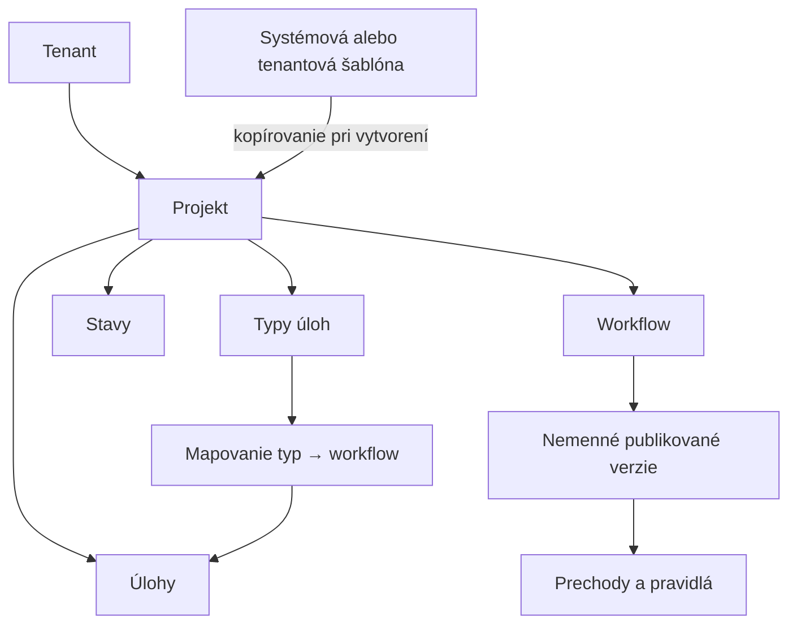
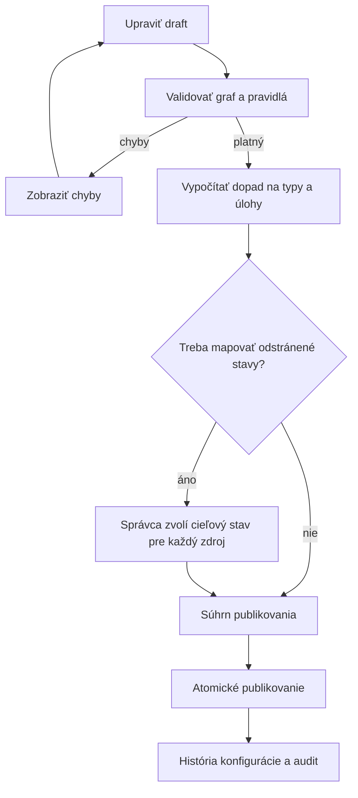
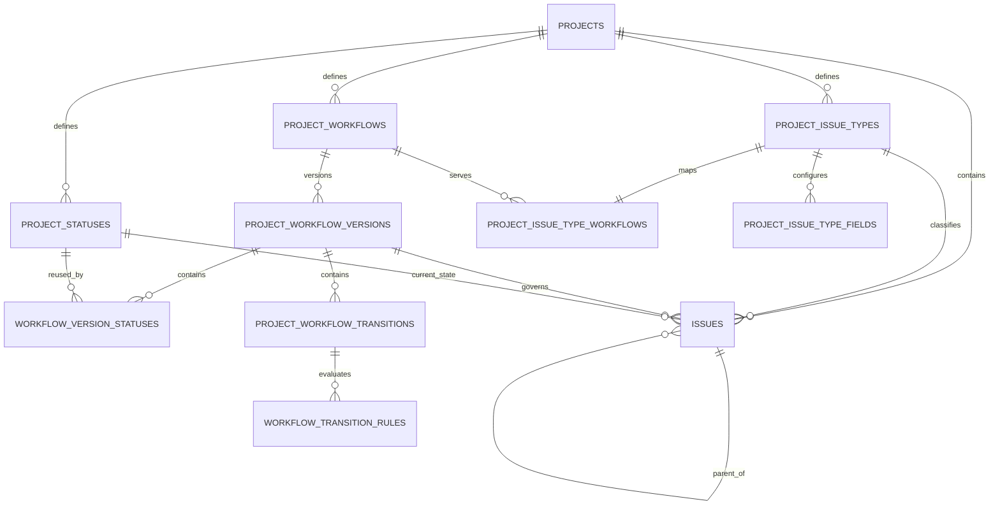

# SOVA – projektová konfigurácia typov úloh a workflow

> Záväzná implementačná špecifikácia pre Jira-like riadenie úloh

| Vlastnosť | Hodnota |
|---|---|
| Stav | Schválený produktový a technický smer |
| Rozsah | Projekt, typy úloh, hierarchia, workflow, prechody |
| Vlastník konfigurácie | Projekt |
| Posledná aktualizácia | 2026-07-26 |

## 1. Cieľ

Každý projekt v SOVA musí mať vlastnú konfigurovateľnú schému práce. Projektový
správca musí vedieť bez nasadenia novej verzie aplikácie:

- vytvoriť, upraviť, zoradiť a archivovať typy úloh,
- používať predvolené typy `EPIC`, `STORY`, `TASK`, `BUG` a `SUBTASK`,
- vytvoriť vlastný typ úlohy,
- určiť hierarchickú úroveň typu,
- vytvoriť viac workflow v jednom projekte,
- priradiť rozdielne workflow jednotlivým typom úloh,
- definovať stavy, prechody, oprávnenia a povinné údaje prechodu,
- bezpečne publikovať zmenu konfigurácie aj v projekte, ktorý už obsahuje úlohy.

Pojem „podobne ako Jira“ v tejto špecifikácii znamená projektovo nastaviteľné typy
úloh, hierarchiu, mapovanie typu na workflow a riadené prechody medzi stavmi. Neznamená
automaticky implementovať všetky funkcie alebo administračné schémy produktu Jira.

## 2. Záväzné rozhodnutia

1. **Konfigurácia patrí projektu.** Typ úlohy, stav ani workflow nemožno použiť priamo
   v inom projekte.
2. **Šablóna sa kopíruje.** Pri vytvorení projektu sa vybraná systémová alebo tenantová
   šablóna skopíruje. Neskoršia zmena šablóny nesmie potichu meniť existujúci projekt.
3. **EPIC je typ úlohy.** Nie je to samostatná tabuľka ani samostatný modul.
4. **Workflow sa mapuje na typ úlohy.** Každý aktívny typ má práve jedno aktívne
   publikované workflow. Jedno workflow môže obsluhovať viac typov v tom istom
   projekte.
5. **Publikované workflow je nemenné.** Úpravy vznikajú v pracovnej verzii a prejavia
   sa až publikovaním novej verzie.
6. **Použitá konfigurácia sa nemaže.** Typy, stavy a workflow s historickými väzbami sa
   archivujú.
7. **Backend je autoritatívny.** Frontend môže prechody predbežne filtrovať, ale
   oprávnenie, aktuálny stav, pravidlá, tenant, projekt a verziu úlohy vždy znovu
   overuje API.
8. **Žiadny používateľský kód.** Podmienky a akcie workflow používajú iba podporovaný
   katalóg pravidiel. Do databázy sa nesmie ukladať spustiteľný PHP, JavaScript, SQL
   ani ľubovoľný výraz.
9. **Funkčná konfigurácia je súčasť jadra.** Grafický drag-and-drop editor môže
   nasledovať neskôr; prvá implementácia musí umožniť úplnú konfiguráciu minimálne
   cez formuláre a tabuľkový editor.

## 3. Vlastníctvo a hranice



Všetky konfiguračné entity nesú `tenant_id` aj `project_id`. `tenant_id` je
denormalizovaný bezpečnostný údaj: musí byť súčasťou aplikačných filtrov, indexov a
kompozitných cudzích kľúčov. Samotné UUID bez overeného tenantového a projektového
kontextu nie je dostatočná referencia.

Tenantová šablóna slúži iba na pohodlné založenie projektu. Zdieľaná „živá“ schéma,
ktorá by jednou zmenou prepísala viac projektov, nie je súčasťou prvej implementácie.

## 4. Predvolená konfigurácia projektu

Nový projekt dostane funkčnú konfiguráciu ešte v transakcii svojho vytvorenia.
Predvolená šablóna obsahuje:

| Kód typu | Názov | Úroveň | Účel |
|---|---|---:|---|
| `EPIC` | Epic | `1` | Väčší produktový alebo pracovný celok |
| `STORY` | User story | `0` | Hodnota alebo požiadavka používateľa |
| `TASK` | Task | `0` | Bežná pracovná úloha |
| `BUG` | Bug | `0` | Chyba alebo regresia |
| `SUBTASK` | Sub-task | `-1` | Menšia časť štandardnej úlohy |

Predvolené stavy:

| Kód | Názov | Kategória |
|---|---|---|
| `OPEN` | Otvorená | `TO_DO` |
| `IN_PROGRESS` | Rozpracovaná | `IN_PROGRESS` |
| `RESOLVED` | Vyriešená | `DONE` |
| `CLOSED` | Uzavretá | `DONE` |

Kategórie `TO_DO`, `IN_PROGRESS` a `DONE` sú systémové a nemeniteľné. Projektový
správca mení názov, opis, poradie a vizuálny token konkrétneho stavu, nie význam
kategórie. Kategórie sa používajú v reportoch, Kanbane a pri výpočte otvorenej alebo
dokončenej práce.

Predvolená šablóna vytvorí jedno workflow pre `STORY`, `TASK`, `BUG` a `SUBTASK`.
`EPIC` môže spočiatku používať rovnaké workflow, ale mapovanie ostáva samostatné, aby
ho projekt mohol neskôr zmeniť.

## 5. Typy úloh

### 5.1 Vlastnosti typu

Typ úlohy obsahuje minimálne:

- stabilné UUID,
- `tenant_id` a `project_id`,
- nemenný strojový `code`,
- používateľský názov a opis zadaný projektom,
- ikonu z podporovaného katalógu a sémantický farebný token,
- `hierarchy_level`,
- poradie vo výberoch,
- príznak aktívny/archivovaný,
- verziu záznamu pre optimistické zamykanie.

Kód sa po vytvorení nemení, pretože sa používa vo filtroch, audite a integráciách.
Názov možno meniť. Kód musí byť po normalizácii unikátny v projekte.

### 5.2 Podporovaná hierarchia

Prvá implementácia podporuje tri úrovne:

```text
1   Epic alebo vlastný typ na úrovni epicu
0   Story, Task, Bug alebo vlastný štandardný typ
-1  Sub-task alebo vlastný podtyp
```

Pravidlá rodiča:

- úloha na úrovni `1` nemá rodiča,
- úloha na úrovni `0` môže mať rodiča iba na úrovni `1`,
- úloha na úrovni `-1` musí mať rodiča na úrovni `0`,
- rodič a dieťa musia patriť rovnakému tenantovi a projektu,
- úloha nesmie byť vlastným rodičom a graf nesmie obsahovať cyklus,
- archivovaný typ nemožno vybrať pre novú úlohu.

Všeobecné ľubovoľné úrovne nad epicom nie sú súčasťou prvej implementácie. Dátový
model používa celé číslo, aby sa dali doplniť bez zmeny identity existujúcich typov.

### 5.3 Polia podľa typu

Projekt môže pre každý typ nastaviť správanie podporovaných systémových polí:

- zobrazené alebo skryté,
- voliteľné alebo povinné pri vytvorení,
- predvolenú hodnotu, ak ju dané pole podporuje,
- poradie vo formulári.

`title`, `project`, `issue_type`, `reporter`, `status` a interné bezpečnostné polia
nemožno skryť spôsobom, ktorý by porušil doménové invariancie. Vlastné používateľské
polia a plnohodnotné obrazovkové schémy sú samostatná neskoršia funkcia; tento model
ich nesmie zablokovať.

### 5.4 Archivácia a zmena typu existujúcej úlohy

Typ s existujúcimi úlohami sa archivuje, nie vymaže. Existujúce úlohy si zachovajú
názov, ikonu, workflow a možnosť dokončiť životný cyklus. Archivovaný typ sa neponúka
pri vytváraní ani bežnej zmene typu.

Zmena typu existujúcej úlohy vyžaduje:

1. oprávnenie `issue.change_type`,
2. aktívny cieľový typ v rovnakom projekte,
3. platnú hierarchiu rodiča a detí,
4. mapovanie aktuálneho stavu do cieľového workflow,
5. doplnenie všetkých povinných polí cieľového typu,
6. očakávanú verziu úlohy,
7. zápis do histórie a auditu.

Ak nemožno stav jednoznačne mapovať, API vyžaduje explicitný cieľový stav.

## 6. Workflow

### 6.1 Identita a verzia

`ProjectWorkflow` je stabilná identita s názvom a opisom. Jeho obsah sa nachádza vo
verziách:

- `DRAFT` – editovateľná pracovná verzia,
- `PUBLISHED` – nemenná verzia používaná úlohami,
- `RETIRED` – historická publikovaná verzia, ktorú už nepoužíva žiadne aktívne
  mapovanie.

V jednom workflow môže byť naraz najviac jeden draft. Číslo publikovanej verzie
monotónne rastie. Z publikovanej verzie sa vytvorí kópia do draftu; publikovaný obsah
sa nikdy neupravuje priamo.

### 6.2 Stav

Projektový stav obsahuje:

- stabilný kód a názov,
- kategóriu `TO_DO`, `IN_PROGRESS` alebo `DONE`,
- opis,
- sémantický farebný token a poradie,
- príznak archivácie.

Stav môže byť použitý vo viacerých workflow toho istého projektu. Členstvo stavu v
konkrétnej verzii workflow je explicitné. Každá verzia má práve jeden počiatočný stav.

### 6.3 Prechod

Prechod obsahuje:

- UUID a zobrazovaný názov akcie, napríklad „Začať prácu“,
- zdrojový a cieľový stav,
- požadované oprávnenie,
- poradie v zozname dostupných akcií,
- voliteľný príznak primárnej akcie,
- zoznam podmienok, validátorov a podporovaných následných akcií.

Prvá implementácia používa presný zdrojový stav. Globálny prechod „z ľubovoľného
stavu“ možno doplniť neskôr ako explicitný typ, nie použitím nejasnej hodnoty `NULL`.

Podporovaný počiatočný katalóg pravidiel:

| Druh | Kľúč | Význam |
|---|---|---|
| Podmienka | `permission` | Aktér musí mať určené oprávnenie |
| Podmienka | `assignee_or_manager` | Aktér je riešiteľ alebo má manažérske oprávnenie |
| Validátor | `required_field` | Pole musí byť po prechode vyplnené |
| Validátor | `resolution_required` | Musí byť zadaný spôsob vyriešenia |
| Akcia | `set_resolution` | Nastaví zvolený spôsob vyriešenia |
| Akcia | `clear_resolution` | Vymaže resolution pri opätovnom otvorení |
| Akcia | `set_resolved_at` | Nastaví čas vyriešenia |
| Akcia | `clear_resolved_at` | Vymaže čas vyriešenia |

Konfigurácia pravidla je štruktúrovaný JSON validovaný podľa schémy konkrétneho
`rule_key`. Kľúč sa mapuje na backendovú implementáciu z pevného registra.

### 6.4 Validácia grafu

Workflow nemožno publikovať, kým neplatí:

- obsahuje aspoň jeden stav a práve jeden počiatočný stav,
- obsahuje aspoň jeden dosiahnuteľný stav kategórie `DONE`,
- každý stav je dosiahnuteľný z počiatočného stavu,
- zdroj aj cieľ každého prechodu sú členmi danej verzie,
- prechod odkazuje iba na podporované pravidlá a platnú konfiguráciu,
- primárna akcia je pre jeden zdrojový stav najviac jedna,
- každý typ mapovaný na workflow ostane po publikovaní obslúžený,
- zmena neodstráni stav používaný úlohami bez migračného mapovania.

Slepá vetva bez cesty do `DONE` je minimálne blokujúca validačná chyba. Projekt môže
mať viac koncových stavov.

## 7. Mapovanie typu na workflow

Aktívny typ úlohy má práve jedno mapovanie na stabilnú identitu workflow v rovnakom
projekte. Workflow má jednu aktívnu publikovanú verziu. Nová úloha si pri vytvorení
uloží konkrétne `workflow_version_id` a počiatočný `status_id`.

Príklad:

| Typ | Workflow |
|---|---|
| Epic | Epic workflow |
| Story | Delivery workflow |
| Task | Delivery workflow |
| Bug | Defect workflow |
| Sub-task | Simple workflow |

Mapovanie nesmie odkazovať na draft, archivovaný typ ani workflow z iného projektu.
Aktivovať nový typ bez publikovaného workflow nie je možné.

## 8. Publikovanie a migrácia konfigurácie

### 8.1 Postup



Pred potvrdením UI zobrazí:

- typy používajúce workflow,
- počet dotknutých úloh podľa aktuálneho stavu,
- odstránené alebo nové stavy a prechody,
- povinné mapovanie starého stavu na nový,
- zmeny pravidiel a oprávnení,
- očakávanú revíziu projektovej konfigurácie.

### 8.2 Atomická zmena

Prvá implementácia publikuje a migruje v jednej databázovej transakcii:

1. zamkne revíziu konfigurácie projektu,
2. znovu overí oprávnenie a očakávanú revíziu,
3. znovu validuje draft a migračné mapovanie,
4. vytvorí nemennú publikovanú verziu,
5. zmení aktívnu verziu workflow,
6. dotknutým úlohám nastaví novú verziu a podľa potreby nový stav,
7. zvýši revíziu konfigurácie projektu,
8. zapíše históriu, audit a outbox udalosť,
9. commitne všetko alebo nič.

Pri neskorších veľkých objemoch možno migráciu presunúť do riadeného background jobu,
ale projekt musí byť počas migrácie v jednoznačnom režime a nesmie používať čiastočne
aktivovanú konfiguráciu.

### 8.3 Súbeh a návrat

Draft aj projektová konfigurácia používajú optimistické zamykanie. Neaktuálne
publikovanie vráti `409 Conflict` a nič nezmení.

Rollback nemení starú publikovanú verziu. Správca vytvorí nový draft z vybranej
historickej verzie a publikuje ho ako novú verziu s rovnakou kontrolou dopadu a
migrácie.

## 9. Beh úlohy

### 9.1 Vytvorenie

Backend pri vytváraní úlohy:

1. overí reláciu, tenantový a projektový kontext,
2. overí `issue.create`,
3. načíta aktívny projektový typ a jeho workflow,
4. validuje polia a rodiča podľa typu,
5. nastaví publikovanú verziu workflow a jej počiatočný stav,
6. atomicky pridelí ďalšie projektové číslo,
7. uloží úlohu, históriu a outbox udalosť v jednej transakcii.

Klient neposiela ľubovoľný počiatočný stav.

### 9.2 Dostupné prechody

`GET transitions` vráti iba prechody platné pre konkrétnu úlohu, aktuálneho aktéra a
aktuálnu verziu workflow. Pri každom prechode vráti:

- ID a názov,
- cieľový stav,
- či ide o primárnu akciu,
- polia, ktoré musí používateľ doplniť,
- verziu úlohy, proti ktorej bol zoznam vypočítaný.

### 9.3 Vykonanie prechodu

Klient posiela `transition_id`, `expected_issue_version` a hodnoty vyžiadaných polí.
Backend v jednej transakcii:

1. zamkne alebo podmienene aktualizuje konkrétnu úlohu,
2. overí jej tenant, projekt, typ, workflow verziu a aktuálny stav,
3. nájde presný prechod podľa ID a zdrojového stavu,
4. vyhodnotí oprávnenie, podmienky a validátory,
5. vykoná podporované následné akcie,
6. zmení stav a zvýši verziu úlohy,
7. uloží históriu a outbox udalosť.

Samotné odoslanie cieľového `status_id` nie je dovolené.

## 10. Oprávnenia a bezpečnosť

Minimálny katalóg:

| Oprávnenie | Účel |
|---|---|
| `project.configure` | Čítať základnú projektovú konfiguráciu |
| `issue_type.manage` | Vytvárať, upravovať a archivovať typy |
| `workflow.manage` | Upravovať stavy, workflow a drafty |
| `workflow.publish` | Publikovať workflow a migrovať úlohy |
| `issue.create` | Vytvoriť úlohu povoleného typu |
| `issue.change_type` | Zmeniť typ existujúcej úlohy |
| `issue.transition` | Vykonať všeobecný workflow prechod |

Konkrétny prechod môže požadovať ďalšie oprávnenie, napríklad
`issue.resolve` alebo `issue.reopen`.

Predvolený `PROJECT_MANAGER` dostane administračné oprávnenia projektu. Tenantová
alebo systémová rola nesmie obísť kontrolu projektového kontextu, ak explicitná
politika neurčuje administratívny zásah. Každý zápis musí overiť, že všetky UUID v
požiadavke patria rovnakému tenantovi a projektu.

Citlivé auditné udalosti:

- vytvorenie, zmena a archivácia typu,
- zmena hierarchickej úrovne,
- vytvorenie workflow alebo draftu,
- publikovanie vrátane migračného mapovania a počtu úloh,
- zmena mapovania typu na workflow,
- neúspešný pokus o cross-project alebo cross-tenant konfiguráciu.

## 11. Navrhovaný dátový model



Odporúčané tabuľky:

| Tabuľka | Dôležité polia |
|---|---|
| `project_issue_types` | `tenant_id`, `project_id`, `code`, `name`, `hierarchy_level`, `position`, `archived_at`, `version` |
| `project_issue_type_fields` | `issue_type_id`, `field_key`, `visibility`, `required_on_create`, `default_value`, `position` |
| `project_statuses` | `tenant_id`, `project_id`, `code`, `name`, `category`, `color_token`, `archived_at` |
| `project_workflows` | `tenant_id`, `project_id`, `name`, `active_version_id`, `archived_at` |
| `project_workflow_versions` | `workflow_id`, `version_number`, `state`, `initial_status_id`, `version` |
| `workflow_version_statuses` | `workflow_version_id`, `status_id`, `position` |
| `project_workflow_transitions` | `workflow_version_id`, `from_status_id`, `to_status_id`, `name`, `permission_code`, `is_primary`, `position` |
| `workflow_transition_rules` | `transition_id`, `rule_type`, `rule_key`, `configuration`, `position` |
| `project_issue_type_workflows` | `tenant_id`, `project_id`, `issue_type_id`, `workflow_id` |
| `issues` | doplniť `project_issue_type_id`, `workflow_version_id`, `status_id`, `parent_issue_id`, `version` |

Databázové obmedzenia majú chrániť aspoň:

- unikátnosť kódu typu a stavu v projekte,
- unikátnosť čísla verzie v workflow,
- najviac jeden draft na workflow,
- jednu mapovaciu väzbu na aktívny typ,
- rovnaký `tenant_id` a `project_id` v konfiguračných väzbách,
- zákaz fyzického odstránenia záznamu, na ktorý odkazuje úloha alebo audit.

Nie všetky grafové pravidlá možno spoľahlivo vyjadriť databázovým constraintom.
Validuje ich doménová služba pri každom publikovaní; databázové obmedzenia ostávajú
poslednou ochranou referenčnej a tenantovej integrity.

## 12. Návrh REST API

Presné OpenAPI schémy sa doplnia pri implementácii. Zamýšľané zdroje:

```text
GET    /api/v1/tenants/{tenantId}/projects/{projectId}/configuration

GET    /api/v1/tenants/{tenantId}/projects/{projectId}/issue-types
POST   /api/v1/tenants/{tenantId}/projects/{projectId}/issue-types
PATCH  /api/v1/tenants/{tenantId}/projects/{projectId}/issue-types/{issueTypeId}
POST   /api/v1/tenants/{tenantId}/projects/{projectId}/issue-types/{issueTypeId}/archive

GET    /api/v1/tenants/{tenantId}/projects/{projectId}/workflows
POST   /api/v1/tenants/{tenantId}/projects/{projectId}/workflows
POST   /api/v1/tenants/{tenantId}/projects/{projectId}/workflows/{workflowId}/draft
PUT    /api/v1/tenants/{tenantId}/projects/{projectId}/workflows/{workflowId}/draft
POST   /api/v1/tenants/{tenantId}/projects/{projectId}/workflows/{workflowId}/validate
POST   /api/v1/tenants/{tenantId}/projects/{projectId}/workflows/{workflowId}/impact
POST   /api/v1/tenants/{tenantId}/projects/{projectId}/workflows/{workflowId}/publish

PUT    /api/v1/tenants/{tenantId}/projects/{projectId}/issue-type-workflows
GET    /api/v1/tenants/{tenantId}/projects/{projectId}/issue-create-metadata

GET    /api/v1/tenants/{tenantId}/issues/{issueId}/transitions
POST   /api/v1/tenants/{tenantId}/issues/{issueId}/transitions/{transitionId}
```

Konfiguračné mutácie prijímajú `expected_config_version` alebo štandardný
`If-Match`. Mutácia úlohy prijíma očakávanú verziu úlohy. API nepreberá `tenant_id`
alebo `project_id` z tela ako dôveryhodný údaj; musí ho porovnať s route a načítanou
entitou.

Odporúčané stabilné chybové kódy:

| HTTP | Kód | Význam |
|---:|---|---|
| `409` | `PROJECT_CONFIG_VERSION_CONFLICT` | Konfiguráciu medzičasom zmenil iný správca |
| `409` | `WORKFLOW_MIGRATION_REQUIRED` | Použité stavy nemajú cieľové mapovanie |
| `409` | `ISSUE_TYPE_IN_USE` | Operácia by porušila existujúce väzby |
| `409` | `ISSUE_VERSION_CONFLICT` | Úloha má novšiu verziu |
| `422` | `WORKFLOW_INVALID` | Graf alebo pravidlá workflow nie sú platné |
| `422` | `HIERARCHY_INVALID` | Rodič alebo úroveň typu porušuje hierarchiu |
| `422` | `TRANSITION_FIELDS_REQUIRED` | Chýbajú údaje požadované prechodom |
| `422` | `TRANSITION_NOT_AVAILABLE` | Prechod nepatrí k aktuálnemu stavu a verzii |
| `404` | `PROJECT_RESOURCE_NOT_FOUND` | Cudzia alebo nedostupná projektová referencia |

Pri citlivých cudzích identifikátoroch je vhodné vrátiť `404`, aby odpoveď
neprezrádzala existenciu objektu mimo povoleného kontextu.

## 13. Používateľské rozhranie

Projektové nastavenia obsahujú samostatné sekcie:

```text
Všeobecné | Členovia | Typy úloh | Workflow | Mapovanie workflow | História konfigurácie
```

### 13.1 Typy úloh

Správca vidí poradie, ikonu, názov, kód, úroveň, workflow a stav typu. Môže:

- pridať vlastný typ,
- upraviť názov, opis, ikonu, poradie a podporované polia,
- zmeniť hierarchickú úroveň iba po kontrole dopadu,
- archivovať typ,
- otvoriť zoznam úloh, ktoré typ používajú.

### 13.2 Workflow editor

Prvá verzia môže používať dve tabuľky:

- stavy s kategóriou, poradím a označením počiatočného stavu,
- prechody so zdrojom, cieľom, názvom, oprávnením a pravidlami.

Editor musí jasne rozlišovať draft a publikovanú verziu, zobrazovať neuložené zmeny,
validačné chyby, dopad a tlačidlo „Publikovať“. Samotné uloženie draftu nesmie zmeniť
správanie úloh.

### 13.3 Bežná práca

- Formulár novej úlohy po výbere projektu načíta iba jeho aktívne typy.
- Po výbere typu upraví polia a výber rodiča.
- Detail zobrazí dostupné prechody podľa konkrétnej verzie workflow.
- Kanban môže zobraziť zjednotenú sadu stavov viacerých workflow. Drop je povolený
  iba vtedy, keď pre danú kartu existuje konkrétny prechod do cieľového stavu.
- Typ, stav ani hierarchia sa nesmú komunikovať iba farbou.

## 14. História, udalosti a cache

Doménová história úlohy zaznamená:

- pôvodný a nový typ,
- pôvodný a nový stav,
- ID a názov vykonaného prechodu,
- zmenu rodiča,
- verziu workflow, podľa ktorej prechod prebehol,
- aktéra, čas a voliteľný komentár.

Odporúčané outbox udalosti:

- `ProjectIssueTypeCreated`,
- `ProjectIssueTypeArchived`,
- `ProjectWorkflowPublished`,
- `ProjectWorkflowMappingChanged`,
- `IssueTypeChanged`,
- `IssueTransitioned`.

Cache konfiguračných metadát musí byť kľúčovaná minimálne cez `tenant_id`,
`project_id` a revíziu konfigurácie. Úspešné publikovanie zvýši revíziu a zneplatní
projektové metadata, board konfiguráciu a formuláre vytvorenia úlohy.

## 15. Odporúčané poradie implementácie

1. Projektové typy, stavy a predvolená šablóna.
2. Hierarchia a validácia rodiča.
3. Workflow identity, verzie, stavy a prechody.
4. Mapovanie typov na workflow.
5. Vytvorenie úlohy z projektových metadát.
6. Runtime dostupných prechodov a vykonanie prechodu.
7. Draft, validácia, impact report a atomické publikovanie.
8. Migrácia použitých stavov a zmena typu existujúcej úlohy.
9. Projektové administračné UI.
10. Kanban nad viacerými workflow a história konfigurácie.

Backend má zachovať modulové hranice: projektová konfigurácia publikuje stabilné
rozhranie pre issue tracking; issue tracking nesmie meniť interné tabuľky konfigurácie
mimo jej aplikačných služieb.

## 16. Povinné testy

### 16.1 Doménové a integračné

- projekt vznikne s úplnou predvolenou konfiguráciou,
- vlastný typ možno vytvoriť a priradiť k workflow,
- aktívny typ bez publikovaného workflow nemožno aktivovať,
- EPIC → STORY/TASK/BUG → SUBTASK rešpektuje povolené úrovne,
- cross-project a cross-tenant rodič je odmietnutý,
- cyklus v hierarchii je odmietnutý,
- neplatný alebo nedosiahnuteľný workflow nemožno publikovať,
- použitý stav nemožno odstrániť bez migračného mapovania,
- publikovanie a migrácia sú atomické,
- konflikt revízie konfigurácie nič neprepíše,
- archivovaný typ nie je dostupný pre novú úlohu,
- zmena typu validuje stav, hierarchiu a povinné polia,
- prechod z nesprávneho zdrojového stavu je odmietnutý,
- prechod vyžadujúci pole alebo oprávnenie je odmietnutý bez nich,
- súbežný prechod nad starou verziou úlohy vráti konflikt,
- každá zmena vytvorí očakávanú históriu, audit a outbox záznam,
- UUID z iného tenantu alebo projektu nikdy nezmení ani neodhalí cudzie dáta.

### 16.2 Frontendové a E2E

- vytvorenie projektu zo šablóny,
- vytvorenie a archivácia vlastného typu,
- samostatné workflow pre Epic a Bug,
- validačná chyba neúplného draftu,
- impact obrazovka a mapovanie odstráneného stavu,
- konflikt dvoch súbežne otvorených editorov,
- vytvorenie Epicu, Story pod Epicom a Sub-tasku pod Story,
- zákaz neplatného rodiča,
- zmena stavu z detailu aj Kanbanu,
- prechod s doplňujúcim formulárom,
- používateľ bez `workflow.publish` draft nepublikuje,
- priama URL nastavení iného projektu alebo tenantu neodhalí dáta.

## 17. Akceptačné kritériá

Funkcia je pripravená na pilot, keď:

1. každý nový projekt dostane nezávislú funkčnú konfiguráciu,
2. projektový správca vie vytvoriť vlastný typ a workflow bez zásahu vývojára,
3. Epic, Story, Task, Bug a Sub-task fungujú v definovanej hierarchii,
4. každý aktívny typ je jednoznačne mapovaný na publikované workflow,
5. zmena draftu neovplyvní existujúce úlohy pred publikovaním,
6. publikovanie bezpečne migruje existujúce úlohy alebo sa celé odmietne,
7. backend neumožní obísť prechod priamym nastavením cieľového stavu,
8. tenantová a projektová izolácia je pokrytá automatizovanými testami,
9. zmeny konfigurácie a úloh sú dohľadateľné v histórii a audite,
10. formulár, detail a Kanban používajú rovnakú publikovanú konfiguráciu.

## 18. Neskoršie rozšírenia

Nasledujúce funkcie nie sú podmienkou prvej implementácie:

- grafický drag-and-drop workflow canvas,
- živé zdieľané schémy medzi projektmi,
- ľubovoľné hierarchické úrovne nad Epicom,
- vlastné polia a plnohodnotné screen schemes,
- globálne prechody z ľubovoľného stavu,
- automatizačné pravidlá, SLA a externé webhooky,
- import a export Jira konfigurácie.

Ich neskoršie doplnenie nesmie porušiť projektové vlastníctvo, nemennosť publikovaných
verzií, bezpečný katalóg pravidiel ani tenantovú izoláciu.
