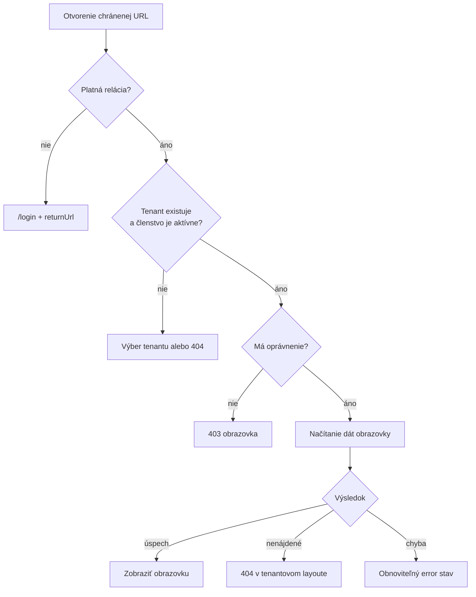
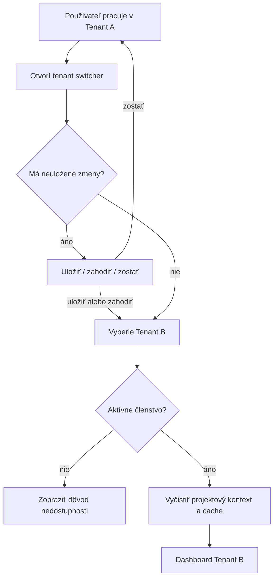

# SOVA – informačná architektúra

## 1. Účel

Dokument definuje globálnu mapu aplikácie, rozdelenie layoutov, routing, navigáciu a
pravidlá pre zachovanie tenantového a projektového kontextu.

## 2. Rozdelenie aplikácie

Webová aplikácia má štyri hlavné zóny:

| Zóna | Používateľ | Layout |
|---|---|---|
| Verejná | Neprihlásený používateľ | `PublicLayout` |
| Tenantová | Prihlásený člen tenantu | `TenantLayout` |
| Tenantová administrácia | Tenant admin/owner | `TenantAdminLayout` |
| Systémová administrácia | `SUPERADMIN` | `SystemAdminLayout` |

```mermaid
flowchart TD
    Root["SOVA"] --> Public["Verejná zóna"]
    Root --> Tenant["Tenantová zóna"]
    Root --> TenantAdmin["Tenant administrácia"]
    Root --> SystemAdmin["Systémová administrácia"]

    Public --> Login["Prihlásenie"]
    Public --> Forgot["Zabudnuté heslo"]
    Public --> Reset["Obnova hesla"]
    Public --> Invite["Prijatie pozvánky"]

    Tenant --> Dashboard["Dashboard"]
    Tenant --> MyWork["Moja práca"]
    Tenant --> Projects["Projekty"]
    Tenant --> Workgroups["Pracovné skupiny"]
    Tenant --> Search["Vyhľadávanie"]
    Tenant --> Notifications["Notifikácie"]
    Tenant --> Profile["Profil"]

    Projects --> ProjectOverview["Prehľad projektu"]
    Projects --> IssueList["Zoznam úloh"]
    Projects --> Board["Kanban"]
    Projects --> IssueDetail["Detail úlohy"]

    TenantAdmin --> Members["Členovia a pozvánky"]
    TenantAdmin --> Roles["Roly"]
    TenantAdmin --> AdminGroups["Skupiny"]
    TenantAdmin --> AdminProjects["Projekty"]
    TenantAdmin --> TenantSettings["Nastavenia"]
    TenantAdmin --> TenantAudit["Audit"]

    SystemAdmin --> Tenants["Tenanti"]
    SystemAdmin --> SystemUsers["Systémoví administrátori"]
    SystemAdmin --> SystemAudit["Systémový audit"]
    SystemAdmin --> SystemSettings["Globálne nastavenia"]
```



## 3. Navrhovaný routing

### 3.1 Verejné routy

```text
/login
/forgot-password
/reset-password/:token
/accept-invitation/:token
/verify-email/:token
```

Verejné routy používajú jednoduchý layout bez tenantovej navigácie. Ak je používateľ
už prihlásený a otvorí `/login`, aplikácia ho presmeruje do posledného aktívneho
tenantu alebo na výber tenantu.

### 3.2 Výber kontextu

```text
/select-tenant
/create-tenant
```

`/select-tenant` je dostupná iba prihlásenému používateľovi. Zobrazuje výhradne aktívne
členstvá. Pozastavený tenant môže byť zobrazený s vysvetlením, ale nemožno ho otvoriť.

### 3.3 Tenantové routy

```text
/t/:tenantSlug/dashboard
/t/:tenantSlug/my-work
/t/:tenantSlug/projects
/t/:tenantSlug/projects/:projectKey
/t/:tenantSlug/projects/:projectKey/issues
/t/:tenantSlug/projects/:projectKey/board
/t/:tenantSlug/issues/:issueKey
/t/:tenantSlug/workgroups
/t/:tenantSlug/workgroups/:workgroupId
/t/:tenantSlug/search
/t/:tenantSlug/notifications
/t/:tenantSlug/profile
```

Tenantový slug je súčasťou URL, aby:

- bola navigácia kopírovateľná a obnoviteľná,
- bolo jednoznačné, v ktorom tenantovi používateľ pracuje,
- história prehliadača zachovala kontext,
- sa minimalizovalo riziko zobrazenia dát pre nesprávneho tenanta.

### 3.4 Tenantová administrácia

```text
/t/:tenantSlug/admin
/t/:tenantSlug/admin/members
/t/:tenantSlug/admin/invitations
/t/:tenantSlug/admin/roles
/t/:tenantSlug/admin/workgroups
/t/:tenantSlug/admin/projects
/t/:tenantSlug/admin/settings
/t/:tenantSlug/admin/audit
```

### 3.5 Systémová administrácia

```text
/system
/system/tenants
/system/tenants/new
/system/tenants/:tenantId
/system/administrators
/system/audit
/system/settings
```

Systémová administrácia nemá používať tenantový layout. Farebne aj navigačne musí byť
jasne odlíšená, aby `SUPERADMIN` nezamenil globálnu a tenantovú operáciu.

## 4. Route guards a resolvery

| Guard/resolver | Zodpovednosť |
|---|---|
| `AnonymousGuard` | Zabráni prihlásenému používateľovi zostať na login obrazovke |
| `AuthGuard` | Vyžaduje platnú používateľskú reláciu |
| `TenantGuard` | Overí existenciu a aktívne členstvo v tenantovi |
| `PermissionGuard` | Kontroluje požadované oprávnenie pre obrazovku |
| `SystemAdminGuard` | Vyžaduje systémovú rolu `SUPERADMIN` |
| `UnsavedChangesGuard` | Upozorní na neuložený formulár |
| `TenantResolver` | Načíta základný tenantový kontext |
| `ProjectResolver` | Načíta projekt a overí jeho príslušnosť k tenantovi |
| `IssueResolver` | Načíta úlohu v tenantovom a projektovom kontexte |

Guard nie je bezpečnostnou hranicou. API musí vykonať vlastné overenie relácie,
tenantu aj oprávnenia.

### 4.1 Vyhodnotenie chránenej routy



## 5. Tenantový aplikačný shell

### 5.1 Desktop

Tenantový layout sa skladá z:

- horného aplikačného panelu,
- ľavej hlavnej navigácie,
- breadcrumb navigácie,
- obsahovej plochy,
- globálnej vrstvy toastov a dialógov.

Horný panel:

- logo SOVA,
- prepínač tenantu,
- globálne vyhľadávanie,
- tlačidlo „Vytvoriť úlohu“,
- notifikácie,
- používateľské menu.

Ľavá navigácia:

- Dashboard,
- Moja práca,
- Projekty,
- Pracovné skupiny,
- uložené alebo obľúbené filtre,
- Administrácia, iba ak má používateľ oprávnenie.

### 5.2 Mobil

Na menších obrazovkách:

- ľavá navigácia sa zmení na off-canvas menu,
- tenant zostáva viditeľný v hlavičke,
- hlavná akcia je dostupná bez otvorenia menu,
- rozsiahle tabuľky sa menia na karty alebo horizontálne rolovateľné oblasti,
- sekundárne panely detailu sa zobrazia pod hlavným obsahom.

## 6. Navigačné pravidlá

### 6.1 Prepnutie tenantu



Po prepnutí tenantu sa používateľ nemá automaticky presmerovať na projekt s rovnakým
slugom v druhom tenantovi.

### 6.2 Breadcrumb

Príklady:

```text
Projekty / SOVA / Úlohy
Projekty / SOVA / SOVA-123
Administrácia / Členovia / Juraj Novák
Systém / Tenanti / Acme
```

Breadcrumb má odrážať informačnú hierarchiu, nie kompletnú históriu kliknutí.

### 6.3 Návrat po akcii

- Po vytvorení úlohy sa otvorí jej detail.
- Po zrušení tvorby sa používateľ vráti na pôvodný zoznam alebo projekt.
- Po archivácii projektu sa otvorí zoznam projektov s potvrdením výsledku.
- Po uložení formulára zostáva používateľ na detaile a vidí potvrdenie.
- Po odstránení objektu sa vráti na najbližší platný nadradený zoznam.

## 7. Globálne komponenty

| Komponent | Správanie |
|---|---|
| Tenant switcher | Zobrazuje aktívne a nedostupné členstvá oddelene |
| Command/search box | Rýchle otvorenie úlohy, projektu alebo akcie |
| Create issue button | Otvorí dialóg alebo samostatnú stránku podľa šírky displeja |
| Notification center | Zobrazuje neprečítané udalosti aktívneho tenantu |
| User menu | Profil, sessions, prepnutie tenantu, odhlásenie |
| Breadcrumb | Kontext aktuálnej obrazovky |
| Toast region | Krátke potvrdenia, nie kritické rozhodnutia |
| Confirm dialog | Deštruktívne alebo nevratné operácie |

## 8. URL a obnoviteľnosť stavu

Do URL patria:

- tenant,
- projekt,
- issue key,
- aktívna záložka detailu,
- stránka alebo cursor, ak je bezpečne obnoviteľný,
- filtre a triedenie zdieľateľného zoznamu.

Do URL nepatria:

- citlivé tokeny po ich spracovaní,
- osobné alebo tajné údaje,
- kompletný obsah rozpísaného formulára,
- interné oprávnenia používateľa.

Po prijatí resetovacieho alebo pozývacieho tokenu má frontend po úspešnom spracovaní
nahradiť URL tak, aby token nezostal v histórii prehliadača.

## 9. Informačná hustota

SOVA je pracovný nástroj, preto desktopové rozhranie môže mať vyššiu informačnú
hustotu. Musí však zachovať:

- jasnú vizuálnu hierarchiu,
- konzistentné umiestnenie primárnych akcií,
- dostatok priestoru pre názvy úloh,
- rozlíšenie stavov textom aj farbou,
- možnosť zmenšiť alebo skryť sekundárne panely.

