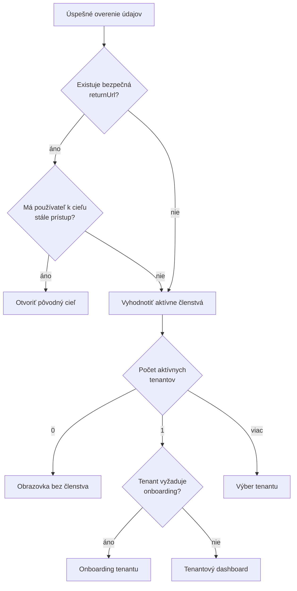
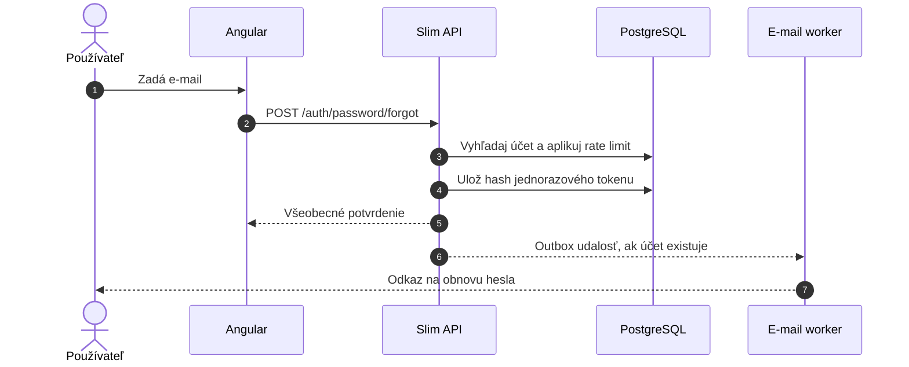
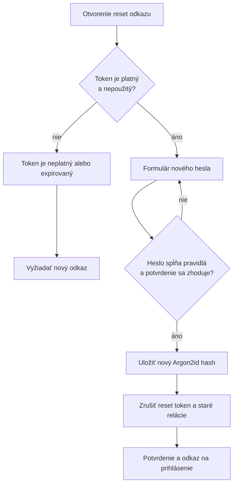
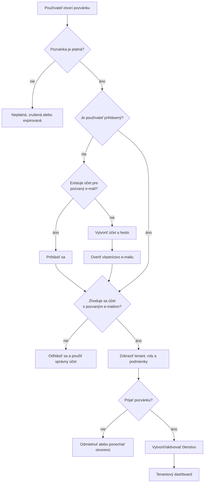
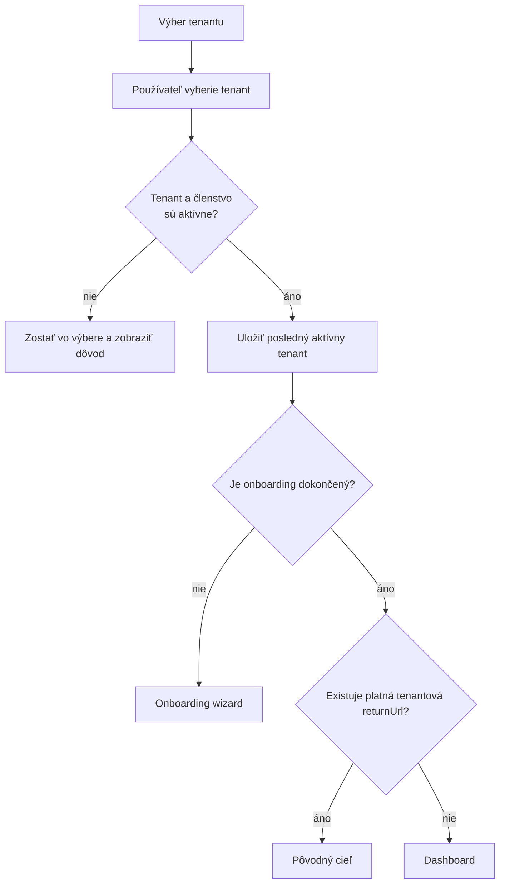
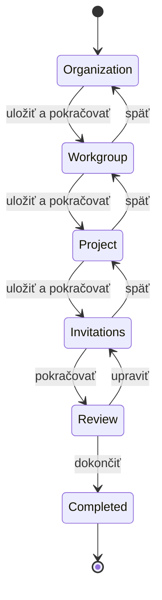
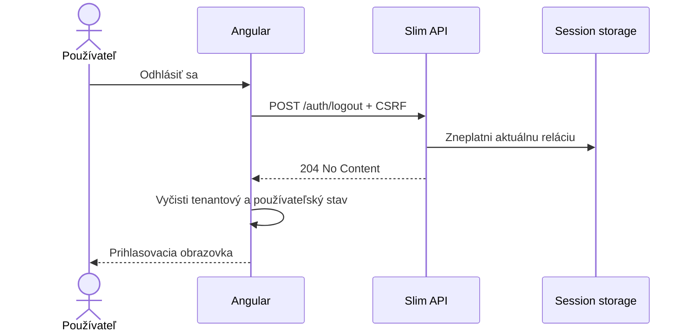

# SOVA – autentifikácia a onboarding

## 1. Rozsah

Dokument opisuje používateľské toky:

- prihlásenie a odhlásenie,
- obnova hesla,
- overenie e-mailu,
- prijatie pozvánky,
- výber tenantu,
- prvé spustenie nového tenantu,
- správa profilu a relácií,
- expirovaná alebo zrušená relácia.

## 2. Katalóg obrazoviek

| ID | Obrazovka | Route | Prístup |
|---|---|---|---|
| AUTH-01 | Prihlásenie | `/login` | Verejný |
| AUTH-02 | Zabudnuté heslo | `/forgot-password` | Verejný |
| AUTH-03 | Nastavenie nového hesla | `/reset-password/:token` | Platný token |
| AUTH-04 | Overenie e-mailu | `/verify-email/:token` | Platný token |
| AUTH-05 | Prijatie pozvánky | `/accept-invitation/:token` | Platný token |
| AUTH-06 | Výber tenantu | `/select-tenant` | Prihlásený |
| AUTH-07 | Prvé nastavenie tenantu | `/t/:tenantSlug/onboarding` | Tenant owner |
| AUTH-08 | Profil | `/t/:tenantSlug/profile` | Prihlásený člen |
| AUTH-09 | Aktívne relácie | `/t/:tenantSlug/profile/sessions` | Prihlásený člen |
| AUTH-10 | Relácia skončila | modal + `/login` | Pôvodne prihlásený |

## 3. Prihlásenie

### 3.1 Obsah obrazovky AUTH-01

Formulár:

- e-mail,
- heslo,
- voľba „Zostať prihlásený“, iba ak bude podporovaná,
- tlačidlo „Prihlásiť sa“,
- odkaz „Zabudol som heslo“.

Stavy:

- počiatočný,
- neplatné lokálne vstupy,
- odosielanie,
- nesprávne prihlasovacie údaje,
- účet čaká na overenie,
- účet je dočasne uzamknutý,
- všeobecná chyba služby,
- úspešné prihlásenie a presmerovanie.

Bezpečnostné správanie:

- nesprávny e-mail a nesprávne heslo majú rovnakú základnú chybovú správu,
- po odoslaní sa primárne tlačidlo dočasne zablokuje,
- heslo sa nikdy nevkladá do URL ani logu,
- `returnUrl` musí smerovať iba na povolenú internú route,
- frontend nemá prezradiť, či účet existuje.

### 3.2 Rozhodnutie po prihlásení

### 3.3 Neúspešné prihlásenie

| Situácia | UI reakcia | Ďalšia akcia |
|---|---|---|
| Neplatný formát e-mailu | Inline chyba | Opraviť e-mail |
| Prázdne heslo | Inline chyba | Doplniť heslo |
| Nesprávne údaje | Všeobecná chyba formulára | Skúsiť znova alebo obnoviť heslo |
| Rate limit | Informácia o dočasnom obmedzení | Počkať |
| Neoverený e-mail | Výzva na nové odoslanie overenia | Poslať overovací e-mail |
| Deaktivovaný účet | Neodhaľujúca informačná správa | Kontaktovať administrátora |
| Nedostupné API | Obnoviteľný error stav | Opakovať |

## 4. Obnova hesla

### 4.1 Požiadavka na obnovu

Používateľ na AUTH-02 zadá e-mail. Aplikácia vždy zobrazí rovnaký úspešný výsledok:

> Ak účet s touto adresou existuje, poslali sme pokyny na obnovu hesla.

Tým sa zabráni zisťovaniu, ktoré e-mailové adresy sú registrované.

### 4.2 Nastavenie nového hesla

AUTH-03 obsahuje:

- nové heslo,
- potvrdenie hesla,
- vizuálny zoznam splnených požiadaviek,
- tlačidlo „Nastaviť nové heslo“.

Tok:

Po úspechu sa token odstráni z URL histórie. Odporúča sa zrušiť všetky existujúce
relácie účtu, prípadne ponechať iba reláciu, ktorá bezpečne dokončila reset, ak bude
tento variant produktovo potvrdený.

## 5. Overenie e-mailu

Po otvorení overovacieho odkazu nastane jedna z možností:

| Stav | Výsledok |
|---|---|
| Token je platný | E-mail sa označí ako overený |
| Token už bol použitý | Informácia, že účet je už overený |
| Token expiroval | Možnosť poslať nový odkaz |
| Token je neplatný | Bezpečná všeobecná chyba |
| Účet je zablokovaný | Overenie sa nevykoná, používateľ dostane ďalší postup |

Ak je používateľ po overení prihlásený, pokračuje na výber tenantu alebo onboarding.
Inak pokračuje na prihlásenie.

## 6. Prijatie pozvánky

Pozvánka je viazaná na:

- tenant,
- e-mail,
- pozývajúceho používateľa,
- predvolené roly alebo skupiny,
- dátum expirácie.

### 6.1 Rozhodovací tok

### 6.2 Obrazovka pozvánky

Má zobraziť:

- názov tenantu,
- meno pozývajúceho, ak je vhodné,
- e-mail, pre ktorý pozvánka platí,
- základný rozsah prístupu,
- dátum expirácie,
- tlačidlo prijatia,
- bezpečný spôsob zmeny účtu.

Nemá zobrazovať interné informácie tenantu pred overením oprávneného e-mailu.

### 6.3 Hraničné prípady

- Používateľ už je aktívnym členom: presmerovať do tenantu a pozvánku uzavrieť.
- Členstvo je deaktivované: prijatie musí rešpektovať pravidlo administrátora, nie ho
  automaticky obísť.
- Pozvánka bola zrušená počas otvorenej stránky: API vráti aktuálny stav.
- Používateľ je prihlásený pod iným e-mailom: ponúknuť bezpečné odhlásenie.
- Tenant je pozastavený: členstvo možno podľa politiky prijať, ale tenant neotvoriť.

## 7. Výber tenantu

AUTH-06 zobrazuje:

- aktívne tenanty,
- posledný použitý tenant,
- rolu alebo stručný typ členstva,
- vyhľadávanie, ak je tenantov veľa,
- oddelenú sekciu nedostupných tenantov s dôvodom,
- možnosť vytvoriť tenant iba v prípade, že to produkt povoľuje.

## 8. Prvé nastavenie tenantu

Onboarding sa odporúča riešiť ako obnoviteľný wizard. Každý dokončený krok sa uloží,
aby vlastník po prerušení nepokračoval od začiatku.

### 8.1 Kroky wizardu

1. **Základné údaje**
   - názov,
   - slug,
   - predvolený jazyk,
   - časová zóna.
2. **Prvá pracovná skupina**
   - názov,
   - opis,
   - voliteľní prví členovia.
3. **Prvý projekt**
   - názov,
   - projektový kód,
   - viditeľnosť.
4. **Pozvanie členov**
   - zoznam e-mailov,
   - predvolená rola,
   - skupina alebo projekt.
5. **Kontrola**
   - súhrn nastavení,
   - vytvorenie chýbajúcich objektov,
   - dokončenie onboardingu.

Pozvanie členov môže byť preskočiteľné. Projekt môže byť preskočiteľný iba vtedy, ak
produkt dovolí tenant bez projektu.

## 9. Profil používateľa

Profil obsahuje:

- zobrazované meno,
- e-mail a stav overenia,
- preferovaný jazyk,
- časovú zónu,
- avatar,
- zmenu hesla,
- aktívne relácie,
- používateľské nastavenia notifikácií.

Zmena e-mailu má samostatný bezpečnostný tok:

1. opätovné overenie hesla alebo MFA,
2. zadanie nového e-mailu,
3. overenie novej adresy,
4. zmena až po úspešnom overení,
5. notifikácia na pôvodnú adresu,
6. audit udalosti.

## 10. Aktívne relácie

Zoznam relácií zobrazuje:

- zariadenie alebo typ prehliadača,
- približnú lokalitu odvodenú z IP, iba ak je právne a produktovo vhodná,
- čas vytvorenia,
- poslednú aktivitu,
- označenie aktuálnej relácie.

Akcie:

- zrušiť konkrétnu inú reláciu,
- zrušiť všetky ostatné relácie,
- po zmene hesla zrušiť všetky relácie podľa bezpečnostnej politiky.

## 11. Odhlásenie

Frontend nemá po odhlásení zobrazovať dáta z predchádzajúcej tenantovej cache.

## 12. Expirovaná relácia

Ak API vráti `401`:

1. globálny interceptor pozastaví opakovateľné požiadavky,
2. aplikácia overí, či relácia naozaj skončila,
3. neuložený formulár sa podľa možností bezpečne zachová lokálne iba pre krátke
   obnovenie,
4. zobrazí sa dialóg „Relácia skončila“,
5. používateľ sa prihlási,
6. aplikácia sa pokúsi obnoviť pôvodnú route a formulár,
7. pred odoslaním znovu načíta verziu objektu, aby nevznikol konflikt.

Ak účet alebo členstvo bolo deaktivované, aplikácia sa nesmie pokúšať nekonečne
obnovovať reláciu.

## 13. E2E scenáre

- úspešné prihlásenie používateľa s jedným tenantom,
- prihlásenie používateľa s viacerými tenantmi,
- bezpečná `returnUrl`,
- nesprávne heslo a rate limit,
- obnova hesla s platným, expirovaným a použitým tokenom,
- prijatie pozvánky novým používateľom,
- prijatie pozvánky existujúcim používateľom,
- otvorenie pozvánky pod nesprávnym účtom,
- onboarding s prerušením a pokračovaním,
- prepnutie tenantu,
- zrušenie inej relácie,
- expirácia relácie počas editácie formulára,
- odhlásenie a vyčistenie tenantovej cache.

