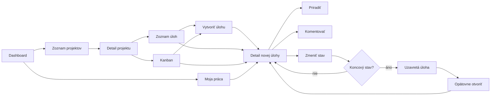
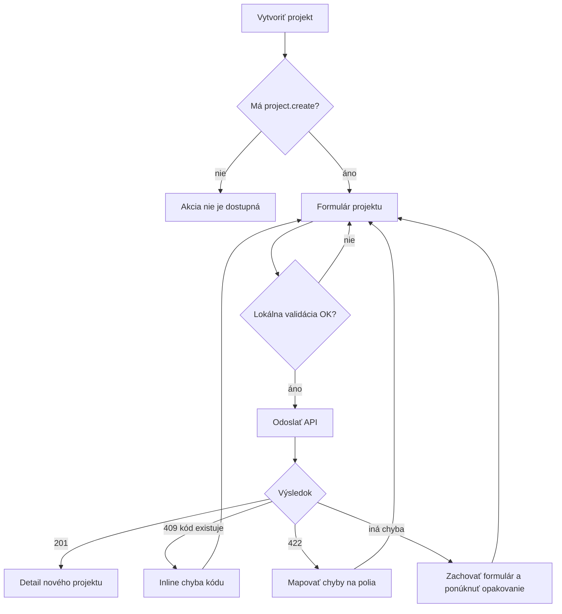
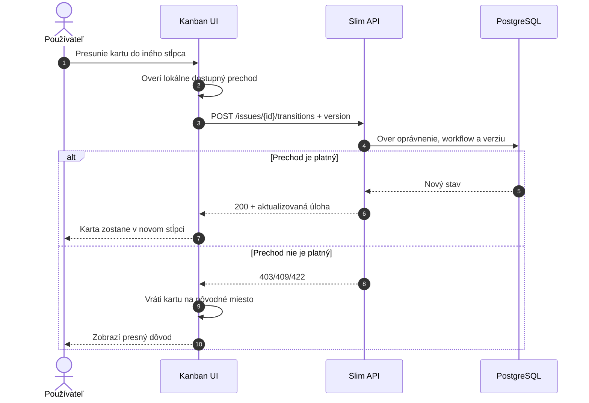
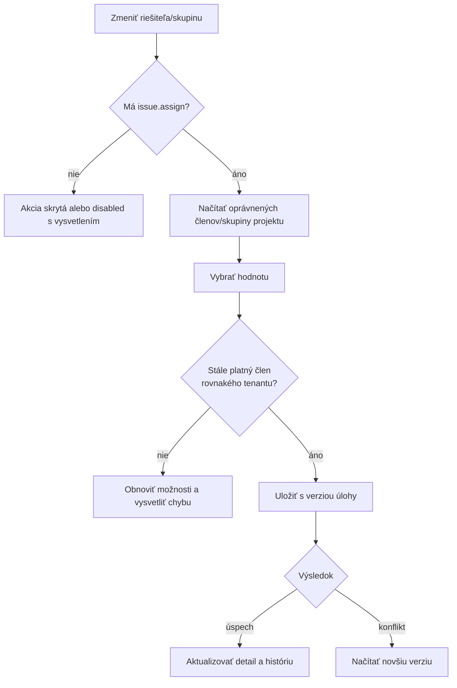
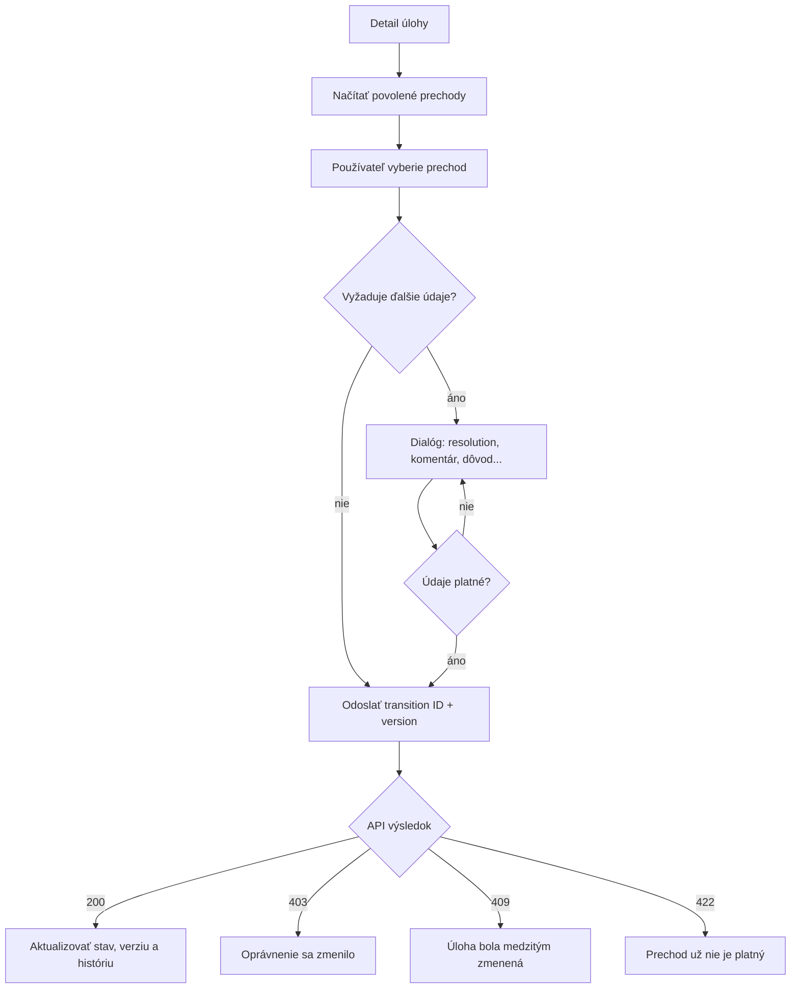

# SOVA – projekty a úlohy

## 1. Rozsah

Dokument opisuje hlavný pracovný tok aplikácie:

- tenantový dashboard,
- „Moja práca“,
- zoznam a vytvorenie projektov,
- detail projektu,
- zoznam a Kanban úloh,
- vytvorenie a úpravu úlohy,
- priradenie a zmenu stavu,
- archiváciu a ostatné životné cykly.

## 2. Katalóg obrazoviek

| ID | Obrazovka | Route | Typický prístup |
|---|---|---|---|
| WORK-01 | Dashboard | `/t/:tenantSlug/dashboard` | Člen tenantu |
| WORK-02 | Moja práca | `/t/:tenantSlug/my-work` | Člen tenantu |
| PRJ-01 | Projekty | `/t/:tenantSlug/projects` | `project.view` |
| PRJ-02 | Nový projekt | modal alebo admin route | `project.create` |
| PRJ-03 | Prehľad projektu | `/t/:tenantSlug/projects/:projectKey` | Prístup k projektu |
| ISS-01 | Zoznam úloh | `.../:projectKey/issues` | `issue.view` |
| ISS-02 | Kanban | `.../:projectKey/board` | `issue.view` |
| ISS-03 | Nová úloha | modal alebo `.../issues/new` | `issue.create` |
| ISS-04 | Detail úlohy | `/t/:tenantSlug/issues/:issueKey` | `issue.view` |
| ISS-05 | Hromadné operácie | časť zoznamu | Osobitné oprávnenia |

## 3. Hlavný pracovný tok



## 4. Dashboard

### 4.1 Účel

Dashboard má používateľovi po vstupe do tenantu odpovedať:

- Čomu sa mám venovať?
- Čo sa nedávno zmenilo?
- Ktoré úlohy sú po termíne?
- Ktoré projekty používam najčastejšie?

### 4.2 Obsah WORK-01

Odporúčané widgety pre MVP:

- „Pridelené mne“,
- „Po termíne“,
- „Nedávno zobrazené“,
- „Aktivita mojich projektov“,
- „Moje projekty“,
- rýchla akcia „Vytvoriť úlohu“.

Každý widget:

- rešpektuje tenantový a projektový prístup,
- má vlastný loading a error stav,
- zobrazuje len obmedzený počet položiek,
- poskytuje odkaz na úplný filtrovaný zoznam.

Dashboard nemá načítavať všetky dáta jednou obrovskou požiadavkou. Jednotlivé bloky
môžu zlyhať nezávisle.

## 5. Moja práca

WORK-02 združuje:

- úlohy priradené používateľovi,
- úlohy používateľovej skupiny bez konkrétneho riešiteľa,
- používateľom vytvorené úlohy,
- sledované úlohy,
- úlohy čakajúce na jeho akciu.

Záložky alebo predvolené filtre:

```text
Pridelené mne | Moje skupiny | Vytvorené mnou | Sledované | Dokončené
```

Filtre sa majú zapisovať do URL, aby bola obrazovka obnoviteľná a zdieľateľná v rámci
oprávnení.

## 6. Zoznam projektov

### 6.1 Obsah PRJ-01

- názov a kód projektu,
- stručný opis,
- vedúci projektu,
- stav,
- používateľova rola,
- počet otvorených úloh, ak je dostupný bez drahého dotazu,
- obľúbenie projektu,
- vyhľadávanie a filter stavu.

Režimy zobrazenia:

- karty pre menší počet projektov,
- kompaktný zoznam pre väčší počet,
- samostatná sekcia archivovaných projektov.

### 6.2 Vytvorenie projektu

Minimálny formulár:

- názov,
- kód projektu,
- opis,
- viditeľnosť,
- vedúci projektu,
- predvolené workflow.

Validácia:

- názov je povinný,
- kód je povinný, normalizovaný a unikátny v tenantovi,
- používateľ a workflow patria rovnakému tenantovi,
- súkromný projekt musí mať aspoň jedného správcu.



## 7. Detail projektu

PRJ-03 obsahuje:

- hlavičku s názvom, kódom, stavom a obľúbením,
- stručný opis,
- navigáciu projektu,
- sumarizáciu otvorených úloh,
- nedávnu aktivitu,
- členov alebo skupiny,
- administračné akcie podľa oprávnení.

Projektová navigácia:

```text
Prehľad | Úlohy | Kanban | Aktivita | Členovia | Nastavenia
```

„Členovia“ a „Nastavenia“ sa zobrazia iba podľa prístupu. Ak používateľ otvorí priamu
URL bez oprávnenia, dostane tenantovú 403 obrazovku.

## 8. Zoznam úloh

### 8.1 Stĺpce

Predvolené stĺpce:

- kód,
- typ,
- názov,
- stav,
- priorita,
- riešiteľ,
- skupina,
- termín,
- posledná zmena.

Používateľ môže zmeniť viditeľnosť a poradie stĺpcov. Preferencia môže byť uložená
pre používateľa a konkrétny pohľad.

### 8.2 Filtre

- text,
- stav,
- typ,
- priorita,
- riešiteľ,
- pracovná skupina,
- autor,
- štítok,
- termín,
- dátum zmeny.

### 8.3 Interakcie

- kliknutie na kód alebo názov otvorí detail,
- kliknutie so špeciálnym modifikátorom zachová štandardné správanie prehliadača,
- triedenie sa odrazí v URL,
- stránkovanie nevynuluje filtre,
- návrat z detailu obnoví pozíciu a filtre zoznamu,
- výber viacerých riadkov zobrazí panel hromadných akcií.

Hromadné operácie majú byť v MVP obmedzené na bezpečný rozsah, napríklad:

- zmena priority,
- priradenie skupiny,
- priradenie riešiteľa,
- pridanie štítku.

Každá úloha sa autorizuje individuálne. Čiastočný úspech musí jasne uviesť, ktoré
záznamy nebolo možné zmeniť.

## 9. Kanban

Stĺpce reprezentujú kategórie alebo stavy workflow. Karta zobrazuje:

- kód,
- názov,
- typ,
- prioritu,
- riešiteľa,
- termín,
- indikátor blokovania.

### 9.1 Drag and drop



Pri prechode vyžadujúcom ďalšie polia, napríklad resolution, sa po dropnutí otvorí
dialóg. Karta sa definitívne presunie až po úspešnom potvrdení.

## 10. Vytvorenie úlohy

### 10.1 Spôsoby otvorenia

- globálne tlačidlo v hlavičke,
- tlačidlo v projekte,
- akcia z prázdneho zoznamu,
- akcia v Kanban stĺpci,
- klávesová skratka, ak bude zavedená.

Ak používateľ vytvára úlohu z projektu, projekt je predvyplnený. Globálna akcia
predvolí posledný použitý projekt, iba ak k nemu má používateľ stále prístup.

### 10.2 Formulár ISS-03

Povinné minimum:

- tenant, implicitný a nemeniteľný v rámci aktuálneho kontextu,
- projekt,
- typ,
- názov,
- opis,
- priorita,
- riešiteľ alebo skupina podľa pravidiel projektu.

Voliteľné:

- nadradená úloha,
- termín,
- odhad,
- štítky,
- prílohy.

### 10.3 Rýchly a plný režim

Rýchly dialóg obsahuje najčastejšie polia. Ak používateľ potrebuje viac priestoru,
prepne sa na samostatnú stránku bez straty údajov.

### 10.4 Úspešné vytvorenie

Po vytvorení:

- API vráti ID, issue key a aktuálnu verziu,
- zobrazí sa potvrdenie,
- predvolená akcia otvorí detail úlohy,
- alternatívne možno zvoliť „Vytvoriť ďalšiu“,
- formulár sa nesmie znovu odoslať dvojklikom.

## 11. Detail úlohy

### 11.1 Layout ISS-04

Hlavička:

- breadcrumb projektu,
- issue key,
- typ,
- názov,
- aktuálny stav,
- primárna workflow akcia,
- menu ďalších akcií.

Hlavný stĺpec:

- opis,
- podradené úlohy alebo väzby,
- prílohy,
- aktivita, komentáre a história.

Pravý panel:

- riešiteľ,
- skupina,
- autor,
- priorita,
- termín,
- odhad,
- štítky,
- sledovatelia,
- vytvorenie a posledná zmena.

Na mobile sa pravý panel presunie pod hlavnú časť alebo do dostupného detailového
panelu.

### 11.2 Inline editácia

Inline editácia je vhodná pre jednoduché polia:

- názov,
- priorita,
- riešiteľ,
- skupina,
- termín,
- štítky.

Pravidlá:

- zmena sa vizuálne odlíši počas ukladania,
- chyba obnoví editovateľný stav a zachová hodnotu,
- `Escape` zruší úpravu,
- zmena nesmie vzniknúť iba opustením poľa bez jasného správania,
- konflikt verzie otvorí porovnanie alebo výzvu na obnovenie.

Opis sa edituje vo väčšom editore s explicitným „Uložiť“ a „Zrušiť“.

## 12. Priradenie úlohy



Ak je priradená skupina bez používateľa, úloha sa zobrazí v „Moje skupiny“. Ak je
priradený konkrétny používateľ, jeho členstvo a projektový prístup musia byť aktívne.

## 13. Zmena stavu

Primárne tlačidlo má zobrazovať najpravdepodobnejší ďalší prechod. Ostatné povolené
prechody sú v rozbaľovacom menu.



Frontend neposiela iba cieľový stav, ale identifikátor konkrétneho povoleného
prechodu. Backend vždy znovu overí aktuálny stav.

## 14. Konflikt súbežnej úpravy

Pri `409 Conflict`:

1. neprepísať serverové dáta,
2. načítať novú verziu,
3. zobraziť, ktoré polia sa zmenili,
4. umožniť skopírovať používateľovu rozpísanú hodnotu,
5. ponúknuť zrušenie alebo opätovné aplikovanie zmeny,
6. opätovné uloženie vykonať proti novej verzii.

Pre jednoduché pole môže stačiť stručný konfliktový dialóg. Pre opis alebo rozsiahly
formulár je vhodné porovnanie oboch verzií.

## 15. Archivácia a odstránenie

### 15.1 Projekt

Projekt sa štandardne archivuje, nie okamžite odstraňuje.

- archivovaný projekt je iba na čítanie,
- zostáva vo vyhľadávaní podľa osobitného filtra,
- priame odkazy fungujú oprávneným používateľom,
- obnovenie vyžaduje oprávnenie,
- trvalé odstránenie je samostatný administratívny proces.

### 15.2 Úloha

Pre MVP sa odporúča:

- bežným používateľom umožniť zrušenie cez workflow,
- soft delete povoliť iba privilegovanej roli,
- v histórii uchovať autora a dôvod odstránenia,
- pri odstránenej úlohe zachovať bezpečné správanie existujúcich odkazov.

## 16. E2E scenáre

- dashboard s úplnými, prázdnymi a čiastočne chybnými widgetmi,
- vytvorenie verejného a súkromného projektu,
- odmietnutie duplicitného projektového kódu,
- filtrovanie zoznamu a návrat z detailu bez straty filtra,
- vytvorenie úlohy z globálnej akcie aj projektu,
- priradenie používateľovi a pracovnej skupine,
- zmena stavu cez detail aj Kanban,
- prechod vyžadujúci doplňujúce pole,
- nepovolený workflow prechod,
- konflikt dvoch súbežných úprav,
- archivácia projektu,
- priama URL úlohy bez projektového oprávnenia.

