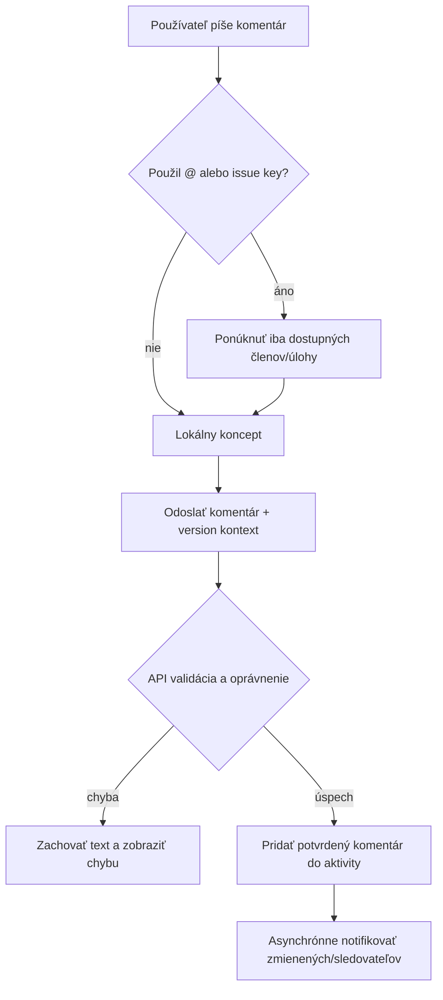
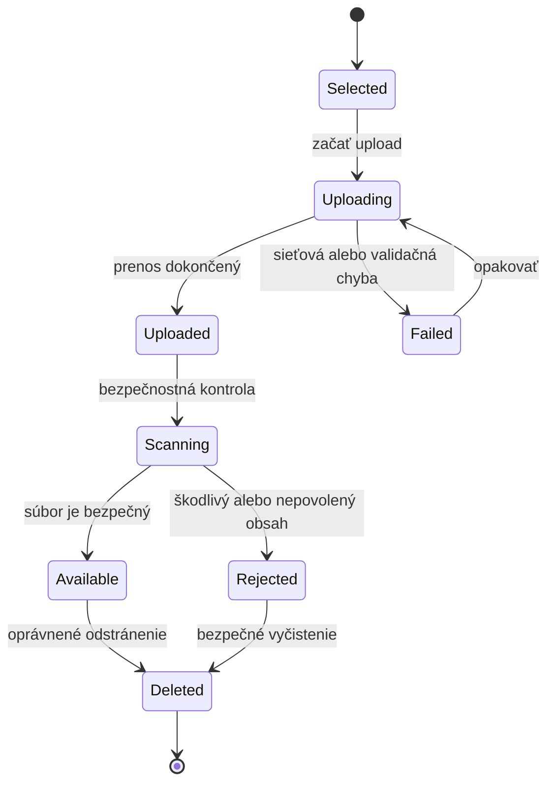
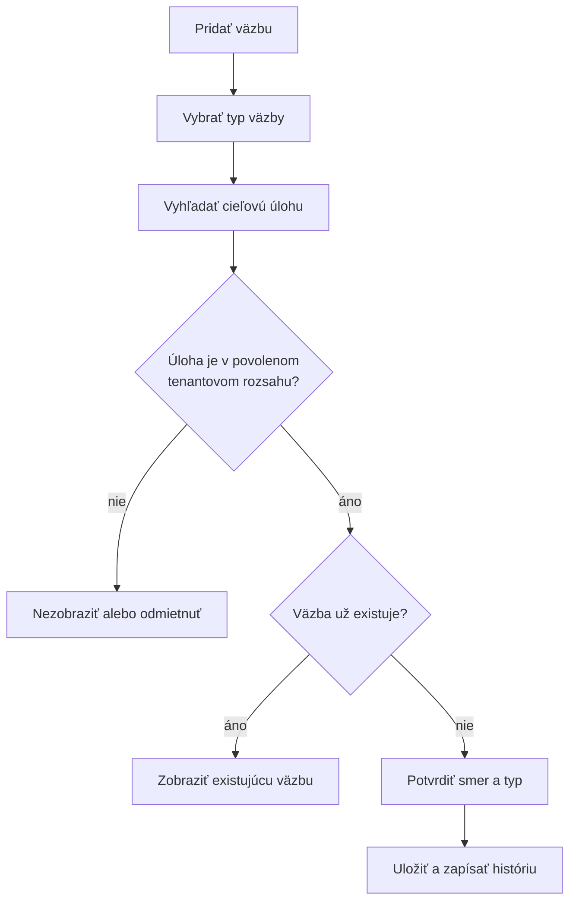
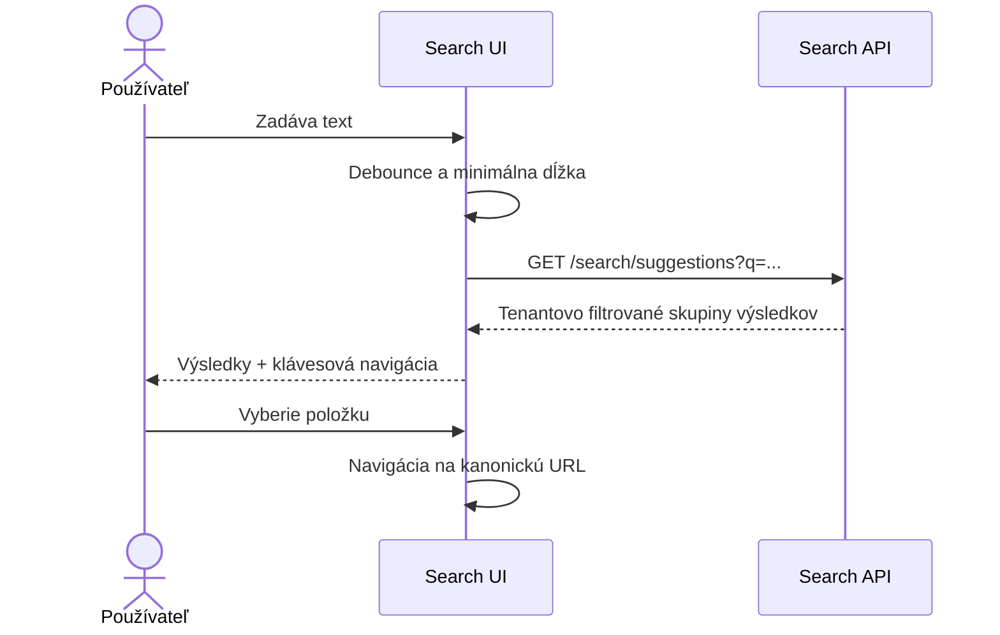
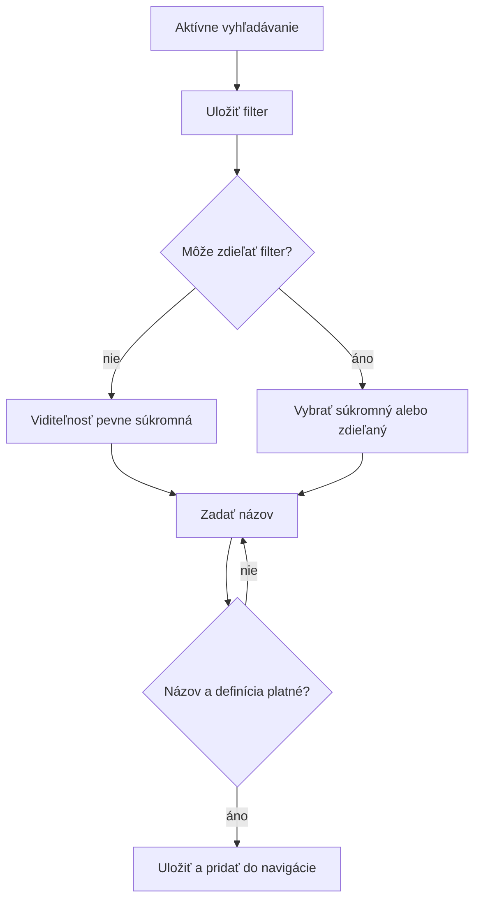
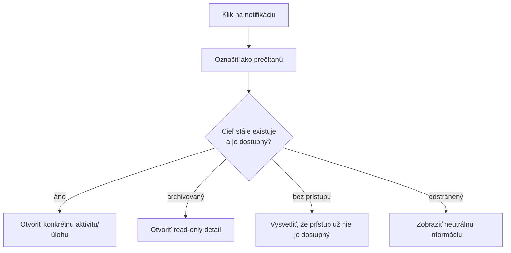

# SOVA – spolupráca, vyhľadávanie a notifikácie

## 1. Rozsah

Dokument opisuje:

- komentáre a zmienky,
- prílohy,
- sledovanie úloh,
- väzby medzi úlohami,
- aktivitu a históriu,
- globálne vyhľadávanie,
- filtre a uložené pohľady,
- in-app a e-mailové notifikácie.

## 2. Katalóg obrazoviek a komponentov

| ID | Obrazovka/komponent | Umiestnenie |
|---|---|---|
| COL-01 | Aktivita úlohy | Detail úlohy |
| COL-02 | Editor komentára | Detail úlohy |
| COL-03 | Správa príloh | Detail úlohy |
| COL-04 | Väzby úloh | Detail úlohy |
| COL-05 | Sledovatelia | Detail úlohy |
| SRC-01 | Rýchle vyhľadávanie | Globálna hlavička |
| SRC-02 | Rozšírené vyhľadávanie | `/t/:tenantSlug/search` |
| SRC-03 | Uložené filtre | Bočná navigácia a vyhľadávanie |
| NOT-01 | Notification popover | Globálna hlavička |
| NOT-02 | Centrum notifikácií | `/t/:tenantSlug/notifications` |
| NOT-03 | Nastavenia notifikácií | Profil používateľa |

## 3. Aktivita úlohy

Detail úlohy má spoločnú sekciu s prepínačmi:

```text
Všetko | Komentáre | História | Čas
```

Položky sa zobrazujú chronologicky alebo reverzne chronologicky podľa jednotnej
produktovej voľby. Predvolene sa odporúča najnovšia aktivita dole pri komentárovom
editore, ak má rozhranie pôsobiť ako diskusia; pri auditnom pohľade môže byť najnovšia
hore.

Každá položka obsahuje:

- autora alebo systémového aktéra,
- čas v časovej zóne používateľa,
- typ udalosti,
- stručný rozdiel hodnôt,
- odkaz na súvisiaci objekt, ak existuje.

Pri veľkej histórii sa používa stránkovanie alebo postupné načítanie. Načítanie
starších položiek nesmie presunúť používateľovi aktuálnu pozíciu bez kontroly.

## 4. Komentáre

### 4.1 Vytvorenie komentára

Editor podporuje:

- čistý text alebo potvrdený formátovací jazyk,
- zmienky používateľov,
- odkazy na úlohy,
- vloženie prílohy,
- náhľad pred odoslaním,
- klávesovú skratku s viditeľnou nápovedou.



Počas odosielania:

- tlačidlo sa nesmie dať opakovane aktivovať,
- text zostáva viditeľný,
- optimisticky zobrazený komentár musí byť označený ako odosielaný,
- pri chybe nesmie používateľ o text prísť.

### 4.2 Zmienky

Návrhy zmienok zobrazujú len používateľov, ktorých môže autor v danom projekte
oprávnene identifikovať. Backend musí znovu overiť, že zmienený účet patrí správnemu
tenantovi.

Zmienka nevytvára nové oprávnenie. Ak zmienený používateľ nemá prístup k úlohe:

- nesmie notifikácia odhaliť obsah úlohy,
- produkt má buď zmienku odmietnuť, alebo ju uložiť bez notifikácie s upozornením,
- odporúčaný MVP variant je takú zmienku neumožniť.

### 4.3 Úprava a odstránenie komentára

Úprava:

- autor môže upraviť vlastný komentár podľa produktovej politiky,
- položka zostane označená ako upravená,
- predchádzajúca verzia môže zostať v internom audite,
- zmienky pridané úpravou môžu vytvoriť nové notifikácie.

Odstránenie:

- vyžaduje potvrdenie,
- bežný používateľ odstraňuje iba vlastný komentár, ak je to povolené,
- moderátor potrebuje samostatné oprávnenie,
- v aktivite môže zostať neutrálna informácia „Komentár bol odstránený“.

## 5. Prílohy

### 5.1 Nahratie

Používateľ môže:

- vybrať súbor,
- pretiahnuť súbor do drop zóny,
- vložiť obrázok zo schránky, ak to produkt povolí.

Každý súbor má samostatný stav:



UI musí rozlíšiť:

- príliš veľký súbor,
- nepovolený typ,
- zlyhanie siete,
- zlyhanie bezpečnostného skenu,
- nedostatok tenantového limitu,
- stratu oprávnenia počas uploadu.

### 5.2 Zobrazenie a stiahnutie

- obrázok môže mať bezpečný náhľad,
- ostatné typy zobrazia názov, typ a veľkosť,
- stiahnutie vždy vyžaduje aktuálnu autorizáciu,
- privátna podpísaná URL má krátku platnosť,
- nebezpečné typy sa nemajú otvárať inline.

### 5.3 Odstránenie

Odstránenie prílohy:

1. zobrazí názov súboru a dopad,
2. vyžaduje potvrdenie,
3. odstráni prístup k súboru,
4. zapíše históriu a audit,
5. fyzické odstránenie môže vykonať asynchrónny cleanup.

## 6. Sledovatelia

Používateľ môže začať alebo prestať sledovať úlohu jednou jasnou akciou.

Automatické sledovanie môže vzniknúť:

- vytvorením úlohy,
- priradením úlohy,
- komentovaním,
- explicitným označením.

Automatické pravidlá musia byť viditeľné v nastaveniach. Používateľ má mať možnosť
sledovanie vypnúť, ak mu to nebráni povinná administratívna politika.

Zoznam sledovateľov nemá odhaliť používateľov mimo povoleného projektového kontextu.

## 7. Väzby medzi úlohami

### 7.1 Vytvorenie väzby



Pri typoch „blokuje“ a „duplikuje“ musí UI zrozumiteľne zobraziť smer väzby.

### 7.2 Nadradená úloha

Pri výbere nadradenej úlohy treba zabrániť:

- nastaveniu úlohy ako vlastného rodiča,
- cyklu v hierarchii,
- nepovolenému typu rodiča,
- prepojeniu iného tenantu,
- výberu neprístupnej úlohy.

## 8. Rýchle vyhľadávanie

SRC-01 sa otvára v hlavičke alebo klávesovou skratkou. Má slúžiť na rýchlu navigáciu,
nie na kompletnú analytiku.

Skupiny výsledkov:

- presná zhoda issue key,
- úlohy,
- projekty,
- pracovné skupiny,
- dostupné navigačné akcie.



Počas písania sa staršia odpoveď nesmie zobraziť nad výsledkami novšej požiadavky.

## 9. Rozšírené vyhľadávanie

SRC-02 obsahuje:

- vizuálny filter builder a Jira-like textový editor `SovaQL`,
- panel filtrov,
- aktívne filtre ako odoberateľné chips,
- triedenie,
- tabuľku alebo zoznam výsledkov,
- počet výsledkov, ak je výpočet primerane lacný,
- uloženie filtra.

Trvalá URL reprezentuje uložený filter nepriehľadným `savedQueryId`. Celý dotaz sa
štandardne neposiela v URL, aby sa mená alebo iné osobné hodnoty nedostali do
histórie a logov. Formát je verzovaný a serverovo validovaný.

### 9.1 Prázdne výsledky

Rozlišovať:

- tenant zatiaľ nemá žiadne úlohy,
- filter nemá výsledky,
- používateľ nemá prístup k žiadnym projektom,
- vyhľadávanie zlyhalo.

Každý stav má inú odporúčanú ďalšiu akciu.

## 10. Uložené filtre

Filter obsahuje:

- názov,
- vlastníka,
- pôvodný a serverom kanonizovaný SovaQL dotaz,
- verziu jazyka a záznamu,
- triedenie a viditeľné stĺpce,
- viditeľnosť súkromný/zdieľaný a explicitné granty,
- dátum poslednej zmeny.

Tok uloženia:



Zmena zdieľaného filtra nesmie prekvapivo zmeniť pracovný pohľad ostatných. Vhodné je
rozlíšiť „Uložiť“ a „Uložiť ako kópiu“.

Filter použitý widgetom nemožno bez vyriešenia závislostí natrvalo odstrániť.
Zdieľanie filtra nikdy neudeľuje prístup k výsledným úlohám. Presná syntax, pravidlá
grantov, životný cyklus, API a chybové stavy sú v
[špecifikácii SovaQL a dashboardov](../SOVAQL-A-DASHBOARDY.md).

## 11. Centrum notifikácií

### 11.1 Popover

Popover v hlavičke zobrazuje:

- počet neprečítaných,
- najnovšie notifikácie aktívneho tenantu,
- akciu „Označiť všetko ako prečítané“,
- odkaz na úplné centrum.

Notifikácie iných tenantov sa môžu sumarizovať iba spôsobom, ktorý neodhaľuje ich
citlivý obsah. Najbezpečnejší MVP variant je zobrazovať detail iba pre aktívny tenant.

### 11.2 Centrum NOT-02

Filtre:

- všetky,
- neprečítané,
- pridelenia,
- zmienky,
- komentáre,
- systémové.

Kliknutie:



### 11.3 Reálny čas

Ak sa použije WebSocket alebo Server-Sent Events:

- udalosť iba signalizuje zmenu,
- frontend si citlivé údaje načíta autorizovaným API requestom,
- po prerušení spojenia sa automaticky obnoví,
- po návrate sa dorovnajú zmeškané udalosti,
- polling zostáva možnou jednoduchšou MVP alternatívou.

## 12. Nastavenia notifikácií

Používateľ nastavuje kanál podľa typu udalosti:

| Udalosť | In-app | E-mail |
|---|---:|---:|
| Pridelenie úlohy | Povinné/predvolené | Voliteľné |
| Zmienka | Povinné/predvolené | Voliteľné |
| Nový komentár sledovanej úlohy | Voliteľné | Voliteľné |
| Zmena stavu | Voliteľné | Voliteľné |
| Blížiaci sa termín | Voliteľné | Voliteľné |
| Bezpečnostná udalosť účtu | Povinné | Povinné |

Bezpečnostné e-maily nemožno úplne vypnúť.

## 13. E2E scenáre

- vytvorenie komentára a zachovanie textu pri chybe,
- zmienka oprávneného a neoprávneného používateľa,
- úprava a odstránenie komentára,
- úspešný upload a bezpečnostný sken prílohy,
- zlyhanie uploadu a opakovanie,
- blokovaná nebezpečná príloha,
- vytvorenie a odstránenie väzby,
- sledovanie a zrušenie sledovania,
- rýchle vyhľadanie issue key,
- pokročilý filter reprezentovaný v URL,
- súkromný a zdieľaný uložený filter,
- otvorenie platnej a zastaranej notifikácie,
- zmena nastavení notifikácií.
