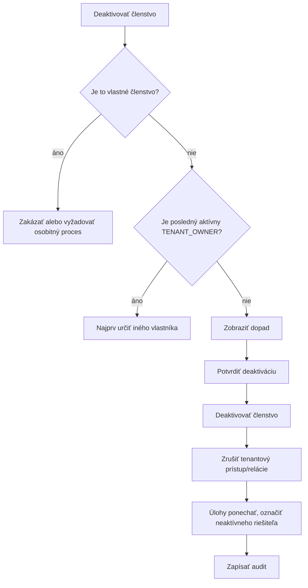
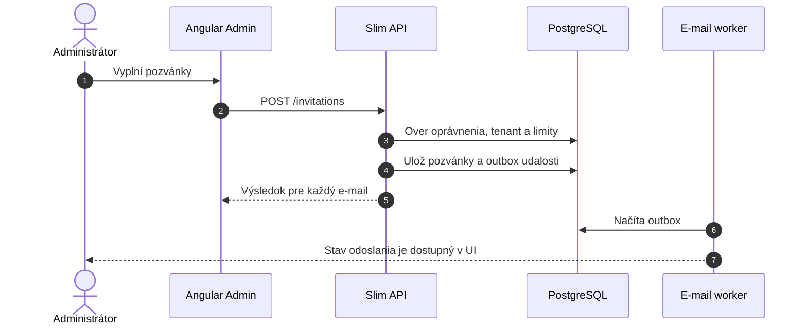
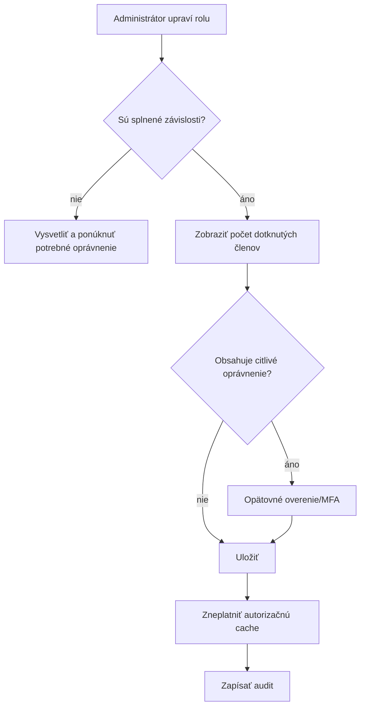
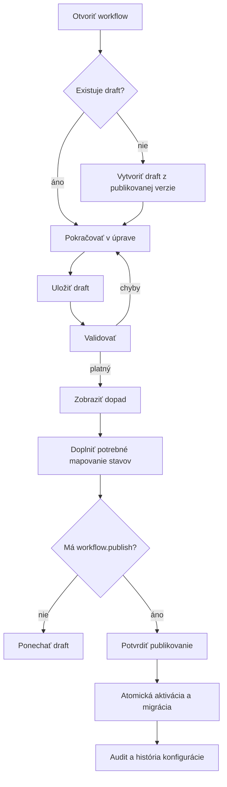
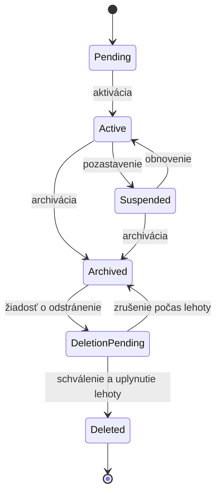
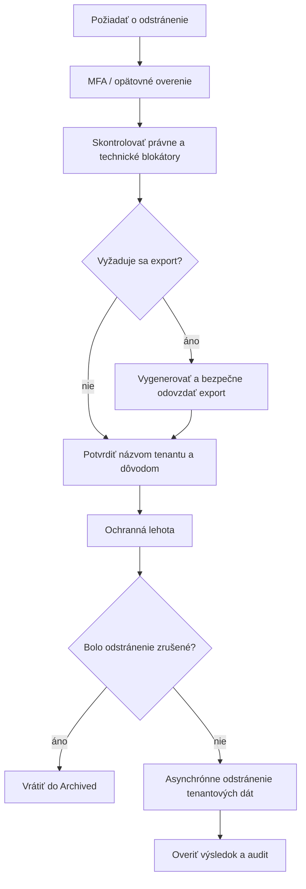
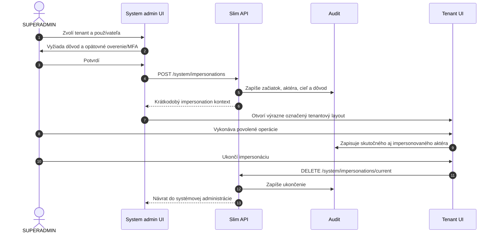

# SOVA – administračné webflow

## 1. Rozsah

Dokument opisuje:

- tenantovú administráciu,
- správu členov, pozvánok, rolí a skupín,
- správu projektov a tenantových nastavení,
- audit,
- systémovú administráciu pre `SUPERADMIN`,
- životný cyklus tenantu,
- kontrolovanú impersonáciu.

## 2. Administratívne zóny

```mermaid
flowchart TD
    Admin["Administrácia SOVA"] --> ProjectAdmin["Projektová administrácia"]
    Admin --> TenantAdmin["Tenantová administrácia"]
    Admin --> SystemAdmin["Systémová administrácia"]

    ProjectAdmin --> ProjectMembers["Členovia a skupiny projektu"]
    ProjectAdmin --> ProjectWorkflow["Workflow a typy úloh"]
    ProjectAdmin --> ProjectSettings["Nastavenia projektu"]

    TenantAdmin --> Members["Členovia a pozvánky"]
    TenantAdmin --> Roles["Roly a oprávnenia"]
    TenantAdmin --> Groups["Pracovné skupiny"]
    TenantAdmin --> Projects["Projekty"]
    TenantAdmin --> Settings["Nastavenia tenantu"]
    TenantAdmin --> Audit["Tenantový audit"]

    SystemAdmin --> Tenants["Správa tenantov"]
    SystemAdmin --> SysAdmins["Systémoví administrátori"]
    SystemAdmin --> SysAudit["Systémový audit"]
    SystemAdmin --> GlobalSettings["Globálne nastavenia"]
```



Každá zóna má vlastnú navigáciu a kontrolu oprávnení. Zobrazenie odkazu v navigácii
nevytvára oprávnenie.

## 3. Tenant admin dashboard

Route:

```text
/t/:tenantSlug/admin
```

Obsah:

- stav tenantu,
- počet aktívnych a pozvaných členov,
- počet skupín a projektov,
- čakajúce administratívne úlohy,
- posledné bezpečnostne významné udalosti,
- upozornenia na limity alebo konfiguráciu.

Rýchle akcie:

- pozvať člena,
- vytvoriť skupinu,
- vytvoriť projekt,
- otvoriť audit.

Widgety musia rešpektovať konkrétne oprávnenia. Administrátor oprávnený spravovať
projekty nemusí automaticky vidieť bezpečnostný audit.

## 4. Členovia

### 4.1 Zoznam členov

Stĺpce:

- meno,
- e-mail,
- stav členstva,
- tenantové roly,
- pracovné skupiny,
- posledná aktivita, ak je jej zobrazovanie povolené,
- akcie.

Filtre:

- aktívny, pozvaný, deaktivovaný,
- rola,
- pracovná skupina,
- projekt.

### 4.2 Detail člena

Detail obsahuje:

- základné identifikačné údaje,
- stav členstva,
- tenantové roly,
- pracovné skupiny,
- projekty a projektové roly,
- dátum pridania,
- relevantnú administratívnu históriu.

Akcie podľa oprávnenia:

- zmeniť roly,
- pridať alebo odstrániť zo skupiny,
- upraviť projektový prístup,
- deaktivovať členstvo,
- obnoviť členstvo,
- odstrániť členstvo.

Administrátor nikdy nevidí heslo ani hash hesla.

### 4.3 Deaktivácia člena



Deaktivácia nemá automaticky prepisovať historického autora komentárov alebo úloh.
Otvorené úlohy neaktívneho riešiteľa sa zobrazia v administratívnom upozornení na
prerozdelenie.

## 5. Pozvánky

### 5.1 Vytvorenie pozvánky

Formulár:

- jeden alebo viac e-mailov,
- tenantová rola,
- pracovné skupiny,
- projekty alebo projektové roly,
- voliteľná osobná správa,
- platnosť pozvánky.



Pri hromadnom pozvaní sa musí zobraziť výsledok pre každý e-mail:

- vytvorená pozvánka,
- už aktívny člen,
- existujúca platná pozvánka,
- neplatný e-mail,
- prekročený limit.

### 5.2 Správa pozvánok

Akcie:

- znovu odoslať,
- zmeniť expiráciu, ak to politika dovolí,
- zrušiť,
- skopírovať bezpečný odkaz iba ak je to povolené,
- zobraziť stav prijatia.

Opätovné odoslanie má rate limit a nemá automaticky vytvoriť neobmedzený počet
platných tokenov.

## 6. Roly a oprávnenia

### 6.1 Zoznam rolí

Rozlišovať:

- systémové predvolené roly,
- tenantové vlastné roly,
- rozsah roly,
- počet používateľov s rolou.

Predvolená rola môže byť needitovateľná alebo kopírovateľná do vlastnej roly podľa
produktového rozhodnutia.

### 6.2 Editor roly

Oprávnenia zoskupiť podľa domény:

```text
Tenant | Členovia | Skupiny | Projekty | Úlohy | Komentáre | Audit
```

Pri každom oprávnení zobraziť:

- ľudský názov,
- stručný dopad,
- závislosti,
- upozornenie pri citlivom oprávnení.



Odstránenie roly nie je možné, kým je priradená, alebo musí obsahovať riadenú migráciu
členov na inú rolu.

## 7. Pracovné skupiny

Admin zoznam zobrazuje:

- názov,
- vedúcich,
- počet aktívnych členov,
- počet projektov,
- stav.

Detail skupiny:

- opis,
- vedúci,
- členovia,
- projekty,
- otvorené skupinové úlohy ako informačný prehľad.

Archivácia skupiny:

- nepridáva nových členov ani nové priradenia,
- historické väzby zostanú,
- otvorené úlohy vyžadujú rozhodnutie o prerozdelení,
- skupinu možno obnoviť.

## 8. Správa projektov

Tenant admin vidí aj archivované projekty a ich administratívny stav.

Akcie:

- vytvoriť projekt,
- zmeniť vlastníka alebo správcu,
- upraviť viditeľnosť,
- spravovať skupiny a členov,
- spravovať typy úloh, hierarchiu a workflow,
- archivovať alebo obnoviť,
- zobraziť projektový audit.

### 8.1 Zmena súkromia projektu

Pri zmene tenantového projektu na súkromný:

1. zobraziť, kto stratí prístup,
2. vyžadovať aspoň jedného projektového správcu,
3. upozorniť na zdieľané filtre alebo odkazy,
4. potvrdiť operáciu,
5. okamžite zneplatniť prístupové cache,
6. auditovať zmenu.

### 8.2 Projektové typy úloh

Route:

```text
/t/:tenantSlug/projects/:projectKey/settings/issue-types
```

Zoznam zobrazuje ikonu, názov, nemenný kód, hierarchickú úroveň, poradie, mapované
workflow, počet úloh a stav aktívny/archivovaný.

Správca s `issue_type.manage` môže:

- vytvoriť vlastný typ,
- upraviť názov, opis, ikonu, poradie a podporované systémové polia,
- zmeniť hierarchickú úroveň po kontrole dopadu,
- archivovať nepoužívaný alebo používaný typ bez straty histórie.

UI musí pri zmene úrovne ukázať neplatné väzby rodič/dieťa. Použitý typ sa fyzicky
neodstraňuje a archivovaný typ sa neponúka pri vytváraní novej úlohy.

### 8.3 Workflow a mapovanie

Routy:

```text
/t/:tenantSlug/projects/:projectKey/settings/workflows
/t/:tenantSlug/projects/:projectKey/settings/workflow-mapping
```

Workflow editor obsahuje minimálne:

- zoznam stavov s kategóriou a počiatočným stavom,
- zoznam prechodov so zdrojom, cieľom, oprávnením a požadovanými poľami,
- jasné označenie draftu a publikovanej verzie,
- validáciu grafu,
- náhľad dopadu na typy, stavy a počty úloh,
- migračné mapovanie odstránených stavov,
- históriu publikovaných verzií.



Uloženie draftu nemení správanie úloh. Publikovanie prijíma očakávanú revíziu
projektovej konfigurácie; konflikt dvoch správcov vráti `409` a nesmie prepísať
novšiu verziu. Mapovanie musí priradiť každému aktívnemu typu práve jedno publikované
workflow rovnakého projektu.

Podrobný doménový, databázový a API návrh je v
[`WORKFLOW-A-TYPY-ULOH.md`](../WORKFLOW-A-TYPY-ULOH.md).

## 9. Tenantové nastavenia

Kategórie:

- všeobecné údaje,
- branding, ak bude podporovaný,
- jazyk a časová zóna,
- bezpečnostná politika,
- pravidlá pozvánok,
- limity príloh,
- predvolené typy a priority,
- notifikačné nastavenia,
- export a životný cyklus tenantu.

Každá kategória má samostatný formulár. Jedna neplatná sekcia nemá blokovať uloženie
nesúvisiacej sekcie.

Citlivé zmeny môžu vyžadovať:

- opätovné heslo,
- MFA,
- potvrdenie názvu tenantu,
- ochrannú lehotu.

## 10. Tenantový audit

Filtre:

- časový interval,
- aktér,
- akcia,
- typ objektu,
- výsledok,
- correlation ID.

Detail udalosti:

- kto,
- kedy,
- odkiaľ,
- v akom tenantovi,
- akú operáciu vykonal,
- relevantný rozdiel,
- súvisiace udalosti.

Citlivé hodnoty sa musia maskovať. Export auditu je osobitné oprávnenie a sám sa
auditne zaznamená.

## 11. Systémová administrácia

### 11.1 Oddelenie kontextu

Systémová administrácia:

- má samostatný layout,
- zobrazuje výrazný štítok „Systémová administrácia“,
- nepoužíva aktívny tenant ako implicitný filter,
- tenantové dáta otvára len cez explicitnú akciu,
- má prísnejšie pravidlá relácie a MFA.

### 11.2 Zoznam tenantov

Stĺpce:

- názov,
- slug,
- stav,
- vlastník,
- počet členov a projektov,
- dátum vytvorenia,
- posledná administratívna zmena,
- limity alebo plán, ak budú existovať.

Filtre:

- stav,
- dátum vytvorenia,
- prekročené limity,
- čakajúce odstránenie.

### 11.3 Vytvorenie tenantu

Wizard:

1. základné údaje,
2. prvý vlastník,
3. limity a politika,
4. kontrola,
5. vytvorenie a odoslanie pozvánky vlastníkovi.

Operácia má podporovať bezpečné opakovanie bez vytvorenia duplikátu.

## 12. Životný cyklus tenantu



### 12.1 Pozastavenie

Dialóg musí uviesť:

- dôvod,
- dopad na používateľov a workery,
- či sa odhlásia aktívne relácie,
- možnosť plánovaného alebo okamžitého pozastavenia.

Po pozastavení:

- členovia nemôžu tenant používať,
- dáta zostávajú zachované,
- joby sa nesmú nekontrolovane vykonávať,
- vlastník dostane primeranú notifikáciu,
- operácia sa auditne zaznamená.

### 12.2 Odstránenie

Odstránenie je viacstupňový proces:



Pred implementáciou treba určiť správanie záloh a zákonnú retention politiku.

## 13. Impersonácia

Impersonácia je voliteľná vysoko privilegovaná funkcia. Nemá byť jediným spôsobom
podpory používateľov.

### 13.1 Tok



### 13.2 Povinné UI prvky

- trvalý výrazný banner,
- identita skutočného aj impersonovaného používateľa,
- dôvod alebo identifikátor support prípadu,
- tlačidlo okamžitého ukončenia,
- zostávajúci čas relácie,
- blokovanie osobitne citlivých operácií podľa politiky.

## 14. Systémové nastavenia

Globálne nastavenia majú byť minimalizované. Môžu obsahovať:

- predvolené limity nového tenantu,
- podporované typy súborov,
- globálnu e-mailovú konfiguráciu bez zobrazenia secrets,
- feature flags,
- bezpečnostné politiky,
- režim údržby.

Každá zmena:

- má validačný náhľad dopadu,
- vyžaduje osobitné oprávnenie,
- pri citlivej zmene vyžaduje MFA,
- zapisuje audit,
- má definovaný rollback alebo postup obnovy.

## 15. E2E scenáre

- pozvanie jedného aj viacerých členov,
- čiastočný úspech hromadných pozvánok,
- zmena roly a okamžitá zmena prístupu,
- ochrana posledného `TENANT_OWNER`,
- deaktivácia člena s otvorenými úlohami,
- archivácia pracovnej skupiny,
- zmena projektu na súkromný,
- vytvorenie a archivácia projektového typu úlohy,
- odmietnutie neplatnej hierarchie typov,
- vytvorenie draftu, kontrola dopadu a publikovanie workflow,
- migrácia úloh pri odstránení používaného stavu,
- konflikt súbežnej úpravy workflow,
- pokus mapovať typ na workflow z iného projektu,
- filtrovanie a export auditu,
- vytvorenie a pozastavenie tenantu,
- obnovenie tenantu,
- žiadosť o odstránenie a zrušenie počas ochrannej lehoty,
- impersonácia so začiatkom, vykonanou akciou a ukončením,
- pokus o vstup do systémovej administrácie bez `SUPERADMIN`.
