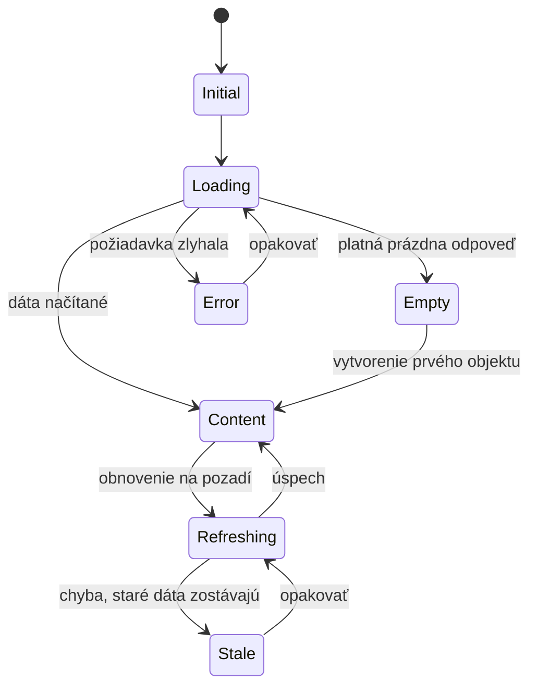
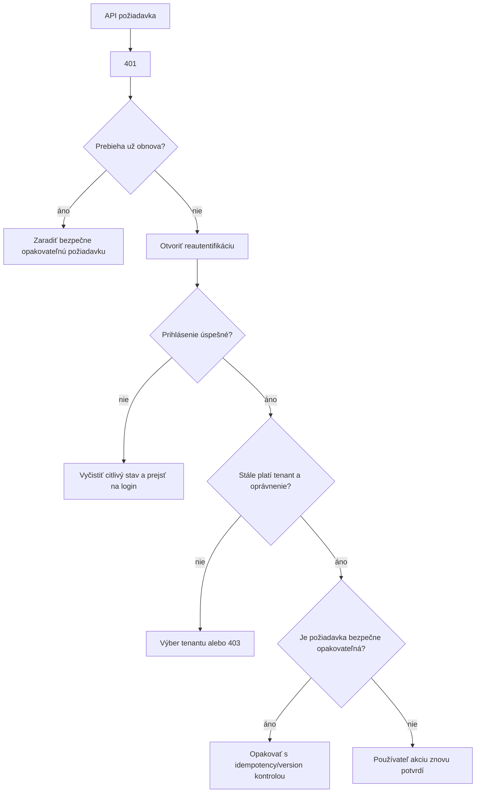
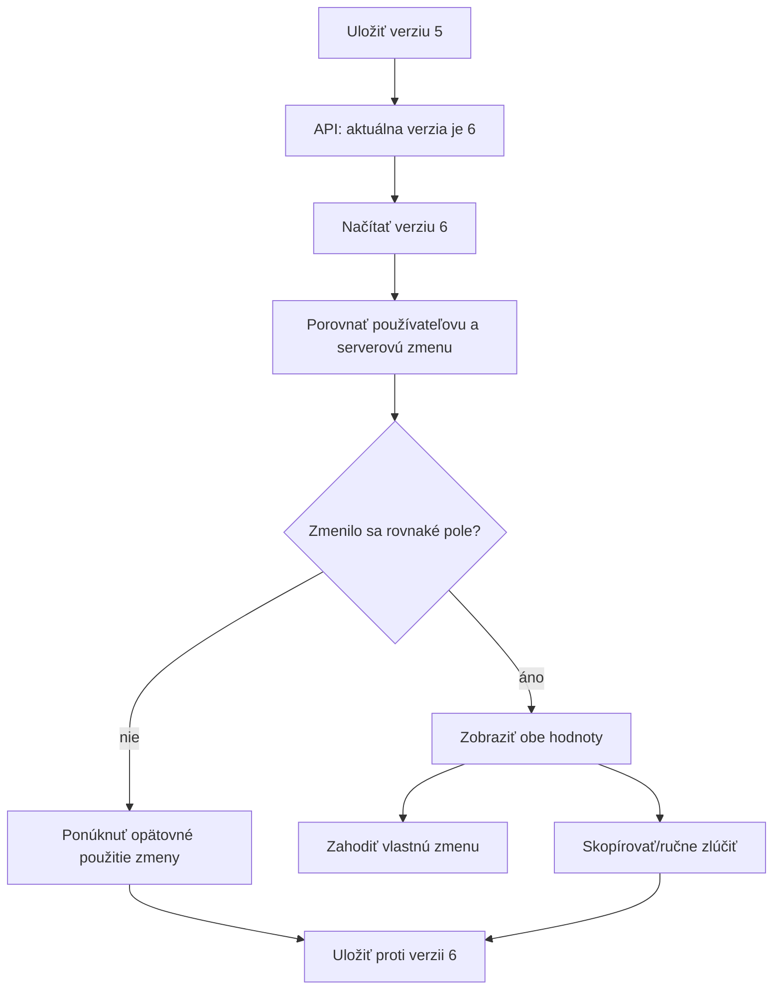
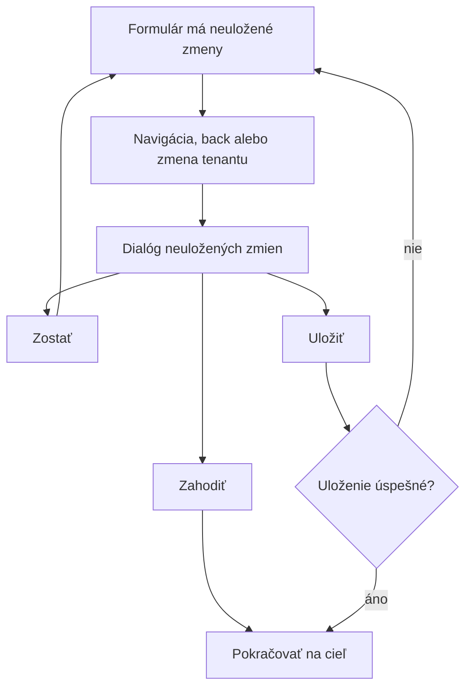
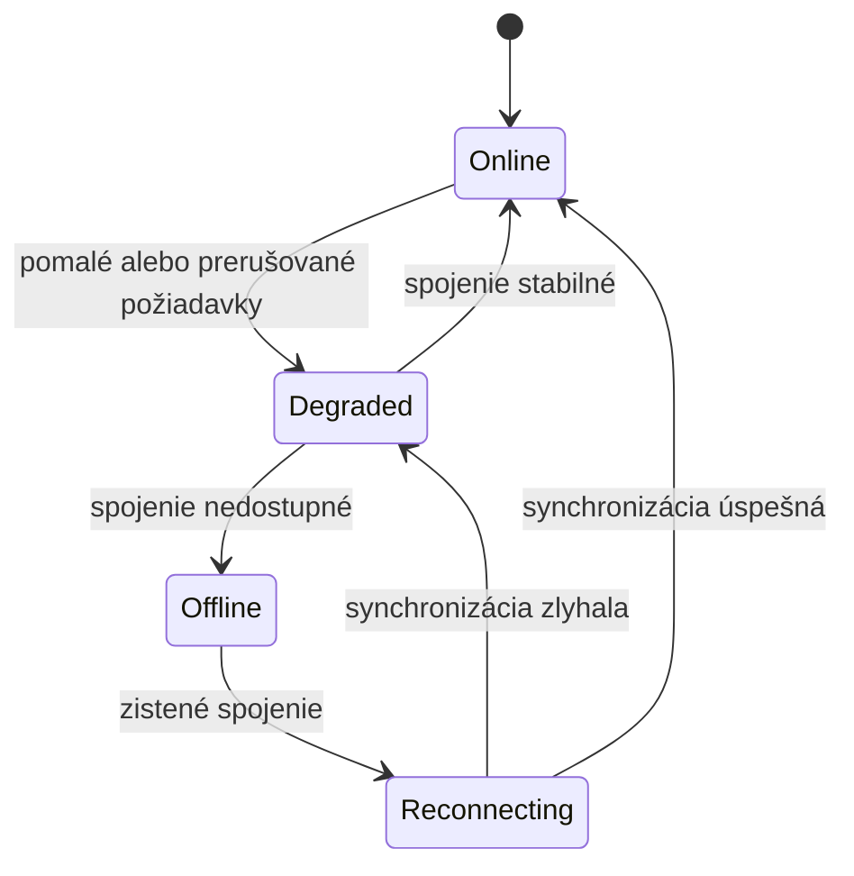
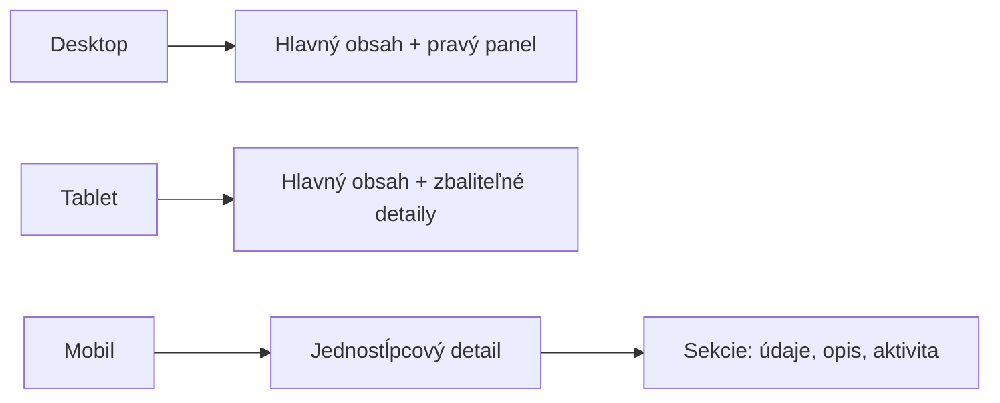

# SOVA – stavy rozhrania, chyby a responzivita

## 1. Účel

Dokument definuje konzistentné správanie aplikácie pri načítavaní, prázdnych dátach,
chybách, strate oprávnenia, konflikte, offline stave a na rôznych veľkostiach
obrazovky.

## 2. Povinné stavy dátovej obrazovky

Každá obrazovka alebo nezávislý dátový blok má zvážiť:

### 2.1 Loading

- pri prvom načítaní použiť skeleton zodpovedajúci budúcemu layoutu,
- pri krátkej mutácii zobraziť stav priamo na aktivovanom prvku,
- nezakrývať celú aplikáciu globálnym spinnerom pri každej požiadavke,
- zabrániť opakovanému odoslaniu,
- zachovať možnosť bezpečnej navigácie, ak operácia nie je kritická.

### 2.2 Empty

Prázdny stav má vysvetliť:

- čo na obrazovke zvyčajne bude,
- prečo zatiaľ nič nevidno,
- čo môže používateľ urobiť.

Príklady:

| Situácia | Správa | Primárna akcia |
|---|---|---|
| Tenant nemá projekt | Zatiaľ nebol vytvorený projekt | Vytvoriť projekt, ak je povolené |
| Projekt nemá úlohy | Projekt zatiaľ nemá úlohy | Vytvoriť úlohu |
| Filter nemá výsledky | Žiadna úloha nezodpovedá filtru | Vyčistiť filtre |
| Žiadne notifikácie | Všetko je vybavené | Bez nútenej akcie |
| Používateľ nemá projektový prístup | Nie ste členom žiadneho projektu | Kontaktovať administrátora |

## 3. Katalóg chýb

### 3.1 Mapovanie HTTP stavov

| HTTP | Význam v UI | Správanie |
|---|---|---|
| `400` | Neplatná požiadavka | Všeobecná chyba, neodosielať bez opravy |
| `401` | Relácia chýba alebo skončila | Reautentifikácia a bezpečný návrat |
| `403` | Nedostatočné oprávnenie | 403 stav bez odhalenia citlivých dát |
| `404` | Objekt neexistuje alebo nie je viditeľný | Tenantová/global 404 podľa kontextu |
| `409` | Súbežná zmena alebo unikátny konflikt | Konfliktový dialóg alebo inline chyba |
| `410` | Objekt alebo token už nie je dostupný | Vysvetlenie a platný ďalší krok |
| `413` | Príliš veľká požiadavka/súbor | Limit a možnosť vybrať menší súbor |
| `422` | Doménová alebo field validácia | Chyby pri konkrétnych poliach |
| `429` | Rate limit | Čas do opakovania, ak je známy |
| `5xx` | Chyba služby | Correlation ID a možnosť opakovať |

### 3.2 Chybová odpoveď

Frontend očakáva konzistentný formát Problem Details s:

- typom chyby,
- ľudským názvom,
- bezpečným detailom,
- HTTP stavom,
- correlation ID,
- kódom doménovej chyby,
- mapou field chýb, ak je relevantná.

Používateľovi sa nemá zobrazovať stack trace, SQL chyba ani interný názov triedy.

## 4. 401 – skončená relácia

Mutácie sa nesmú automaticky opakovať, ak by mohli vytvoriť duplikát alebo vykonať
operáciu dvakrát.

## 5. 403 – nedostatočné oprávnenie

Rozlišovať:

- celostránkovú 403 pri neprístupnej route,
- inline 403 pri akcii, ku ktorej používateľ stratil oprávnenie,
- skrytú akciu, ak ju používateľ nikdy nemal.

Ak sa oprávnenie zmenilo počas otvorenej obrazovky:

1. API operáciu odmietne,
2. UI zruší lokálny „úspešný“ stav,
3. obnoví permissions snapshot,
4. vysvetlí, že prístup sa zmenil,
5. skryje alebo deaktivuje už nedostupné akcie.

## 6. 404 a 410

404 nesmie potvrdiť existenciu cudzieho tenantového objektu. Text môže byť:

> Objekt neexistuje alebo k nemu nemáte prístup.

410 sa hodí pre:

- expirovanú pozvánku,
- použitý resetovací token,
- odstránený dočasný export,
- už neplatný jednorazový odkaz.

Má ponúknuť konkrétny ďalší krok, napríklad vyžiadanie nového odkazu.

## 7. Konflikt 409

### 7.1 Unikátny údaj

Pri duplicitnom projektovom kóde alebo názve roly:

- chyba patrí ku konkrétnemu poľu,
- formulár zostáva vyplnený,
- focus sa presunie na prvé chybné pole až po zrozumiteľnom oznámení.

### 7.2 Súbežná zmena

## 8. Validácia formulárov

### 8.1 Klientská validácia

Slúži na rýchlu spätnú väzbu:

- povinné pole,
- formát,
- dĺžka,
- základné vzájomné závislosti.

### 8.2 Serverová validácia

Je autoritatívna pre:

- unikátnosť,
- oprávnenia,
- tenantové väzby,
- workflow,
- aktuálny stav,
- limity,
- bezpečnostné pravidlá.

### 8.3 Zobrazenie chýb

- inline chyba pod poľom,
- súhrn chýb pri dlhom formulári,
- focus na súhrn po neúspešnom odoslaní,
- odkazy zo súhrnu na konkrétne polia,
- hodnotu používateľa zachovať, pokiaľ nie je nebezpečná.

Chyba nemá byť oznámená iba červenou farbou.

## 9. Neuložené zmeny

Pri zatvorení tabu prehliadača možno použiť natívne upozornenie, ale text nemusí byť
plne ovládateľný. Automatický koncept má význam najmä pre dlhý opis alebo komentár.

Koncept nesmie zostať dostupný inému používateľovi na zdieľanom zariadení.

## 10. Offline a nestabilná sieť

SOVA nemusí byť plne offline aplikácia. Má však zvládnuť krátke výpadky:

- zobraziť stav spojenia,
- zachovať rozpísaný text,
- pri čítaní možno ponechať staré dáta označené ako neaktuálne,
- mutáciu neopakovať bez kontroly idempotencie,
- po obnovení spojenia načítať aktuálnu verziu,
- odlíšiť sieťovú chybu od validačnej chyby.

## 11. Toast, alert a dialóg

| Prvok | Použitie | Nepoužiť na |
|---|---|---|
| Toast | Krátke potvrdenie úspechu | Kritickú chybu vyžadujúcu rozhodnutie |
| Inline alert | Chyba alebo upozornenie v kontexte bloku | Globálnu systémovú udalosť |
| Page alert | Stav celej obrazovky | Drobné uloženie jedného poľa |
| Confirm dialog | Deštruktívna alebo významná akcia | Každú bežnú úpravu |
| Banner | Impersonácia, údržba, systémový stav | Bežné úspešné potvrdenie |

Toast musí zostať dostupný asistívnym technológiám, ale nemá byť jediným miestom,
kde sa používateľ dozvie výsledok kritickej operácie.

## 12. Responzivita

### 12.1 Orientačné režimy

| Režim | Typické správanie |
|---|---|
| Mobil | Jednostĺpcový obsah, off-canvas navigácia |
| Tablet | Kompaktná navigácia, obmedzené sekundárne panely |
| Desktop | Ľavá navigácia, hlavný obsah, detailový panel |
| Široký desktop | Vyššia informačná hustota, nie nekontrolované rozťahovanie textu |

Konkrétne breakpointy sa majú odvodiť od Bootstrap 5 a reálneho obsahu.

### 12.2 Tabuľky

Na malom displeji:

- prioritné stĺpce zostávajú viditeľné,
- ostatné údaje sa presunú do karty alebo detailu,
- horizontálny scroll je prípustný pri administratívnych dátach,
- primárna akcia nesmie byť mimo dosahu,
- výber riadkov musí fungovať dotykom aj klávesnicou.

### 12.3 Detail úlohy

## 13. Prístupnosť

Povinné princípy:

- logické poradie nadpisov,
- landmarky pre navigáciu a hlavný obsah,
- skip link,
- viditeľný focus,
- ovládanie všetkých akcií klávesnicou,
- focus trap a návrat focusu pri modaloch,
- menovky formulárov,
- popis povinných polí,
- ARIA live región iba pre vhodné dynamické oznámenia,
- stav vyjadrený textom alebo ikonou aj farbou,
- dostatočný kontrast,
- rešpektovanie reduced motion.

### 13.1 Focus po navigácii

- po zmene route prejsť focusom na hlavný nadpis,
- po otvorení modalu na jeho názov alebo prvé relevantné pole,
- po zatvorení modalu vrátiť focus na prvok, ktorý ho otvoril,
- po inline chybe nepresúvať focus chaoticky pri každom znaku.

### 13.2 Kanban

Drag and drop musí mať klávesovú alternatívu:

- vybrať kartu,
- zvoliť cieľový stav,
- potvrdiť prechod,
- oznámiť výsledok asistívnej technológii.

## 14. Výkonnostné správanie UI

- lazy-load funkčných oblastí,
- stránkovanie alebo virtualizácia veľkých zoznamov,
- debounce vyhľadávania,
- rušenie zastaraných požiadaviek,
- skeleton namiesto poskakovania layoutu,
- optimalizácia obrázkov a avatarov,
- opatrné používanie realtime aktualizácií,
- žiadne nekonečné obnovovanie po chybe.

## 15. Bezpečnostné správanie UI

- po odhlásení vyčistiť tenantovú cache,
- po prepnutí tenantu zrušiť staré rozpracované tenantové requesty,
- nezobrazovať citlivé dáta v URL,
- neukladať session token do `localStorage`,
- nepredvyplniť cudzie tenantové hodnoty z predchádzajúceho kontextu,
- sanitizovať renderovaný formátovaný obsah,
- nepoužívať frontend permissions ako bezpečnostnú kontrolu,
- pri impersonácii trvalo zobrazovať varovný banner.

## 16. E2E scenáre

- loading, empty, error a stale stav dashboard widgetu,
- 401 počas čítania aj počas rozpísaného formulára,
- 403 po zmene roly počas otvorenej stránky,
- tenantovo bezpečná 404,
- 409 pri jednoduchom poli aj dlhom opise,
- 422 s mapovaním viacerých field chýb,
- neuložené zmeny pri navigácii a prepnutí tenantu,
- krátky výpadok siete počas komentovania,
- responzívny zoznam a detail úlohy,
- ovládanie modalu a Kanbanu klávesnicou,
- focus po route navigácii,
- vyčistenie cache po odhlásení.

