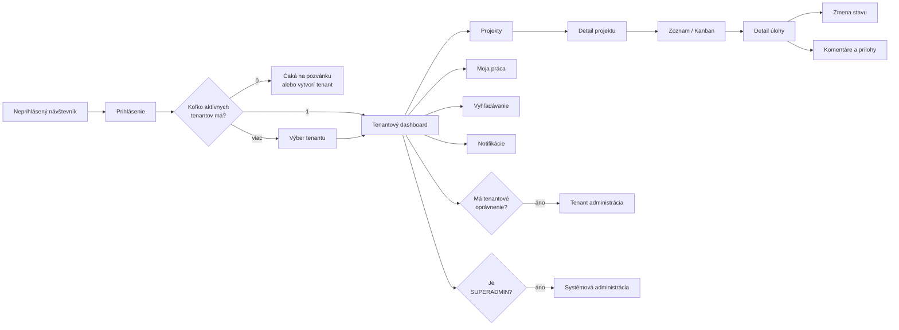

# SOVA – webflow dokumentácia

Táto časť dokumentácie opisuje informačnú architektúru, navigáciu, obrazovky a
používateľské toky webovej aplikácie SOVA.

Pojem **webflow** v týchto dokumentoch znamená tok používateľa cez webovú aplikáciu,
nie službu Webflow.com.

## Dokumenty

| Dokument | Obsah |
|---|---|
| [00 – Informačná architektúra](./00-INFORMACNA-ARCHITEKTURA.md) | Mapa aplikácie, routy, layouty, navigácia a route guards |
| [01 – Autentifikácia a onboarding](./01-AUTENTIFIKACIA-A-ONBOARDING.md) | Prihlásenie, heslá, pozvánky, výber tenantu a prvé spustenie |
| [02 – Projekty a úlohy](./02-PROJEKTY-A-ULOHY.md) | Dashboard, projekty, zoznamy, Kanban, detail a workflow úlohy |
| [03 – Spolupráca](./03-SPOLUPRACA.md) | Komentáre, prílohy, vyhľadávanie, filtre a notifikácie |
| [04 – Administrácia](./04-ADMINISTRACIA.md) | Tenant admin, projekt admin, SUPERADMIN a impersonácia |
| [05 – Stavy rozhrania](./05-STAVY-ROZHRANIA.md) | Loading, empty, error, forbidden, konflikt, offline a responzivita |

Nadradená produktová a technická analýza je v
[ANALYZA_PROJEKTU.md](../ANALYZA_PROJEKTU.md).

## Ako dokumentáciu používať

Dokumentácia má slúžiť ako spoločný podklad pre:

- návrh Angular routingu,
- tvorbu wireframov a výsledného UI,
- návrh API endpointov,
- definovanie oprávnení,
- písanie používateľských scenárov,
- prípravu E2E testov,
- kontrolu prístupnosti.

Každá obrazovka je podľa potreby opísaná cez:

- účel,
- vstupné cesty,
- požadované oprávnenia,
- hlavné komponenty,
- používateľské akcie,
- úspešné a chybové stavy,
- následnú navigáciu.

## Globálne princípy

1. Používateľ vždy vidí, v akom tenantovi a projekte sa nachádza.
2. Zmena aktívneho tenantu nesmie zachovať neplatný projektový kontext.
3. Frontend môže ovládací prvok skryť, ale bezpečnosť vždy vynucuje backend.
4. Každá asynchrónna obrazovka má loading, empty, error a success stav.
5. Deštruktívna operácia vyžaduje explicitné potvrdenie.
6. Neuložené zmeny nesmú byť stratené bez upozornenia.
7. URL má reprezentovať aktuálny tenant, projekt, filter alebo otvorený objekt.
8. Detail úlohy musí byť dostupný priamym URL odkazom.
9. Kritická operácia má po dokončení jednoznačný výsledok a ďalší krok.
10. Rozhranie musí byť ovládateľné klávesnicou a zrozumiteľné aj bez farieb.

## Základný end-to-end tok

